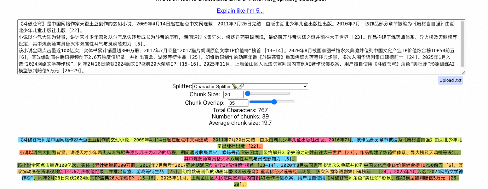
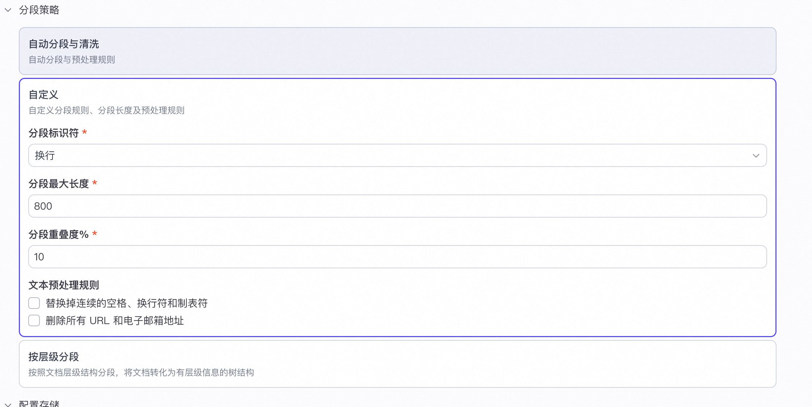
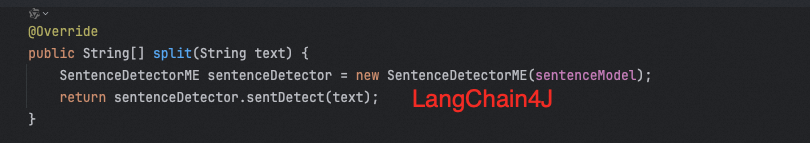

# ✅常见文档分片方式


**由于大模型上下文窗口的限制**，这意味着我们不可能一次性把整篇文档送入模型。而在RAG中，我们需要将文档拆分成很多的**小文本块（chunk）**，到检索生成环节的时候，检索的就是与用户问题最相似的一部分小文本块，从而让RAG这个“知识外挂”的大小在模型上下文可接受的范围内。这个“拆分”的过程就是文档分片。


> PS：关于名字，有的叫Chunking，有的也叫Splitting，不管是Chunking还是Splitting，都是一回事儿，不用纠结，中文叫分段、分片、分块，也都行，也不要纠结。


Chunking 是指将大型文档切分成一个个更小的、语义连贯的文本块，以便于检索系统精确地找到相关信息，并送入语言模型进行处理。Chunking 是连接海量原始知识库和有限的 LLM 上下文窗口之间的关键桥梁。它不是一个可有可无的优化选项，而是 RAG 架构能够成立和高效运作的基石。这一步至关重要，因为它确保文本符合嵌入模型的输入大小。


分块的方式有很多种，不同的人或者机构也会试着总结出不同的分块的方法，但是总结下来，比较典型的都是分成以下5个level：

-   Fixed Size Chunking（固定大小分块）

-   Recursive Chunking（递归分块）

-   Document Based chunking（基于文档分块）

-   Semantic Chunking（语义分块）

-   LLM-based Chunking（基于LLM分块）


### 固定大小分块

这是最原始也是最简单的文本分段方法。它将文本分割成指定数量的字符块，而不管其内容或结构是怎么样的。有人把它叫做Character Splitting、也有人叫做Fixed Size Chunking，都是一回事儿。

他主要有两个关键参数：

-   chunk\_size：块中的字符数量

-   chunk\_overlap: 顺序块中重叠的字符数。


overlap，是为了尽量避免将单个上下文片段切割成多个片段。这将导致块之间出现重复数据。


比如，我把一段关于斗破苍穹小说的介绍，设置为chunk\_size=20的分段（以下截图来自：https://www.chunkviz.com/ ）：

> 《斗破苍穹》是中国网络作家天蚕土豆创作的玄幻小说，2009年4月14日起在起点中文网连载，2011年7月20日完结，首版由湖北少年儿童出版社出版。2010年7月，该作品部分章节被编为《废材当自强》由湖北少年儿童出版社出版 \[22\]。
>
>
>
> 小说以斗气大陆为背景，讲述天才少年萧炎从斗气尽失逐步成长为斗帝的历程，期间通过收集异火、修炼丹药突破困境，最终解开斗帝失踪之谜并前往大千世界 \[23\]。作品构建了炼药师体系、异火榜及天鼎榜等设定，其中炼药师需具备火木双属性斗气与灵魂感知力 \[6\]。
>
>
>
> 该小说全网点击量近100亿次，实体书累计销量超300万册，2017年7月荣登“2017猫片胡润原创文学IP价值榜”榜首 \[13-14\]。2020年8月被国家图书馆永久典藏并位列中国文化产业IP价值综合榜TOP50前五 \[6\]，其改编动画在腾讯视频创下2.6万热度值纪录，并推出盲盒、游戏等衍生品 \[25\]。幻维数码制作的动画年番《斗破苍穹》重现佛怒火莲等经典场景，多次入围华语剧集口碑榜前十 \[24\]。2025年1月入选“2024网络文学神作榜”，同年2月28日荣获2024阅文IP盛典20大荣耀IP \[15-16\]。2025年11月，上海金山区人民法院宣判国内首例AI著作权侵权案，用户擅自使用《斗破苍穹》角色“美杜莎”形象训练AI模型被判赔偿5万元 \[26-29\]。


可以看到，每一个分段的字符数都是20，长度都一样。

如果我给他设置个overlap，比如5：



你就会发现，相邻的两个分段中，会有5个字符是重复的。因为直接分段可能导致文本块边界处的语义断裂，而加一个overlap就可以通过重叠部分内容，确保每个块的开头包含前一个块的结尾信息，减少语义断裂。

这个方案的优点就是非常简单，按照固定大小分段就行了，但是缺点也比较明显，那就是完全没考虑文档结构，所谓文档结构就是文档中本身的一些分段、空格、换行等等。就像我们自己读文档一样，遇到换行的时候，就知道一段结束了。

所以，有了另外一种切割方式。

### 递归分块（常用）

递归分块，他的主要方式就是可以指定一些列分隔符，这些分隔符可以用来分割文档。比如常见的：

-   "\\n\\n" - 双换行符，或通常指段落分隔

-   "\\n" - 换行

-   " " - 空格

-   "" - 空字符


同样一段文本，我们选择这种切割方式：


可以看到，这次切割结果和上一次是不一样的，尤其是在分段处，比如第一段结束的`[22]。` 就是单独切割出来的，而下一次切割时从下一段开始的。


这种切割方式，一般会比上一种切分出来的段会更多一些。


**因为这种方式用的比较多，我们展开讲讲这种。**


这种分块方式，很多人不知道，他为什么叫递归分块呢？递归体现在哪里呢？其实，大家可以看一下源码，比如com.alibaba.cloud.ai.transformer.splitter.RecursiveCharacterTextSplitter：

```java
public RecursiveCharacterTextSplitter(int chunkSize, String[] separators) {
  if (chunkSize <= 0) {
    throw new IllegalArgumentException("Chunk size must be positive");
  }

  this.chunkSize = chunkSize;
  this.separators = Objects.requireNonNullElse(separators,
      new String[] { "\n\n", "\n", "。", "！", "？", "；", "，", " " });
}

private void splitText(String text, int separatorIndex, List<String> chunks) {
  if (text.isEmpty()) {
    return;
  }

  if (text.length() <= chunkSize) {
    chunks.add(text);
    return;
  }

  if (separatorIndex >= separators.length) {
    // Final fallback - split by chunkSize 最终按块大小分割
    for (int i = 0; i < text.length(); i += chunkSize) {
      int end = Math.min(i + chunkSize, text.length());
      chunks.add(text.substring(i, end));
    }
    return;
  }

  String separator = separators[separatorIndex];
  String[] splits;
  if (separator.isEmpty()) {
    // Split by character
    splits = new String[text.length()];
    for (int i = 0; i < text.length(); i++) {
      splits[i] = String.valueOf(text.charAt(i));
    }
  }
  else {
    // Split by separator
    splits = text.split(separator);
  }

  for (String split : splits) {
    if (split.length() > chunkSize) {
      splitText(split, separatorIndex + 1, chunks);
    }
    else {
      chunks.add(split);
    }
  }
}
```

重点就在下面这个for循环得地方，可以看到就是一个递归调用splitText方法。大致的流程就是从前面的`new String[] { "\n\n", "\n", "。", "！", "？", "；", "，", " " }` 中逐个取出字符进行切分，然后判断是否符合条件（主要是看长度），如果符合直接返回，如果不符合继续用下一个字符进行分割。


### 基于文档分块（常用）


上面这个切割方式已经好了一些，但是还是有进步空间，有些问题还是解决不了，比如说带 Markdown 的文档、他切割的其实就不好。


所以，针对这个问题，可以使用支持根据文档没在结构进行分割的方式，这种方式针对markdown文档、PYTHON/JS文档、带有表格的文档以及带有图片的PDF文档等都会更加的友好。


### 语义分块（常用）

以上三个分块方式都是只关注文档的内容和结构，并需要保持块大小的恒定值，而忽略了语义。想要更好分块，最好是从文档中提取语义意义，然后评估这些块之间的语义关系，将语义相似的块保持在一起。


这种一般需要借助自然语言处理（NLP）技术，通过理解文本的语义边界（如主题转换、逻辑段落）进行智能分割。


### 智能分块

上面的这个分段方式是基于NLP的模型分块的，那么还有一种基于大模型分段的方案。


LLM-based Chunking或者叫做Agentic Chunking，反正都是借助大模型来做文档切割。比如我让DeepSeek帮我切割：


以下文档内容，请帮我做chunking：

> 《斗破苍穹》是中国网络作家天蚕土豆创作的玄幻小说，2009年4月14日起在起点中文网连载，2011年7月20日完结，首版由湖北少年儿童出版社出版。2010年7月，该作品部分章节被编为《废材当自强》由湖北少年儿童出版社出版 \[22\]。小说以斗气大陆为背景，讲述天才少年萧炎从斗气尽失逐步成长为斗帝的历程，期间通过收集异火、修炼丹药突破困境，最终解开斗帝失踪之谜并前往大千世界 \[23\]。作品构建了炼药师体系、异火榜及天鼎榜等设定，其中炼药师需具备火木双属性斗气与灵魂感知力 \[6\]。该小说全网点击量近100亿次，实体书累计销量超300万册，2017年7月荣登“2017猫片胡润原创文学IP价值榜”榜首 \[13-14\]。2020年8月被国家图书馆永久典藏并位列中国文化产业IP价值综合榜TOP50前五 \[6\]，其改编动画在腾讯视频创下2.6万热度值纪录，并推出盲盒、游戏等衍生品 \[25\]。幻维数码制作的动画年番《斗破苍穹》重现佛怒火莲等经典场景，多次入围华语剧集口碑榜前十 \[24\]。2025年1月入选“2024网络文学神作榜”，同年2月28日荣获2024阅文IP盛典20大荣耀IP \[15-16\]。2025年11月，上海金山区人民法院宣判国内首例AI著作权侵权案，用户擅自使用《斗破苍穹》角色“美杜莎”形象训练AI模型被判赔偿5万元 \[26-29\]。


以下是他的切割结果：


```
Chunk 1：基础信息与出版
《斗破苍穹》是中国网络作家天蚕土豆创作的玄幻小说，2009年4月14日起在起点中文网连载，2011年7月20日完结，首版由湖北少年儿童出版社出版。2010年7月，该作品部分章节被编为《废材当自强》由湖北少年儿童出版社出版 [22]。
Chunk 2：故事背景与世界观设定
小说以斗气大陆为背景，讲述天才少年萧炎从斗气尽失逐步成长为斗帝的历程，期间通过收集异火、修炼丹药突破困境，最终解开斗帝失踪之谜并前往大千世界 [23]。作品构建了炼药师体系、异火榜及天鼎榜等设定，其中炼药师需具备火木双属性斗气与灵魂感知力 [6]。
Chunk 3：市场表现与荣誉奖项
该小说全网点击量近100亿次，实体书累计销量超300万册，2017年7月荣登“2017猫片胡润原创文学IP价值榜”榜首 [13-14]。2020年8月被国家图书馆永久典藏并位列中国文化产业IP价值综合榜TOP50前五 [6]。
Chunk 4：衍生作品开发
其改编动画在腾讯视频创下2.6万热度值纪录，并推出盲盒、游戏等衍生品 [25]。幻维数码制作的动画年番《斗破苍穹》重现佛怒火莲等经典场景，多次入围华语剧集口碑榜前十 [24]。
Chunk 5：IP价值与法律案例
2025年1月入选“2024网络文学神作榜”，同年2月28日荣获2024阅文IP盛典20大荣耀IP [15-16]。2025年11月，上海金山区人民法院宣判国内首例AI著作权侵权案，用户擅自使用《斗破苍穹》角色“美杜莎”形象训练AI模型被判赔偿5万元 [26-29]。
```


### 常用的分块方式


到底哪些比较常用呢？其实我们可以看一下百炼/Coze/Dify这种平台上支持的，一般都是比较常用的：

**百炼**


百炼目前支持6种切分方式：

-   智能切分（递归分块+语义分块？）

-   按长度切分（固定大小分块）

-   按符号切分（递归分块）

-   按页切分（类似递归分块）

-   按标题切分（类似递归分块）

-   按正则切分（类似递归分块）


**Dify**


Dify主要支持两种，一种是通用分块，其实也就是**递归分块。**还有一种是叫做父子分块，这个也是一个比较好用的分块，但是这个网上介绍的比较少，但是我实践下来比较好用，后面会给大家手撸一个这种分块的代码。


**Coze**



###

从上面三种常见平台支持的方案来看，其实目前最常用的就是**递归分块**，包括Dify中的通用分块，Coze中的自定义分块，都是一样的，全部都是递归分块，都支持传入3种核心参数：

-   分段标识符

-   分段最大长度

-   分段重叠度/重叠长度


除了上面这种递归分块比较常用以外，还有一种比较常用的就是语义分块了，他的效果比较好，很多平台上面的智能分块，其实就是依赖语义分块实现的。


关于语义分块的实现，在Spring AI Alibaba 和LangChain4J中都有：

-   SentenceSplitter：Spring AI中的语义分块

-   DocumentBySentenceSplitter：LangChain4J中的语义分块


在两个实现的具体实现代码中，都有这么两句：

```java
SentenceDetectorME sentenceDetector = new SentenceDetectorME(sentenceModel);
String[] texts = sentenceDetector.sentDetect(text);
```




这个`SentenceDetectorME`是OpenNLP 提供的句子分割器类，`ME` 表示 "Maximum Entropy"（最大熵模型）。`getSentenceModel()` 方法用于从资源路径加载预训练的句子模型（/opennlp/opennlp-en-ud-ewt-sentence-1.2-2.5.0.bin 文件）。通过这个自然语言模型来进行文本分块。


另外，相信大家在使用dify、coze等平台的时候，能看到父子分段、按层级分段等分段方式，这个后面我们在RAG优化中可能会在提及到，这里先不展开。
