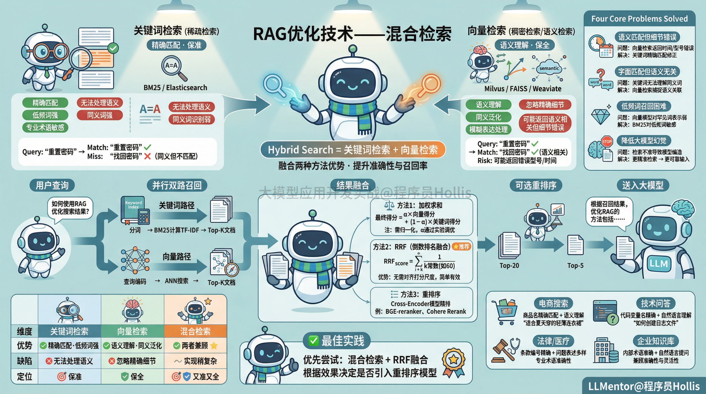
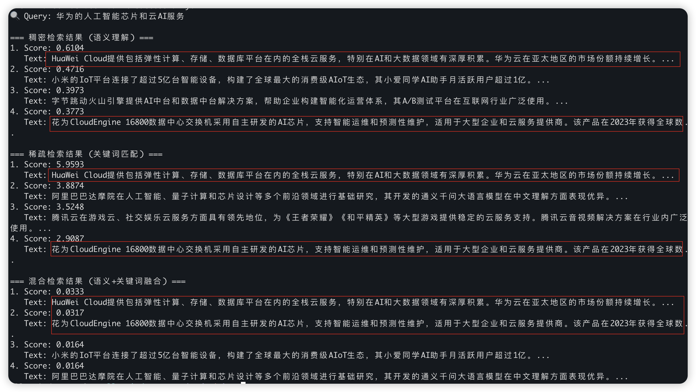
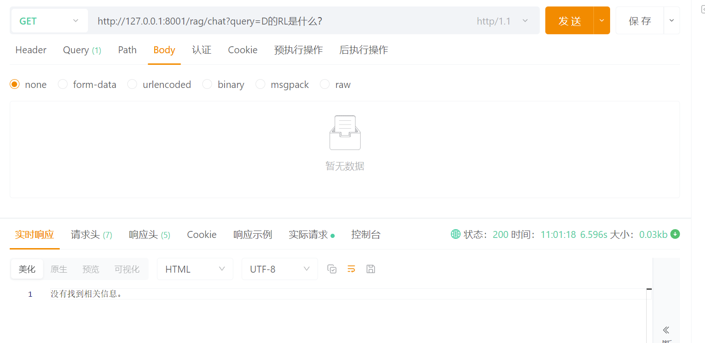
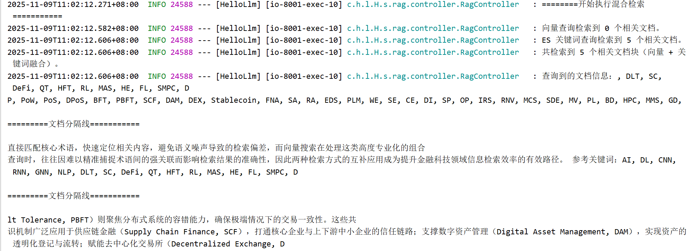

# ✅RAG优化技术：混合检索




在检索增强生成流程中，混合检索（Hybrid Search）是提高检索阶段质量的关键高级技术。它确保了大模型在生成答案之前，能够获得语义最相关、关键词最精确的上下文信息。


## 传统检索方式


传统的单一检索方式存在以下局限：


**稠密检索/向量检索**（如基于向量的语义相似度搜索）：

-   能捕捉语义信息，但可能在精确关键词匹配上表现不佳。

-   对训练数据、包括文档的质量、切片和嵌入质量高度依赖，容易受嵌入偏差影响。


**稀疏检索/****关键字搜索**（如 BM25）：

-   依赖文档切分出来的关键词进行匹配。

-   无法理解语义相似但用词不同的查询与文档（例如“汽车” vs “轿车”）。


> 比如在ElasticSearch中，倒排索引是一种将“关键词”映射到“文档ID”的数据结构，实现了快速定位候选文档。**BM25（Best Match 25）则是在通过倒排索引查找到候选文档后，利用其词频（TF）和逆文档频率（IDF）计算相关性得分并排序的算法。**


| **检索方式** | **优势** | **劣势** |
| --- | --- | --- |
| **关键字搜索** | **精确匹配**：擅长匹配**精确的术语、缩写、标识符、数字或专有名词**。保证结果不偏离核心关键词。 | **语义理解差**：如果用户使用了**同义词或不同的表达方式**，即使文本内容相同，也可能无法召回。 |
| **语义搜索** | **意图理解**：擅长理解查询的**语义意图**，即使查询和文档使用的词汇完全不同，只要意思相近，也能召回。 | **关键字敏感度低**：对于**代码片段、产品型号、人名**等需要精确匹配的术语，它的嵌入可能不够精确，导致召回结果过于泛化。 |


**混合检索（Hybrid Search）是一种复合的检索策略，它结合了至少两种**不同类型的搜索算法，以利用它们各自的优势，克服单一检索模式的固有缺陷。


## 为什么需要混合检索？


混合检索就是通过融合两者的优势，在保持语义理解能力的同时保留关键词匹配的精确性，从而提高检索结果的**召回率**（Recall）和**排序质量**（Ranking Quality），最终提升 RAG 系统的整体性能（如回答准确性、事实一致性）。


混合检索将两者结合，使系统既能**深刻理解用户意图（语义优势）**，又能**确保检索结果不偏离核心关键词（关键字优势）**，从而**显著提升 RAG 的召回质量，能解决以下问题：**

1.  **语义匹配但细节错误**

2.  向量检索可能返回语义相关但关键信息（如时间、型号、编号）错误的内容。

3.  混合检索通过关键词精确匹配修正偏差。

4.  **字面匹配但语义无关**

5.  关键词检索无法理解同义词或模糊表达（如“重置密码” vs “找回密码”）。

6.  向量检索可捕捉语义关联，弥补此缺陷。

7.  **低频词或专业术语召回困难**

8.  向量模型对罕见词表示弱，而关键词检索（如 BM25）对此更敏感。

9.  **降低大模型“幻觉”风险**

10.  更精准的检索结果 → 更可靠的知识输入 → 减少模型编造答案。


## 混合检索的常见做法


混合检索的常见做法就是**并行多路召回 + 结果融合。**


也就是说把同一个查询同时送入：**关键词检索模块**（如 Elasticsearch / BM25）、**向量检索模块**（如 Milvus / FAISS / PgVector），然后再对对两路结果进行融合排序。


融合排序有以下常见算法：


-   **加权求和（Score Weighting）**`最终得分 = α × 向量得分 + (1−α) × 关键词得分`（需归一化得分，α 通常通过实验调优）

-   **重排序，**包括RRF、Cross-Encoder等，下一个章节介绍。


## 混合检索的实现


### Langchain&LlamaIndex

提到成熟的智能体框架就不得不提到 Langchain，Langchain对于混合检索有着非常好的支持，开箱即用。在 LangChain 中，混合检索和重排序通常通过组合不同的组件来实现。


对于混合检索，LangChain 提供了 EnsembleRetriever。EnsembleRetriever 并不直接执行检索，而是**包装多个子检索器**（如 `BM25Retriever`、`VectorStoreRetriever` 等），在收到查询时：


1.  同时调用所有子检索器；

2.  获取每个检索器返回的文档及其“分数”（或排名）；

3.  使用一种**融合策略**（如 Reciprocal Rank Fusion, RRF）合并结果；

4.  返回最终排序后的 Top-K 文档。


```java
//稀疏检索器（BM25）

bm25_retriever = BM25Retriever.from_documents(chunks)

//稠密检索器（FAISS + Embeddings）
embedding_model = HuggingFaceEmbeddings(model_name="all-MiniLM-L6-v2")
vectorstore = FAISS.from_documents(chunks, embedding_model)
dense_retriever = vectorstore.as_retriever(search_kwargs={"k": 2})

//构建 EnsembleRetriev
ensemble_retriever = EnsembleRetriever(
    retrievers=[bm25_retriever, dense_retriever],
    weights=[0.5, 0.5]  # 注意：LangChain 的 EnsembleRetriever 实际上默认使用 RRF，weights 参数在某些版本中可能被忽略
)
```


实际case，用llamaindex写一个hybrid\_retriever.py文件：

```
import os
import re
from llama_index.core import VectorStoreIndex, Document
from llama_index.core.retrievers import VectorIndexRetriever
from llama_index.core.retrievers.fusion_retriever import QueryFusionRetriever
from llama_index.embeddings.dashscope import DashScopeEmbedding
from llama_index.llms.dashscope import DashScope
from llama_index.core import Settings
from llama_index.core.node_parser import SentenceSplitter
from llama_index.core.schema import NodeWithScore
from llama_index.core.schema import QueryBundle
from rank_bm25 import BM25Okapi
import jieba

# 设置 DashScope API Key
DASHSCOPE_API_KEY = "sk-xxx" # 改成你自己的

# ===== 构造文档 - 科技公司产品和服务描述 =====
texts = [
    "花为CloudEngine 16800数据中心交换机采用自主研发的AI芯片，支持智能运维和预测性维护，适用于大型企业和云服务提供商。该产品在2023年获得全球数据中心网络设备市场份额第一。",
    "HuaWei Cloud提供包括弹性计算、存储、数据库平台在内的全栈云服务，特别在AI和大数据领域有深厚积累。华为云在亚太地区的市场份额持续增长。",
    "阿里巴巴的云计算平台阿里云是国内市场份额最大的云服务提供商，其核心产品包括ECS弹性计算、OSS对象存储和RDS关系数据库。阿里云在电商和大数据处理方面有独特优势。",
    "阿里巴巴达摩院在人工智能、量子计算和芯片设计等多个前沿领域进行基础研究，其开发的通义千问大语言模型在中文理解方面表现优异。",
    "腾讯云在游戏云、社交娱乐云服务方面具有领先地位，为《王者荣耀》《和平精英》等大型游戏提供稳定的云服务支持。腾讯云音视频解决方案在行业内广泛使用。",
    "腾讯的微信支付和支付宝是中国两大移动支付平台，其中微信支付依托微信社交生态，在个人转账和小额支付场景中占据优势。",
    "字节跳动的推荐算法是其核心竞争力，抖音和今日头条的内容推荐系统能够实现高度个性化，用户粘性极高。",
    "字节跳动火山引擎提供AI中台和数据中台解决方案，帮助企业构建智能化运营体系，其A/B测试平台在互联网行业广泛使用。",
    "百度的自动驾驶平台Apollo是国内最成熟的自动驾驶解决方案之一，已在多个城市开展Robotaxi商业化运营。",
    "百度的文心一言大模型在中文创作和逻辑推理方面表现突出，特别是在处理中国传统文化相关内容时具有优势。",
    "小米的IoT平台连接了超过5亿台智能设备，构建了全球最大的消费级AIoT生态，其小爱同学AI助手月活跃用户超过1亿。",
    "小米手机采用高通和联发科芯片，但在影像处理芯片和充电芯片方面有自研成果，澎湃系列芯片已应用于多款产品。",
]

docs = [Document(text=t) for t in texts]

# 分块
splitter = SentenceSplitter(chunk_size=120, chunk_overlap=20)
nodes = splitter.get_nodes_from_documents(docs)

# ===== 自定义 BM25 检索器 =====
def tokenize_zh(text: str):
    """中文文本分词 + 清理"""
    text = re.sub(r"[^\w\s]", "", text)  # 去除标点符号
    tokens = jieba.lcut(text)
    return [t.strip() for t in tokens if t.strip()]

# 构建 BM25 索引
corpus = [node.text for node in nodes]
tokenized_corpus = [tokenize_zh(doc) for doc in corpus]
bm25 = BM25Okapi(tokenized_corpus)

class CustomBM25Retriever:
    def __init__(self, nodes, bm25_model, similarity_top_k=3):
        self.nodes = nodes
        self.bm25 = bm25_model
        self.similarity_top_k = similarity_top_k

    def retrieve(self, str_or_query_bundle):
        # 兼容字符串和 QueryBundle
        if isinstance(str_or_query_bundle, QueryBundle):
            query_str = str_or_query_bundle.query_str
        else:
            query_str = str_or_query_bundle  # 假设是 str

        tokenized_query = tokenize_zh(query_str)
        scores = self.bm25.get_scores(tokenized_query)
        top_k_indices = sorted(
            range(len(scores)), key=lambda i: scores[i], reverse=True
        )[:self.similarity_top_k]
        results = []
        for idx in top_k_indices:
            results.append(NodeWithScore(node=self.nodes[idx], score=float(scores[idx])))
        return results

    async def aretrieve(self, str_or_query_bundle):
        return self.retrieve(str_or_query_bundle)

# ===== 稠密检索器 =====
embed_model = DashScopeEmbedding(
    model_name="text-embedding-v2",
    api_key=DASHSCOPE_API_KEY
)

Settings.llm = DashScope(
    model_name="qwen-max",
    api_key=DASHSCOPE_API_KEY
)

vector_index = VectorStoreIndex(nodes, embed_model=embed_model)
dense_retriever = VectorIndexRetriever(index=vector_index, similarity_top_k=4)

# ===== 替换稀疏检索器 =====
sparse_retriever = CustomBM25Retriever(nodes=nodes, bm25_model=bm25, similarity_top_k=4)

# ===== 混合检索器 =====
hybrid_retriever = QueryFusionRetriever(
    retrievers=[dense_retriever, sparse_retriever],
    similarity_top_k=4,
    num_queries=1,
    mode="reciprocal_rerank",
)

# ===== 查询：专门设计的问题 =====
query_str = "华为的人工智能芯片和云AI服务"

print("🔍 Query:", query_str)

print("\n=== 稠密检索结果 (语义理解) ===")
dense_nodes = dense_retriever.retrieve(query_str)
for i, node in enumerate(dense_nodes):
    print(f"{i+1}. Score: {node.score:.4f}")
    print(f"   Text: {node.text[:80]}...")

print("\n=== 稀疏检索结果 (关键词匹配) ===")
sparse_nodes = sparse_retriever.retrieve(query_str)
for i, node in enumerate(sparse_nodes):
    print(f"{i+1}. Score: {node.score:.4f}")
    print(f"   Text: {node.text[:80]}...")

print("\n=== 混合检索结果 (语义+关键词融合) ===")
hybrid_nodes = hybrid_retriever.retrieve(query_str)
for i, node in enumerate(hybrid_nodes):
    print(f"{i+1}. Score: {node.score:.4f}")
    print(f"   Text: {node.text[:80]}...")
```

```java
uv add llama-index llama-index-core llama-index-embeddings-openai llama-index-postprocessor-colbert-rerank rank_bm25 llama-index-embeddings-dashscope rank_bm25 jieba
```


运行`uv run hybrid_retriever.py`


得到以下结果：





可以看到，通过单纯的关键词检索和语义检索，检索效果都不如混合检索的效果好。所以说，混合检索是一种常见的做检索优化的方案。


> 以上代码中，我们没有直接用llamaindex中的llama-index-retrievers-bm25，而是自己写了一个，主要是我的电脑总是安装不成功，所以就没办法自己写了一个。


### Spring AI如何实现

比较遗憾的是 Spring AI 在这方面比较薄弱，没有提供完善的开箱即用的工具， 但是 Spring AI 提供了模块化架构和核心接口，我们可以**混合检索的思想，自行实现一套可定制的混合检索 + 重排序流程。**


基于之前的课程，我们已经实现了基于 **PGvector** 的**向量相似度检索**，它擅长语义召回。为了实现完整的**混合检索**，我们必须引入另一个互补的检索机制——**关键词检索**。


因此，我们需要引入一个全文搜索引擎组件，最理想的选择就是 **Elasticsearch (ES)**。有了 ES，我们可以将之前的文本块进行**双重存储**：

1.  **PGvector**：存储**向量（Embedding）**，用于语义搜索。

2.  **Elasticsearch**：存储**原始文本块**，用于关键词、模糊或高亮查询，实现精确的稀疏召回。


## 实现混合检索


关于ES的部署，文档的存储，以及检索，看这篇： ✅使用ElasticSearch做关键词检索


上面的看完之后，继续看这里。我们就可以开始正式去做混合检索了。我们还是基于之前的样例来修改：


```java
@GetMapping("/hybridchat")
public String hybridchat(@RequestParam("query") String query) throws Exception {
    log.info("========开始执行混合检索===========");
    // 1. 向量检索获取相似文档
    List<Document> vectorDocs = embeddingService.similarSearch(query);
    log.info("向量查询检索到 {} 个相关文档，chunkId列表：{}",
            vectorDocs.size(),
            vectorDocs.stream()
                    .map(doc -> doc.getMetadata().getOrDefault("chunkId", "unknown").toString())
                    .collect(Collectors.joining(", ")));

    // 2. ES 关键词检索
    List<EsDocumentChunk> keywordDocs = esRagService.searchByKeyword(query, 5, true);
    log.info("ES 关键词查询检索到 {} 个相关文档，chunkId列表：{}",
            keywordDocs.size(),
            keywordDocs.stream()
                    .map(doc -> doc.getMetadata().getOrDefault("chunkId", "unknown").toString())
                    .collect(Collectors.joining(", ")));

    // 3. 根据 id 去重并合并文档
    Map<String, String> idToContent = new LinkedHashMap<>();

    // 向量检索文档
    for (Document doc : vectorDocs) {
        idToContent.putIfAbsent(doc.getId(), doc.getText());
    }

    // ES 关键词检索文档
    for (EsDocumentChunk doc : keywordDocs) {
        idToContent.putIfAbsent(doc.getId(), doc.getContent());
    }

    List<String> mergedContents = rrfFusion(vectorDocs, keywordDocs, 5);
    log.info("RRF 融合后共 {} 个相关文档块。", mergedContents.size());

//        List<String> mergedContents = new ArrayList<>(idToContent.values());
//        log.info("共检索到 {} 个相关文档块（向量 + 关键词融合）。", mergedContents.size());

    // 4. 构建提示词模板
    String promptTemplate = """
            请基于以下提供的参考文档内容，回答用户的问题。
            如果参考文档中没有相关信息，请直接说明"没有找到相关信息"，不要编造内容。
            如果有了参考文档内容，请务必尽量回答问题。有可能用户的输入比较随意，你可以先尝试回答用户的问题，猜测他的实际需求，先给出回复，你需要尽量去贴合用户的问题需求。

            参考文档:
            {documents}

            用户问题: {question}

            """;

    // 5. 拼接文档内容
    String documentContent = String.join("\n\n=========文档分隔线===========\n\n", mergedContents);
    log.info("查询到的文档信息：{}", documentContent);

    // 6. 填充模板参数
    PromptTemplate prompt = new PromptTemplate(promptTemplate);
    Prompt realPrompt = prompt.create(Map.of("documents", documentContent, "question", query));

    // 7. 调用大模型生成回答
    String text = chatClient.prompt(realPrompt).call().chatResponse().getResult().getOutput().getText();

    return text;
}
```

为了演示效果，我再拿出原来只有相似度查询的chat来对比：两个的提示词保持一致


```java
@GetMapping("/chat")
public String chat(@RequestParam("query") String query) {
    // 1. 相似度检索获取相关文档
    List<Document> similarDocs = embeddingService.similarSearch(query);

    // 2. 构建提示词模板
    String promptTemplate = """
            请基于以下提供的参考文档内容，回答用户的问题。
            如果参考文档中没有相关信息，请直接说明"没有找到相关信息"，不要编造内容。
            如果有了参考文档内容，请务必尽量回答问题。有可能用户的输入比较随意，你可以先尝试回答用户的问题，猜测他的实际需求，先给出回复，你需要尽量去贴合用户的问题需求。

            参考文档:
            {documents}

            用户问题: {question}

            """;

    log.info("共检索到 {} 个相关文档块。", similarDocs.size());

    // 3. 处理检索到的文档内容
    String documentContent = similarDocs.stream()
            .map(Document::getText)
            .collect(Collectors.joining("\n\n=========文档分隔线===========\n\n"));

    log.info("查询到的文档信息：{}", documentContent);

    // 4. 填充模板参数
    Map<String, Object> params = new HashMap<>();
    params.put("documents", documentContent);
    params.put("question", query);
    PromptTemplate prompt = new PromptTemplate(promptTemplate);
    Prompt realPrompt = prompt.create(Map.of("documents", documentContent, "question", query));

    // 5. 调用大模型生成回答
    String text = chatClient.prompt(realPrompt).call().chatResponse().getResult().getOutput().getText();

    return text;
}
```

**调用示例**

**问题一：RL和DL是什么？**

**相似度检索：**


**混合检索结果:**


**我们可以看到，两种查询都能回答出来，说明这个问题在语义上还是比较完整的。那我现在就构造一个比较奇葩的问题，看两者的效果。**


**问题二：D的RL是什么？**

这个问题很奇葩，但是其实我们对用户的输入是**无法预判的**，也许只是用户的一个**误输入**，就会导致有这种问题出现，DL和RL本身是两个概念，但是这个问题，**就可以很明显的让相似度查询失效，检索不到任何文档内容**，这时候，就需要我们的**关键词查询**出场了，他会对这个问题进行分词，可能分成：“D”“的”“RL”“是什么”，这样就能检索到相应的文本块**（实际应用中需要增加停用词，将“的”，“了”，“吗”等这种词不分词）**。接下来我们看下效果

**相似度检索：**



我们可以看到日志中根本没检索到任何的文本块：


**混合检索：**




我们可以看到混合检索输出了一些相关内容，日志中体现的向量检索是没有检索到内容，但是通过ES关键词找到了几个相关度高的文本块，这就体现出了混合检索多个数据源的优势。


# 总结

混合检索通过向量检索与关键词检索的多策略融合，既能利用向量检索捕捉语义关联，又能依托关键词检索精准匹配核心术语（如专业名词、特定表述），从而扩大候选文档的覆盖范围，尤其适合需兼顾召回率与关键信息匹配的场景。
