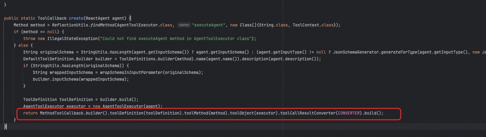
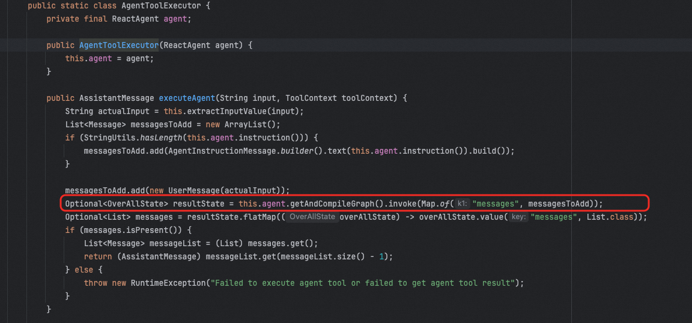
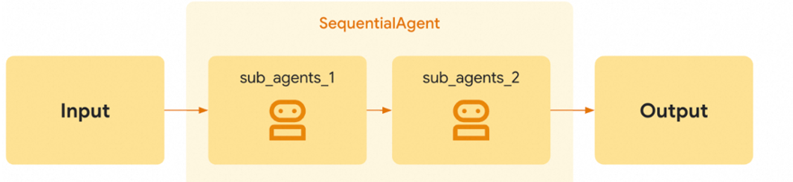

# ✅Spring AI Alibaba中的多智能体支持

除了Python中有很多框架可以实现多智能体以外，Java中的Spring AI Alibaba框架也提供了类似的功能。


前面我们介绍的多智能体的各种模式中，Spring AI主要支持了Agent Tool和Hand off两种实现。


## Agent Tool


Agent Tool的思想就是可以把其他的Agent当做工具，SpringAI Alibaba中定义了AgentTool，来表示一个智能体工具。


这个类中提供了一个getFunctionToolCallback方法，可以把一个ReactAgent转成ToolCallback


有了它， 实现多智能体就简单了。


```java
ReactAgent writerAgent = ReactAgent.builder()
        .name("writer_agent")
        .model(chatModel)
        .description("专门负责创作文章和内容生成")
        .instruction("你是一个专业作家，擅长各类文章创作。")
        .build();

// 创建翻译Agent
ReactAgent translatorAgent = ReactAgent.builder()
        .name("translator_agent")
        .model(chatModel)
        .description("专门负责文本翻译工作")
        .instruction("你是一个专业翻译，能够准确翻译多种语言。")
        .build();

// 创建总结Agent
ReactAgent summarizerAgent = ReactAgent.builder()
        .name("summarizer_agent")
        .model(chatModel)
        .description("专门负责内容总结和提炼")
        .instruction("你是一个内容总结专家，擅长提炼关键信息。")
        .build();

// 创建主Agent，集成多个工具
ReactAgent multiToolAgent = ReactAgent.builder()
        .name("multi_tool_coordinator")
        .model(chatModel)
        .instruction("你可以访问多个专业工具：写作、翻译和总结。" +
                     "根据用户需求选择合适的工具来完成任务。")
        .tools(
                AgentTool.getFunctionToolCallback(writerAgent),
                AgentTool.getFunctionToolCallback(translatorAgent),
                AgentTool.getFunctionToolCallback(summarizerAgent)
        )
        .build();

// 使用 - 主Agent会根据需求自动选择合适的工具
Optional<OverAllState> result = multiToolAgent.invoke(
        "请写一篇关于AI的文章，然后翻译成英文，最后给出摘要");
```


分别定义三个不同的子Agent，然后再定义一个主Agent，在主Agent中，通过tools设置三个工具，分别是三个子Agent通过AgentTool.getFunctionToolCallback转换出来的工具。


### 实现原理


AgentTool.getFunctionToolCallback的实现也不复杂，简单看看。


关键在最后一步：




通过Spring AI中提供的MethodToolCallback构造一个ToolBack，并将agent

的名字和描述作为工具的描述，然后将AgentToolExecutor这个内部类的executeAgent作为方法的工具的实际调用方法。


executeAgent中的代码也不复杂，核心就是我框出来这句，也就是直接调用Graph底层的invoke方法做执行。(这个invoke方法，ReactAgent的call在执行的时候也会调。)




## Hand off


除了上面的Agent Tool这种模式，还有Hand off，这种Spring AI Alibaba也支持。


并且官方针对这个Hand off支持了多种交接方式，包括串行、并行、路由、监督等等方式。通过FlowAgent定义的，他有多个实现类：


SequentialAgent：顺序执行模式，多个Agent按预定义的顺序依次执行。每个Agent的输出成为下一个Agent的输入。


```java
SequentialAgent blogAgent = SequentialAgent.builder()
  .name("blog_agent")
  .description("根据用户给定的主题写一篇文章，然后将文章交给评论员进行评论")
  .subAgents(List.of(writerAgent, reviewerAgent))
  .build();
```


ParallelAgent：并行执行模式，多个Agent同时处理相同的输入。它们的结果被收集并合并。


```java
ParallelAgent parallelAgent = ParallelAgent.builder()
  .name("parallel_creative_agent")
  .description("并行执行多个创作任务，包括写散文、写诗和做总结")
  .mergeOutputKey("merged_results")
  .subAgents(List.of(proseWriterAgent, poemWriterAgent, summaryAgent))
  .mergeStrategy(new ParallelAgent.DefaultMergeStrategy())
  .build();
```


LlmRoutingAgent：路由模式，使用LLM动态决定将请求路由到哪个子Agent。


```java
LlmRoutingAgent routingAgent = LlmRoutingAgent.builder()
  .name("content_routing_agent")
  .description("根据用户需求智能路由到合适的专家Agent")
  .model(chatModel)
  .subAgents(List.of(writerAgent, reviewerAgent, translatorAgent))
  .build();
```


SupervisorAgent：监督者模式，使*用大语言模型（LLM）作为监督者，动态决定将任务路由到哪个子Agent，并支持多步骤循环路由。与 LlmRoutingAgent 不同，SupervisorAgent 支持子Agent执行完成后返回监督者，监督者可以根据执行结果继续路*由到其他Agent或完成任务。


```java
SupervisorAgent supervisorAgent = SupervisorAgent.builder()
  .name("content_supervisor")
  .description("内容管理监督者，负责协调写作、翻译等任务")
  .model(chatModel)
  .subAgents(List.of(writerAgent, translatorAgent))
  .build();
```


### 实现原理


Spring AI Alibaba中的agent离不开graph，底层还是基于graph实现的。不管是串行、还是并行、还是其他的，无非就是画不同的有向图。


比如串行，其实就是按照顺序把多个agent的graph画出来就行了。




代码实现：


在顺序流程中，就是按照顺序取出subAgents，然后不断地添加node和edge把他们连起来。


## 啰嗦几句


其实可以看到，Spring AI Alibaba因为依赖了底层自己抽象出来的Graph，那么就可以非常灵活的做各种有向图的编排，可以快速的实现各种多智能体。


虽然用graph带来了一定的学习成本，但是熟练掌握之后，会发现这个方案还是有很多可取之处的。最关键的就是扩展性极强，非常的灵活。
