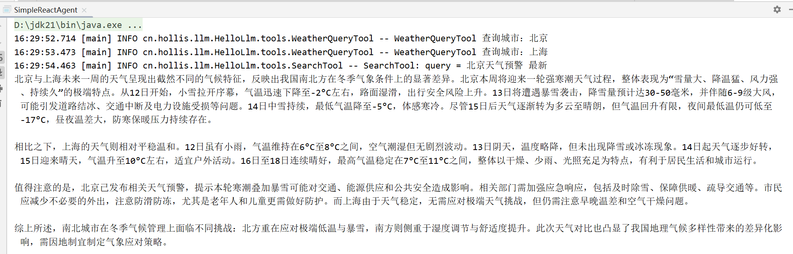
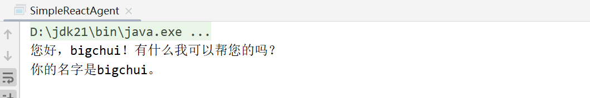

# ✅实战一：手搓 ReactAgent（非流式）

本章节将通过**从零手搓一套** `**SimpleReactAgent**`**（基于原生Spring AI来实现）**，带你深入理解 ReAct 在真实工程环境中的工作原理。

相比直接使用现成的 Agent 框架，这种方式能够让你清楚地看到：

-   **模型每一轮是如何做决策的**

-   **工具调用是如何被触发和执行的**

-   **ReAct 循环究竟是由模型驱动，还是由代码驱动**


当你真正走完整个实现过程后，**ReAct 将不再是一个“黑盒概念”，而是一套你可以随意拆解和重构的工程模式。**

在真正动手写代码之前，有一个非常重要的问题需要先回答清楚：

**一个 ReAct Agent，在工程结构上到底由哪些核心模块组成？**

为此，我们可以先结合之前的 ReAct Agent 结构图，从整体视角再理解一下完整的执行流程。


# 构成组件

在明确了 ReAct Agent 的整体结构之后，我们可以开始从代码层面定义 `SimpleReactAgent` 的核心组成。

结合前面结构图中展示的执行逻辑，一个基础且完整的 ReAct Agent 至少需要包含以下几类核心要素：

-   **用户输入（Query）与行为约束（Prompt）**

-   **用于推理与决策的 Model**

-   **用于执行具体动作的 Tools**


基于这一结构，我们首先在 `SimpleReactAgent` 中定义对应的核心属性：

```java
public class SimpleReactAgent {
    // react系统提示词
    public static final String REACT_AGENT_SYSTEM_PROMPT = """
            你是一个严格遵循 ReAct 模式的智能 AI 助手......
            """;
    // 智能体名称
    private final String name;
    // 模型
    private final ChatModel chatModel;
    // 工具
    private final List<ToolCallback> tools;
    // 用户注入的系统提示词
    private final String systemPrompt;
    // 功能增强
    private final List<Advisor> advisors;
    // 最大迭代轮次
    private int maxRounds;
    // 记忆模块
    private ChatMemory chatMemory;
}
```

接下来我们设计一下我们的系统提示词 **REACT\_AGENT\_SYSTEM\_PROMPT**，定义它的角色，调用规则，输出要求、规则等等。

```java
public static final String REACT_AGENT_SYSTEM_PROMPT = """
            ## 角色
            你是一个严格遵循 ReAct 模式的智能 AI 助手，会通过 Reasoning → Act(ToolCall) → Observation 的反复循环来逐步解决任务。

            ## 工具调用规则（极其重要）
            1. 如果需要调用工具：必须使用 OpenAI 官方 ToolCall 结构，并且 **只能通过工具调用字段输出**。
            2. 工具调用时：**禁止在 content 中出现任何形式的工具调用文本**（包括 JSON、<tool_call>、函数名、参数、思考、推理或描述）。
            3. 工具调用消息必须是一次性、原子性输出，不得混杂任何解释或内容。
            4. 工具调用前后不得输出任何多余文字、标签、换行、推理轨迹或说明。
            5. 调用工具时：
               -工具参数必须是有效的JSON
               -参数必须简洁，不超过500个字符
               -切勿包含以前的工具结果、原始内容、HTML或长文本
               -仅包括工具所需的最小控制参数

            ## 工具执行结果
            系统会自动将工具执行结果作为 ToolResponseMessage 注入上下文，你只需读取并决定下一步动作。

            ## 最终答案规则
            1. 如果上下文已经拥有了完成任务的全部信息，则不要再调用任何工具。
            2. 在这种情况下，你必须输出最终自然语言答案，且 **禁止包含任何工具调用格式**。
            3. 最终答案只允许是自然语言，不能包含 JSON、思考过程、reasoning、ToolCall 或伪代码。

            ## 强制要求（必须遵守）
            1. 工具调用消息必须只通过 ToolCall 字段输出，不允许在 content 字段体现工具调用迹象。
            2. 如果本轮没有工具调用，则视为任务完成，你必须输出最终答案。
            3. 不允许重复调用同一个工具（名称 + 参数完全一致），除非工具调用失败。
            4. 禁止输出会干扰工具系统解析的任何结构（如 <reason>、<ToolCall>、函数 JSON、或模型内部思考）。
            5. 如果上下文已经包含了完成任务的全部信息，则不要再调用任何工具。

            ## 反思机制
            如果在反思过程中，助手判断当前回答未能完全满足用户问题，或者达到最大反思轮次，你必须遵循以下规则：
            1. 尽最大可能利用当前已有的信息给出完整回答，即使信息不完全，也要合理推断或总结现有数据。
            2. 如果某些关键信息缺失，可在答案中用合理措辞提示用户，如“根据现有信息判断…”或“可进一步确认…”。
            3. 最终输出必须尽量满足用户需求，保证逻辑清晰、结论可靠、表达完整，即便未能完美覆盖所有反思反馈。
            """;
```

我们可以看出这个提示词，他的核心就是，**让大模型在输出的时候，如果是需要调工具则需要输出 tool\_call 字段，然后工具的执行结果，由我们程序自己会注入到上下文之中，当没有 tool\_call 的时候说明不需要再调用工具了，输出即结论。**

接下来就是初始化了，我们同样需要构造出 **ChatClient** 才可以。

```java
private void initChatClient() {
    try {
        ToolCallingChatOptions toolOptions = ToolCallingChatOptions.builder()
                .toolCallbacks(tools)
                .internalToolExecutionEnabled(false)
                .build();

        this.chatClient = ChatClient.builder(chatModel)
                .defaultOptions(toolOptions)
                .defaultToolCallbacks(tools)
                .build();
    } catch (Exception e) {
        throw new RuntimeException("ChatClient 初始化失败：" + e.getMessage(), e);
    }
}
```

这个地方就有个重点概念，就是 **internalToolExecutionEnabled。**

# **internalToolExecutionEnabled**

在初始化 `ChatClient` 时，有一个参数虽然看起来只是一个配置项，但实际上对 Agent 的整体行为具有决定性影响，这个参数就是 `internalToolExecutionEnabled`。在前面的课程中我们已经介绍过 Function Call 的基本机制。默认情况下，`ChatClient` 内部是具备**自动工具调用能力**的：当模型输出 ToolCall 后，框架会自动完成工具匹配、执行以及结果注入，并继续后续流程。这种模式对于单轮、一次性的工具调用场景非常友好，但它隐含了一个前提——**工具调用只是模型推理过程中的内部实现细节**。而 ReAct 并不是这样工作的。在 ReAct 模式下，工具调用不再是一次性的行为，而是 Agent 明确调度的一步执行动作。Agent 需要清楚地知道：当前是否进入了工具阶段、调用了哪些工具、工具执行完成后是否要继续下一轮推理。如果仍然依赖 `ChatClient` 的内部自动执行机制，这些关键的执行边界都会被框架吞掉，Agent 也就失去了对整个流程的掌控能力。因此，在 `SimpleReactAgent` 中我们需要显式关闭 `ChatClient` 的内部工具执行逻辑：

```java
ToolCallingChatOptions toolOptions = ToolCallingChatOptions.builder()
    .toolCallbacks(tools)
    .internalToolExecutionEnabled(false)
    .build();
```

这一行配置的含义就是：**模型只负责表达“我想调用什么工具”，而不再负责调用工具本身**。工具什么时候被调用、调用多少次、调用完成后如何处理结果，全部交由**开发者代码显式控制**。也正是通过这一点，你才能将原本框架自动调用工具的执行模式，转变为多轮决策与行动的 ReAct 模式。

可以说，`**internalToolExecutionEnabled(false)**` **是整个** `**SimpleReactAgent**` **能够成立的前提条件**。没有它，你得到的只会是一个会使用工具的 ChatBot；而有了它，**Agent 才真正掌握了行动控制权**，从而具备实现完整 ReAct 循环的能力。

# 主流程

下面的代码就是展示了一个完整的 React 流程。 是的，你没有看错：**实现一套基础且完整的 ReAct 模式，核心主流程代码只需要 100 行。**

```java
/**
 * 非流式输出
 *
 * @param question
 * @return
 */
public String call(String question) {
    return callInternal(null, question);
}

// 带会话id
public String call(String conversationId, String question) {
    return callInternal(conversationId, question);
}

public String callInternal(String conversationId, String question) {
    List<Message> messages = Collections.synchronizedList(new ArrayList<>());
    boolean useMemory = conversationId != null && chatMemory != null;

    // ===== 加载历史记忆 =====
    if (useMemory) {
        List<Message> history = chatMemory.get(conversationId);
        if (history != null && !history.isEmpty()) {
            messages.addAll(history);
        }
    }

    // ===== 加载 System Prompt（仅新会话，防止重复）=====
    if (messages.isEmpty()) {
        messages.add(new SystemMessage(REACT_AGENT_SYSTEM_PROMPT));
        messages.add(new SystemMessage(systemPrompt));
    }

    messages.add(new UserMessage("<question>" + question + "</question>"));

    // 添加记忆
    if (useMemory) {
        chatMemory.add(conversationId, new UserMessage(question));
    }

    int reflectionRound = 0;
    int round = 0;

    while (true) {
        round++;
        if (maxRounds > 0 && round > maxRounds) {
            log.warn("=== 达到 maxRounds（{}），强制生成最终答案 ===", maxRounds);
            ensureToolCallsClosed(messages);
            messages.add(new UserMessage("""
                    你已达到最大推理轮次限制。
                    请基于当前已有的上下文信息，
                    直接给出最终答案。
                    禁止再调用任何工具。
                    如果信息不完整，请合理总结和说明。
                    """));

            return chatClient.prompt().messages(messages).call().content();
        }

        ChatClientResponse chatResponse = chatClient
                .prompt()
                .messages(messages)
                .call()
                .chatClientResponse();

        String aiText = chatResponse.chatResponse().getResult().getOutput().getText();

        AssistantMessage.Builder builder = AssistantMessage.builder().content(aiText);

        // ===== 没有工具调用，视为最终答案 =====
        if (!chatResponse.chatResponse().hasToolCalls()) {
            if (useMemory) {
                chatMemory.add(conversationId, new UserMessage(question));
            }
            return aiText;
        }

        // ===== 有工具调用：执行工具 =====
        messages.add(builder.toolCalls(chatResponse.chatResponse().getResult().getOutput().getToolCalls()).build());

        chatResponse.chatResponse()
                .getResult()
                .getOutput()
                .getToolCalls()
                .forEach(toolCall -> {
                    String toolName = toolCall.name();
                    String argsJson = toolCall.arguments();

                    ToolCallback callback = findTool(toolName);
                    if (callback == null) {
                        addErrorToolResponse(messages, toolCall, "工具未找到：" + toolName);
                        return;
                    }

                    Object result;
                    try {
                        if (argsJson.length() > 2000) {
                            log.info("#################SimpleReactAgent call tool, toolName: {}, argsJson: 过长，超过2000字符###############", toolName);
                            addErrorToolResponse(
                                    messages,
                                    toolCall,
                                    "工具参数过长，拒绝执行！"
                            );
                            return;
                        }
                        log.info("#################SimpleReactAgent call tool, toolName: {}, argsJson: {}###############", toolName, argsJson);

                        result = callback.call(argsJson);
                        String safeJson;
                        safeJson = objectMapper.writeValueAsString(result);
                        ToolResponseMessage.ToolResponse tr = new ToolResponseMessage.ToolResponse(toolCall.id(), toolName, safeJson);

                        messages.add(ToolResponseMessage.builder().responses(List.of(tr)).build());
                    } catch (Exception ex) {
                        addErrorToolResponse(messages, toolCall, "工具执行失败：" + ex.getMessage());
                    }
                });
    }
}
```

我们再从结构图的视角重新审视这段代码，会发现 ReAct 的三个核心阶段在这里一一对应：

-   **Reasoning**由模型完成：`chatClient.prompt().messages(messages).call()`

-   **Act**通过`hasToolCalls()`判断是否进入工具阶段，并解析模型给出的 ToolCall，然后调用ToolCallback.call 方法，实现自主工具调用。

-   **Observation**执行完工具，并将 `ToolResponseMessage` 注入回 `messages`


而整个 ReAct 的“循环”本身，并不依赖任何框架，而是由一个最简单的`while(true)`循环来驱动。

这一点非常重要，也说明了 **ReAct 不是一种模型能力，而是一种由代码驱动的执行模式。**

## **构建上下文**

```java
List<Message> messages = Collections.synchronizedList(new ArrayList<>());
boolean useMemory = conversationId != null && chatMemory != null;

// ===== 加载历史记忆 =====
if (useMemory) {
    List<Message> history = chatMemory.get(conversationId);
    if (history != null && !history.isEmpty()) {
        messages.addAll(history);
    }
}

// ===== 加载 System Prompt（仅新会话，防止重复）=====
if (messages.isEmpty()) {
    messages.add(new SystemMessage(REACT_AGENT_SYSTEM_PROMPT));
    messages.add(new SystemMessage(systemPrompt));
}

messages.add(new UserMessage("<question>" + question + "</question>"));
```

ReAct 的一切，都是从上下文开始的。`**messages**`**不仅仅是聊天记录，也是 Agent 的状态容器**。它完整保存了：**历史会话记忆、React 模式提示词、系统提示词、用户问题、工具决策tool\_calls、工具执行结果**。`**messages**`**会在整个 ReAct 循环中不断地被扩展。**

## **进入循环**

```java
while (true) {
        round++;
        if (maxRounds > 0 && round > maxRounds) {
            log.warn("=== 达到 maxRounds（{}），强制生成最终答案 ===", maxRounds);
            ensureToolCallsClosed(messages);
            messages.add(new UserMessage("""
                    你已达到最大推理轮次限制。
                    请基于当前已有的上下文信息，
                    直接给出最终答案。
                    禁止再调用任何工具。
                    如果信息不完整，请合理总结和说明。
                    """));

            return chatClient.prompt().messages(messages).call().content();
        }
    ChatClientResponse chatResponse = chatClient
                    .prompt()
                    .messages(messages)
                    .call()
                    .chatClientResponse();
```

进入循环首先会有一个`maxRounds`的判断，如果`maxRounds`设置的是小于等于0的则表示无限制循环，接下来会首先在每一轮开始，判断当前迭代轮次是否已经超过`maxRounds`了，如果达到，则强制利用当前的迭代信息输出答案。**这边有个**`**ensureToolCallsClosed**`**需要注意，这是一个坑，Openai规范要求，必须带有**`**tool_call**`**的**`**AssistantMessage**`**后面跟着的是**`**ToolResponseMessage**`**，否则就会报错400**，所以这个地方，我们需要做一个兼容性的处理，给最后一个tool\_call拼上一个空的结果即可。

org.springframework.ai.retry.NonTransientAiException: 400 - {"error":{"message":"<400> InternalError.Algo.InvalidParameter: An assistant message with \\"tool\_calls\\" must be followed by tool messages responding to each \\"tool\_call\_id\\". The following tool\_call\_ids did not have response messages: message\[7\].role","type":"invalid\_request\_error","param":null,"code":"invalid\_parameter\_error"},"id":"chatcmpl-1714d553-c4c9-40ba-be9c-fc7101c593a0","request\_id":"1714d553-c4c9-40ba-be9c-fc7101c593a0"}

```java
private void ensureToolCallsClosed(List<Message> messages) {
    if (messages.isEmpty()) {
        return;
    }

    Message last = messages.get(messages.size() - 1);

    if (!(last instanceof AssistantMessage assistantMsg)) {
        return;
    }

    List<AssistantMessage.ToolCall> toolCalls = assistantMsg.getToolCalls();
    if (toolCalls == null || toolCalls.isEmpty()) {
        return;
    }

    List<ToolResponseMessage.ToolResponse> responses = new ArrayList<>();

    for (AssistantMessage.ToolCall tc : toolCalls) {
        responses.add(new ToolResponseMessage.ToolResponse(tc.id(), tc.name(), ""));
    }

    messages.add(
            ToolResponseMessage.builder()
                    .responses(responses)
                    .build()
    );
}
```

接下来就是正式进入循环，首先需要调用一次模型请求，主要目的有两个：

-   **把当前完整上下文交给模型**

-   **让模型基于“已知信息”做一次决策**


## 读取模型决策结果

模型的决策结果会有两种形态返回，一种是带有 tool\_call 的表示还需要继续调用工具，另一种是不带有 tool\_call 的，表示目前的信息不需要调用工具了，可以直接返回最终结论了。

```java
String aiText = chatResponse.chatResponse().getResult().getOutput().getText();
AssistantMessage.Builder builder = AssistantMessage.builder().content(aiText);
if (!chatResponse.chatResponse().hasToolCalls()) {
    return aiText;
}
```

## 调用工具

```java
messages.add(builder.toolCalls(chatResponse.chatResponse().getResult().getOutput().getToolCalls()).build());
chatResponse.chatResponse().getResult().getOutput().getToolCalls().forEach(toolCall -> {
    String toolName = toolCall.name();
    String argsJson = toolCall.arguments();

    ToolCallback callback = findTool(toolName);
    if (callback == null) {
        addErrorToolResponse(messages, toolCall, "工具未找到：" + toolName);
        return;
    }

    Object result;
    try {
        result = callback.call(argsJson);
    } catch (Exception ex) {
        addErrorToolResponse(messages, toolCall, "工具执行失败：" + ex.getMessage());
        return;
    }

    ToolResponseMessage.ToolResponse tr =
            new ToolResponseMessage.ToolResponse(toolCall.id(), toolName,
                    Objects.toString(result, ""));

    messages.add(ToolResponseMessage.builder()
            .responses(List.of(tr))
            .build());
});
```

在模型返回 ToolCall 之后，Agent 并不会立刻执行工具，而是**先将包含 ToolCall 的** `**AssistantMessage**` **追加到** `**messages**` **中。这一步的目的，是把模型本轮的“行动决策”补充为上下文的一部分**，使得后续的推理过程可以完整感知自己已经做过哪些尝试。ToolCall 在这里并不代表执行结果，而仅仅是模型表达出来的行动意图，只有当这一意图被记录进上下文后，整个 ReAct 的状态才是连续且可回溯的。随后，Agent 遍历所有 ToolCall，显式查找并调用对应的工具实现，工具执行过程中出现的异常也由 Agent 统一兜底处理。每一次工具调用的真实结果，都会被封装为 `ToolResponseMessage` 并再次写入 `messages`，作为下一轮推理的 Observation 输入给模型。通过这种方式，模型始终只负责决策是否行动，而 Agent 则完整掌控行动的执行与结果回流，从而在一个 `while` 循环中自然地形成了 ReAct 的 Act → Observation 闭环。

# Builder

为了方便使用，这里采用 Builder 模式来构建 `SimpleReactAgent`，一方面避免构造函数参数过多带来的可读性问题，另一方面也方便在不影响主流程的情况下逐步扩展 Agent 能力。

```java
public static class Builder {
    private String name;
    private ChatModel chatModel;
    private List<ToolCallback> tools;
    private String systemPrompt = "";

    private int maxReflectionRounds;

    private int maxRounds;

    private List<Advisor> advisors;

    private ChatMemory chatMemory;

    public Builder chatMemory(ChatMemory chatMemory) {
        this.chatMemory = chatMemory;
        return this;
    }

    public Builder name(String name) {
        this.name = name;
        return this;
    }

    public Builder chatModel(ChatModel chatModel) {
        this.chatModel = chatModel;
        return this;
    }

    public Builder tools(ToolCallback... tools) {
        this.tools = Arrays.asList(tools);
        return this;
    }

    public Builder tools(List<ToolCallback> tools) {
        this.tools = tools;
        return this;
    }

    public Builder advisors(List<Advisor> advisors) {
        this.advisors = advisors;
        return this;
    }

    public Builder advisors(Advisor... advisors) {
        this.advisors = Arrays.asList(advisors);
        return this;
    }

    public Builder systemPrompt(String systemPrompt) {
        this.systemPrompt = systemPrompt;
        return this;
    }

    public Builder maxReflectionRounds(int maxReflectionRounds) {
        this.maxReflectionRounds = maxReflectionRounds;
        return this;
    }

    public Builder maxRounds(int maxRounds) {
        this.maxRounds = maxRounds;
        return this;
    }

    public SimpleReactAgent build() {
        if (chatModel == null) {
            throw new IllegalArgumentException("chatModel 不能为空！");
        }
//            if (tools == null || tools.isEmpty()) {
//                throw new IllegalArgumentException("tools 不能为空！");
//            }
        return new SimpleReactAgent(name, chatModel, tools, advisors, systemPrompt, maxReflectionRounds, maxRounds, chatMemory);
    }
}
```

# 效果演示

这边我准备了2个工具，一个工具是查天气，一个是搜索引擎（两个工具返回的数据都是模拟数据）

```java
public static void main(String[] args) {
    String baseUrl = "https://dashscope.aliyuncs.com/compatible-mode/";
    String apiKey = "sk-XXXXXXXXXXXXXXXXXXXXXXXX";
    String modelName = "qwen-plus";

    OpenAiChatOptions opts = new OpenAiChatOptions();
    opts.setModel(modelName);
    opts.setMaxTokens(3000);
    opts.setTemperature(0.7);

    ChatModel chatModel = OpenAiChatModel.builder()
            .openAiApi(OpenAiApi.builder()
                    .baseUrl(baseUrl)
                    .apiKey(new SimpleApiKey(apiKey))
                    .build())
            .defaultOptions(opts)
            .build();

    ToolCallback weatherTool = FunctionToolCallback
            .builder("weather", new WeatherQueryTool())
            .description("查询指定城市的实时天气和未来一周天气趋势")
            .inputType(String.class)
            .build();

    ToolCallback searchTool = FunctionToolCallback
            .builder("search", new SearchTool())
            .description("搜索指定关键词的信息，补充天气分析所需的背景数据")
            .inputType(String.class)
            .build();

    SimpleReactAgent agent = SimpleReactAgent.builder()
            .name("simple-agent")
            .chatModel(chatModel)
            .maxRounds(-1)
            .tools(weatherTool, searchTool)
            .systemPrompt("你是专业的研究分析助手！")
            .build();

    String question = """
            请你根据北京今天的天气、未来七天的天气趋势、以及上海今天的天气，并搜索北京天气的预警情况，生成一份不少于 600 字的综合分析报告。
            """;

    System.out.println(agent.call(question));
}
```



再尝试下历史记忆：

```java
    // 也可以使用带历史记忆的
    System.out.println(agent.call("123", "我的名字叫bigchui"));
    System.out.println(agent.call("123", "我的名字是什么？"));
```



# 总结

整体来看，`SimpleReactAgent` 的结构非常直观：`messages` 用来承载整个对话和状态，`ChatModel` 只负责做决策，`ToolCallback` 提供具体的执行能力，通过 Agent 显式控制工具的调用与结果回传，在一个简单的循环中就完成了完整的 ReAct 推理过程。后续的课程中，我也会继续带大家一步步增强这个 Agent，让大家在理解其结构清晰性的同时，也能切身体会到它良好的扩展能力。虽然在具体实现上与 Alibaba 官方的 ReactAgent 在智能体结构、调度方式和状态管理等方面存在一些差异，但在核心思想上是一致的：都遵循“模型负责思考，Agent 负责行动”的原则。因此，一旦你理解了 `SimpleReactAgent` 的设计，再去看官方实现或其他 ReAct 框架，整体使用和理解成本都会非常低。
