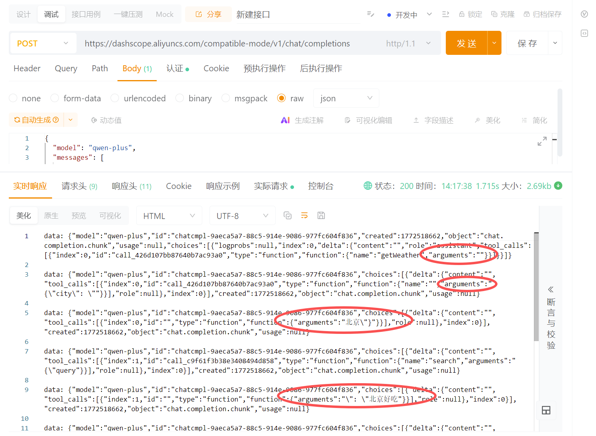
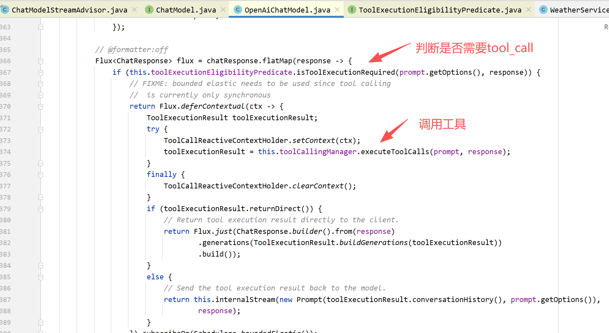

# ✅ReAct Agent 流式输出后续问题

# tool\_call出现时机

我在后续切换使用其他模型的时候，发现不同模型他的返回的行为方式是有一些差异的。

比如我一开始使用我们公司自己微调量化出来的qwen32b模型，他在进行流式输出的时候，如果需要调用工具，那么第一块chunk确实是直接输出的tool\_call，如果没有工具调用那么就是直接输出content。所以我在上文中给大家讲解的 processChunk 方法中的处理也是按照这种方式来处理的，通过对第一块chuck的判断来决定后续的处理模式。

但是当我在切换模型的时候，比如使用百炼平台的qwen模型的时候，他流式输出的方式其实是会受到我的提示词影响的。

后来我发现是因为提示词有这么一段内容的时候，大模型会严格按照ReAct模式来思考问题，所以他的流式输出，就算是需要调用工具，他一开始也会输出那么一段think的过程。


我们直接把这段角色定义的内容copy出来，直接调用qwen的api来看下现象：


我们可以看到他的最后才输出了tool\_call，而前面是输出了一段think的过程放置到content之中。

那我们去掉这段角色定义，再来看下现象：


我们可以看到去除掉React角色定义后啊，他的tool\_call从一开始就输出出来了。换句话说，也就是大模型他的指令遵循能力越强，他越有可能去输出这么一段think的过程。当然还是那句话，大模型的输出是具有随机性的，也不是说他一定就会这么输出一段think，但是我们从代码层面来说肯定是不能再按照前面那种方式来判断是工具模式还是最终输出模式了。那应该怎么改呢？我们来看代码。

核心问题还是在processChunk这个方法上，我们改成以下的方式来进行判断：

```java
private void processChunk(ChatResponse chunk, Sinks.Many<String> sink, RoundState state) {

        if (chunk == null || chunk.getResult() == null ||

                chunk.getResult().getOutput() == null) return;

        Generation gen = chunk.getResult();

        String text = gen.getOutput().getText();

        List<AssistantMessage.ToolCall> tc = gen.getOutput().getToolCalls();

        // 一旦发现 tool_call，立即进入 TOOL_CALL 模式

        if (tc != null && !tc.isEmpty()) {

            state.mode = RoundMode.TOOL_CALL;

            state.toolCalls.addAll(tc);

            return;

        }

        // 还没出现 tool_call，发送并缓存文本

        if (text != null) {

            sink.tryEmitNext(text);

            state.textBuffer.append(text);

        }

    }
```

我们只需要判断这一轮中，如果出现了tool\_call则进入工具调用模式，如果没有出现，则认为就是普通的文本，直接使用sink输出就好了。

那同样，我们还需要调整一下finishRound方法：

```java
private void finishRound(List<Message> messages, Sinks.Many<String> sink, RoundState state, AtomicLong roundCounter, AtomicBoolean hasSentFinalResult, StringBuilder finalAnswerBuffer, boolean useMemory, String conversationId) {

        // 如果整轮都没有 tool_call，才是最终答案

        if (state.mode != RoundMode.TOOL_CALL) {

            String finalText = state.textBuffer.toString();

            sink.tryEmitComplete();

            hasSentFinalResult.set(true);

            if (useMemory) {

                chatMemory.add(conversationId, new AssistantMessage(finalText));

            }

            return;

        }

        // TOOL_CALL

        AssistantMessage assistantMsg = AssistantMessage.builder().toolCalls(state.toolCalls).build();

        messages.add(assistantMsg);

        if (maxRounds > 0 && roundCounter.get() >= maxRounds) {

            forceFinalStream(messages, sink, hasSentFinalResult);

            return;

        }

        executeToolCalls(state.toolCalls, messages, hasSentFinalResult, () -> {

            if (!hasSentFinalResult.get()) {

                scheduleRound(messages, sink, roundCounter,

                        hasSentFinalResult, finalAnswerBuffer,

                        useMemory, conversationId);

            }

        });

    }
```

当整轮都没有tool\_call的时候，那就是最终答案了，我们需要complete对话，结束流程，后续流程还是保持不变，继续工具调用。

# tool\_call分段如何处理（视频中暂未提及，后期补）

这个问题的现象不是必现的，他是跟模型的特点以及工具调用参数的复杂度有关，会导致arguments不是一次性返回，而是被拆分成了多个chunk，如下图所示：



这个现象在springai 1.1.x版本中也是存在的，时不时的他就会报错，完全依赖模型的行为，模型一次性输出tool\_call他就ok，多次分块输出他就不行了。他的流式源码如下：



这种的话，就有可能报错：

java.lang.IllegalArgumentException: toolName cannot be null or empty

Tool call arguments are null or empty for tool: getWeather. Using empty JSON object as default.

那我们既然用ReactAgent接管了工具调用的权利，那我们应该怎么做。

正确的逻辑则应该是：

**检测到chunk是tool\_call，判定进入工具模式，然后就是收集工具的chunk，也就是arguments，拼接所有的arguments，直到tool\_call结束，发起工具调用。**

修改ReactAgent的代码：增加mergeToolCall方法，拼接arguments即可。

```java
 private void processChunk(ChatResponse chunk, Sinks.Many<String> sink, RoundState state) {

        if (chunk == null || chunk.getResult() == null ||

                chunk.getResult().getOutput() == null) return;

        Generation gen = chunk.getResult();

        String text = gen.getOutput().getText();

        List<AssistantMessage.ToolCall> tc = gen.getOutput().getToolCalls();

        // 一旦发现 tool_call，立即进入 TOOL_CALL 模式

        if (tc != null && !tc.isEmpty()) {

            state.mode = RoundMode.TOOL_CALL;

            for (AssistantMessage.ToolCall incoming : tc) {

                mergeToolCall(state, incoming);

            }

            return;

        }

        // 还没出现 tool_call，发送并缓存文本

        if (text != null) {

            sink.tryEmitNext(text);

            state.textBuffer.append(text);

        }

    }
```

```java
private void mergeToolCall(RoundState state, AssistantMessage.ToolCall incoming) {

        for (int i = 0; i < state.toolCalls.size(); i++) {

            AssistantMessage.ToolCall existing = state.toolCalls.get(i);

            if (existing.id().equals(incoming.id())) {

                String mergedArgs = Objects.toString(existing.arguments(), "") + Objects.toString(incoming.arguments(), "");

                state.toolCalls.set(i,

                        new AssistantMessage.ToolCall(existing.id(), "function", existing.name(), mergedArgs)

                );

                return;

            }

        }

        // 新的 toolcall

        state.toolCalls.add(incoming);

    }
```

```java
 /**

     * 轮次结束处理工具调用

     */

    private void finishRound(List<Message> messages, Sinks.Many<String> sink, RoundState state, AtomicLong roundCounter, AtomicBoolean hasSentFinalResult, StringBuilder finalAnswerBuffer, boolean useMemory, String conversationId) {

        // 如果整轮都没有 tool_call，才是最终答案

        if (state.mode != RoundMode.TOOL_CALL) {

            String finalText = state.textBuffer.toString();

            sink.tryEmitComplete();

            hasSentFinalResult.set(true);

            if (useMemory) {

                chatMemory.add(conversationId, new AssistantMessage(finalText));

            }

            return;

        }

        // TOOL_CALL

        AssistantMessage assistantMsg = AssistantMessage.builder().toolCalls(state.toolCalls).build();

        messages.add(assistantMsg);

        if (maxRounds > 0 && roundCounter.get() >= maxRounds) {

            forceFinalStream(messages, sink, hasSentFinalResult);

            return;

        }

        executeToolCalls(state.toolCalls, messages, hasSentFinalResult, () -> {

            if (!hasSentFinalResult.get()) {

                scheduleRound(messages, sink, roundCounter,

                        hasSentFinalResult, finalAnswerBuffer,

                        useMemory, conversationId);

            }

        });

    }
```
