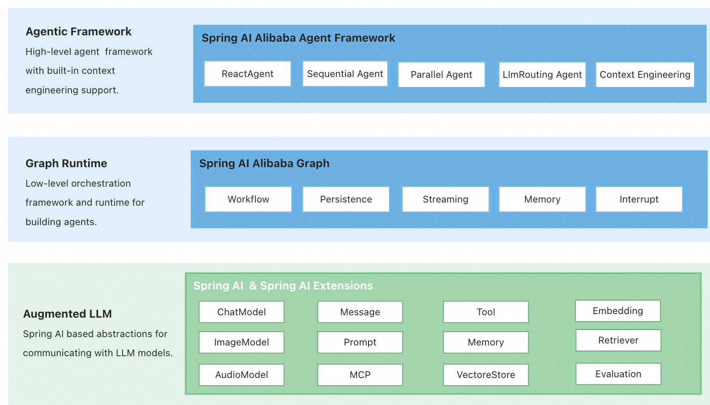

# ✅Spring AI Alibaba Graph的使用

前面我们介绍的都是LangGraph，但是，对于Java开发来说，在Java中如何实现呢？

在Spring AI Alibaba 1.1推出之前，想要实现还是比较复杂的（幸好在写文档的2天前，1.1正式版推出了，要不然.......）。

引用一下官方说明：


Spring AI Alibaba Graph 可以改变您构建智能代理的思维方式。使用 Graph 构建代理时，您将首先把它分解为称为节点（nodes）的离散步骤。然后，描述每个节点的不同决策和转换。最后，通过一个共享的状态（state）将节点连接起来，每个节点都可以读取和写入该状态。在本教程中，我们将指导您完成使用 Spring AI Alibaba Graph 构建客服邮件处理代理的思维过程。


在这个版本中，Spring AI Alibaba 项目从架构上包含如下三层：

-   Agent Framework，是一个以 ReactAgent 设计理念为核心的 Agent 开发框架，使开发者能够构建具备自动上下文工程和人机交互等核心能力的Agent。

-   Graph，graph 是一个低级别的工作流和多代理协调框架，能够帮助开发者实现复杂的应用程序编排，它具备丰富的预置节点和简化的图状态定义，Graph 是 Agent Framework 的底层运行时基座。

-   Augmented LLM，以 Spring AI 框架底层原子抽象为基础，为构建大型语言模型（LLM）应用提供基础抽象，例如模型（Model）、工具（Tool）、多模态组件（MCP）、消息（Message）、向量存储（Vector Store）等。




### Graph

Graph 是 Agent Framework 的底层运行时基座，是一个低级工作流和多智能体编排框架。它通过 Graph、State、Node 和 Edge、CheckPointer、等概念，使开发者能够实现复杂的应用程序编排。这些概念是不是很熟悉，没错，和LangGraph是一样的。所以我们就不展开再介绍一遍了。

### 接入

想要使用的话，需要增加依赖spring-ai-alibaba-agent-framework：

```xml
<dependencies>
  <!-- Spring AI Alibaba Agent Framework -->
  <dependency>
    <groupId>com.alibaba.cloud.ai</groupId>
    <artifactId>spring-ai-alibaba-agent-framework</artifactId>
    <version>1.1.0.0-M5</version>
  </dependency>

  <!-- DashScope ChatModel 支持 -->

  <dependency>
    <groupId>com.alibaba.cloud.ai</groupId>
    <artifactId>spring-ai-alibaba-starter-dashscope</artifactId>
    <version>1.1.0.0-M5</version>
  </dependency>
</dependencies>
```

我们试着把之前的LangGraph实现的“研究助手”改写成Java的。

（这部分改造内容详见代码和视频吧）

### 使用Graph的流程

1、定义State


我们先要定义一个state，里面约定好都有哪些字段，以及他们的类型，并且指定更新的方式（覆盖还是追加）。

```java
KeyStrategyFactory keyStrategyFactory = () -> {
      Map<String, KeyStrategy> keyStrategyMap = new HashMap<>();

      // 用户原始问题
      // ReplaceStrategy
      keyStrategyMap.put("question", new ReplaceStrategy());

      // Planner 制定的计划（步骤列表）
      keyStrategyMap.put("plan", new AppendStrategy());

      // Researcher 搜集到的研究内容
      keyStrategyMap.put("researchNotes", new ReplaceStrategy());

      // Writer 生成的报告草稿
      keyStrategyMap.put("draft", new ReplaceStrategy());

      // Reviewer 的反馈
      keyStrategyMap.put("feedback", new ReplaceStrategy());

      // 是否通过审核
      keyStrategyMap.put("approved", new ReplaceStrategy());

      // 当前轮次（防止无限循环）
      keyStrategyMap.put("revisionCount", new ReplaceStrategy());

      return keyStrategyMap;
  };
```

如以上方式，我们定义了几个字段，包括plan、approved、draft等，这些字段的值在整个graph的运行过程中都是存在的，并且在每一个节点中也可以"修改"他们（这里的修改不是直接改state，而是建议如何修改）。

2、定义Node

每一个Node都是一个单独的函数，在Java中，可以定义为一个单独的类，然后让他实现NodeAction接口，重写apply方法。这个apply方法的实现就就是这个节点需要做的事情。

```java
public class PlannerNode implements NodeAction {

  private static final Logger logger = LoggerFactory.getLogger(PlannerNode.class);

  private final ChatClient chatClient;

  public PlannerNode(ChatClient chatClient) {
      this.chatClient = chatClient;
  }

  @Override
  public Map<String, Object> apply(OverAllState state) throws Exception {
      logger.info("📋 [Planner] 正在制定研究计划...");

      String question = state.value("question", "");

      String promptTemplate = String.format("""
              用户问题：%s
              请制定一个清晰的研究计划，分3-5个具体步骤，每步说明要查什么。
              只输出步骤列表，不要解释。
              每个步骤单独一行。
              """, question);

      // 调用AI模型
      Flux<String> streamResult = this.chatClient.prompt()
              .user(promptTemplate)
              .stream()
              .content();

      String result = streamResult.reduce("", (acc, item) -> acc + item).block();

      // 解析步骤列表
      List<String> planSteps = Arrays.stream(result.split("\n"))
              .map(String::trim)
              .filter(step -> !step.isEmpty())
              .collect(Collectors.toList());

      logger.info("📋 [Planner] 制定了 {} 个研究步骤", planSteps.size());

      for(int i = 0; i < planSteps.size(); i++){
          logger.info("  [步骤 {}]: {}", i + 1, planSteps.get(i));
      }

      Map<String, Object> resultMap = new HashMap<>();
      resultMap.put("plan", planSteps);
      return resultMap;
  }
}
```

这里面最后要返回一个map，其中的key可以是前面state中定义过的，这时候就相当于在"修改"了。

3、定义Graph

有了state和node之后，我么就可以用edge把他们连起来了。这时候就可以定义一个graph，然后用edge把各个node连接起来。

```java
// 构建工作流图
StateGraph stateGraph = new StateGraph(keyStrategyFactory)
    // 添加所有节点
    .addNode("planner", node_async(new PlannerNode(chatClient)))
    .addNode("researcher", node_async(new ResearcherNode(chatClient)))
    .addNode("writer", node_async(new WriterNode(chatClient)))
    .addNode("reviewer", node_async(new ReviewerNode(chatClient)))

    // 设置线性流程：START -> planner -> researcher -> writer -> reviewer
    .addEdge(StateGraph.START, "planner")
    .addEdge("planner", "researcher")
    .addEdge("researcher", "writer")
    .addEdge("writer", "reviewer")

    // 评审后可能回到 writer（形成反思循环！）
    .addConditionalEdges("reviewer",
        edge_async(new ReviewerRouteAction()),
        Map.of("writer", "writer", "end", StateGraph.END)
    );
```

通过StateGraph定义一个Graph，通过addNode来设置节点，通过addEdge来定义边，同时可以用addConditionalEdges添加一些有条件的边。

4、编译成CompiledGraph

有了Graph之后，想要使用他的话，需要把它编译成CompiledGraph：

```java
this.compiledGraph = stateGraph.compile();
```

5、运行工作流

通过以下方式，就可以运行工作流了，支持2个参数，一个是state，一个是一些运行时需要的配置。

```java
compiledGraph.invoke(initialState, runnableConfig);
```

运行结果是一个Optional<OverAllState>，这里面是一个State，可以从这里面拿出我们前面定义过的那些字段的内容，比如draft等。
