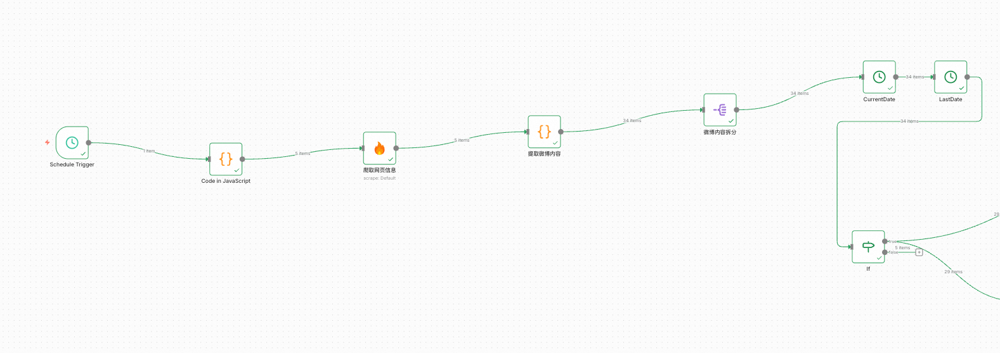

# ✅工作流实战：舆情分析助手——微博内容提取

我们拿到前5页网页爬取后的结果之后，就需要把里面的微博内容解析出来，前面说过了，直接用他的json内置的prompt方式解析会出现丢数据的情况，于是我想到的是自己写代码解析，于是：


新建一个微博内容提取的code节点，其中的代码如下：

```java
// Loop over input items and add a new field called 'myNewField' to the JSON of each one
// 基准当前时间
  const offsetHours = 8;
  const now = new Date();
  const utc = now.getTime() + (now.getTimezoneOffset() * 60000);
  const NOW = new Date(utc + (offsetHours * 3600000));

  function parseWeiboTime(raw) {
    raw = raw.trim();

    // 1. 已是标准格式：2023-10-23 21:48
    if (/^\d{4}-\d{2}-\d{2}\s+\d{1,2}:\d{2}$/.test(raw)) {
      return raw + ':00';
    }

    // 2. X秒前
  const secMatch = raw.match(/^(\d+)秒前$/);
  if (secMatch) {
    const secs = parseInt(secMatch[1], 10);
    const dt = new Date(NOW.getTime() - secs * 1000);
    return dt.toISOString().replace('T', ' ').substring(0, 19);
  }

  // 3. X分钟前
  const minMatch = raw.match(/^(\d+)分钟前$/);
  if (minMatch) {
    const mins = parseInt(minMatch[1], 10);
    const dt = new Date(NOW.getTime() - mins * 60 * 1000);
    return dt.toISOString().replace('T', ' ').substring(0, 19);
  }

  // 4. X小时前
  const hourMatch = raw.match(/^(\d+)小时前$/);
  if (hourMatch) {
    const hours = parseInt(hourMatch[1], 10);
    const dt = new Date(NOW.getTime() - hours * 60 * 60 * 1000);
    return dt.toISOString().replace('T', ' ').substring(0, 19);
  }

    // 5. 今天HH:mm
    const todayMatch = raw.match(/^今天(\d{1,2}):(\d{2})$/);
    if (todayMatch) {
      const h = parseInt(todayMatch[1], 10);
      const m = parseInt(todayMatch[2], 10);
      const dt = new Date(NOW);
      dt.setHours(h + 8, m, 0, 0);
      return dt.toISOString().replace('T', ' ').substring(0, 19);
    }

    // 6. MM月DD日 HH:mm
    const monthDayMatch = raw.match(/^(\d{1,2})月(\d{1,2})日\s+(\d{1,2}):(\d{2})$/);
    if (monthDayMatch) {
      const month = parseInt(monthDayMatch[1], 10) - 1; // JS 月份从 0 开始
      const day = parseInt(monthDayMatch[2], 10);
      const h = parseInt(monthDayMatch[3], 10) + 8;
      const m = parseInt(monthDayMatch[4], 10);

      let year = NOW.getFullYear();
      const candidate = new Date(year, month, day, h, m, 0);

      // 如果解析出的日期比 NOW 还晚（比如 12月2日 在 12月1日看就是未来），则减一年
      if (candidate > NOW) {
        year -= 1;
      }

      const dt = new Date(year, month, day, h, m, 0);
      const pad = n => n.toString().padStart(2, '0');
      return `${dt.getFullYear()}-${pad(dt.getMonth() + 1)}-${pad(dt.getDate())} ${pad(dt.getHours())}:${pad(dt.getMinutes())}:00`;
    }

    // 5. 无法识别，返回原始 + 补00秒（保守处理）
    if (/^\d{4}-\d{2}-\d{2}\s+\d{1,2}:\d{2}:\d{2}$/.test(raw)) {
      return raw;
    }
    // 兜底：尝试直接补 :00
    if (raw.includes(':') && !raw.includes(':00')) {
      return raw + ':00';
    }
    return raw; // 保留原样
  }
const posts = [];

for (const item of $input.all()) {
  // === 主提取逻辑 ===
  const blocks = item.json.data.markdown.split(/\n-\s*转发\s*\n/);

  const inlineImageRegex = /\[\]\((https?:\/\/[^\s\)]+\.(?:jpg|jpeg|png|gif))\)/gi;

  for (const block of blocks) {
    const userPattern = /\[!\[.*?\]\((https?:\/\/[^\s\)]+)\)\]\((https?:\/\/[^\s\)]+)\)\s*\n\s*\[([^\]]+)\]\((https?:\/\/[^\s\)]+)\)(?:\s*\n\s*\[!\[.*?\]\(.*?\)\])?\s*\n\s*\[([^\]]+)\]\((https?:\/\/[^\s\)]+)\)/;
    const userMatch = block.match(userPattern);
    if (!userMatch) continue;

    const username = userMatch[3];
    const userLink = userMatch[4];
    const rawPostTime = userMatch[5];
    const postTimeLink = userMatch[6];

    // ✅ 标准化时间
    const postTime = parseWeiboTime(rawPostTime);

    let rawContent = block.slice(userMatch.index + userMatch[0].length).trim();
    const cutOffIndex = rawContent.search(/\n-\s*(\[\]\(https?:\/\/.*?\.(?:jpg|png|gif)\)|\d+|转发|评论|赞)/i);
    if (cutOffIndex !== -1) {
      rawContent = rawContent.slice(0, cutOffIndex).trim();
    }

    let content = rawContent
      .replace(/\[展开 _c_\]\([^)]*\)/g, '')
      .replace(/收起 _d_/g, '')
      .replace(/\s+/g, ' ')
      .trim();

    content = content.replace(/^来自\s*\[[^\]]+\]\([^)]*\)\s*/, '').trim();

    // 提取并移除内联图片
    const inlineImages = [];
    let imgMatch;
    while ((imgMatch = inlineImageRegex.exec(content)) !== null) {
      inlineImages.push(imgMatch[1]);
    }
    content = content.replace(inlineImageRegex, '').replace(/\s+/g, ' ').trim();

    // 提取列表图片
    const listImages = [];
    const listImageRegex = /-\s*\[\]\((https?:\/\/[^\s\)]+\.(?:jpg|jpeg|png|gif))\)/gi;
    let listMatch;
    while ((listMatch = listImageRegex.exec(block)) !== null) {
      listImages.push(listMatch[1]);
    }

    const imageUrls = [...new Set([...inlineImages, ...listImages])];

    const hashtags = [...new Set(
      content.match(/#([^#\s]+)#?/g)?.map(tag => tag.replace(/^#|#$| $/g, '')) || []
    )];

    // ✅ 新增：从微博链接提取唯一ID
  function extractWeiboId(url) {
    try {
      const cleanUrl = url.split('?')[0]; // 移除查询参数
      const parts = cleanUrl.split('/');
      return parts[parts.length - 1] || null;
    } catch (e) {
      return null;
    }
  }

    const weiboId = extractWeiboId(postTimeLink); // ✅ 提取唯一ID

    posts.push({
      weiboId,
      username,
      userLink,
      postTime,          // ← 已标准化为 YYYY-MM-DD HH:mm:ss
      postTimeLink,
      content,
      imageUrls,
      hashtags
    });
  }

}

return posts;
```

值得注意的是关于时间的处理，一方面是微博显示的时间有很多种，比如xx秒前，XX分钟前，今天xx:xx、xx月xx日 xx:xx等等，而且时区默认还不太对，所以我们大多数代码都在处理这个时间的问题。


关于时区，N8N默认是美国时区，我们可以在启动的时候指定时区：


TZ=Asia/Shanghai GENERIC\_TIMEZONE=Asia/Shanghai npx n8n


经过这个节点处理字后，就是几个时间处理和判断的节点，主要是做了些限制：只爬取24小时内的数据。这个不展开说了，大家到时候把我的配置导入n8n查看下就行了。



