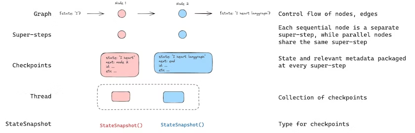

# ✅什么是上下文工程？

前面我们介绍过了，过长的上下文，会带来幻觉、token爆炸、超出上下文窗口限制、不稳定、效果差、性能差等问题。这些问题，通过传统的提示词工程已经无法解决了。（哈哈哈，提示词工程都变成传统手艺了），因为上下文不仅仅包括提示词。

于是，针对整个上下文做优化的上下文工程就应运而生了。**提示词工程是关注和大模型说什么，上下文工程是关注让大模型看到什么。**

还记得我们在RAG的时候提到过的：Garbage in ，Garbage out么？上下文工程其实也是在不断地优化上下文，让智能体（LLM）只看到**恰到好处**的上下文信息。

**大语言模型（LLM）像一种新型操作系统，而它的上下文窗口就是 RAM（工作内存）。**上下文工程，就相当于操作系统的内存管理器——决定哪些数据该加载进 RAM，哪些该移除或压缩。

LangChain在2025年7月发布了一篇文章《Context Engineering for Agents》，从Agent开发的角度来看，为了让Agent的上下文恰到好处，文章将上下文工程方法归纳为四个过程：**Write（写入）、Select（选择）、Compress（压缩）、Isolate（隔离）**。

## **Write（写入）**

**目的**：把重要信息**保存到上下文窗口之外**，供后续使用。实现上下文写入的方案通常有两种，一种叫**Scratchpad（草稿板/短期记忆），**另外一种是**Long Term** **Memory（长期记忆）。**

### **Scratchpad（草稿板/短期记忆）**

所谓草稿版，就是他不是最终输出，而是**工作过程中的临时笔记。**

比如LangGraph中使用Checkpoint来实现类似的功能，每次智能体执行一个“超步”（super-step，即完成一轮节点计算），LangGraph 会自动将当前**完整状态（state）** 保存为一个 **checkpoint（检查点）**。这些 checkpoint 按 **thread\_id（线程 ID）** 归档，代表一次独立的用户会话或任务实例。开发者可通过 `graph.update_state()` 主动向状态中**写入信息**（如计划、工具结果、错误日志等）。

就像我们的Spring AI中的conversation\_id一样，也是类似的方案。

###

### **Long Term** **Memory（长期记忆）**

关于长期记忆，我们有专门的章节介绍，详见：

> **📄 ✅什么是长期记忆**
>
> 前面我们讲过，Agent的记忆能力必不可少。Agent 的“记忆”是指其在与环境或用户交互过程中，用于存储、检索和利用信息的机制。这些信息可以包括： 没有记忆的 Agent 只能处理孤立的请求，无法实现上下文感知、个性化服务或持续改进。
>
> 来源：LLMentor

## **Select（选择）**

有了前面的上下文写入之后，还需要有一个能提取这些上下文的方式，所以Select就是从外部存储中**精准检索最相关的信息**，注入当前上下文。

-   **从长期记忆中召回语义相关的事实**

-   动态选择**最匹配的工具**（而非暴露全部工具）

-   加载特定规则文件（如 `CLAUDE.md`、`.cursor/rules`）

## **Compress（压缩）**

除了做保存和提取外，还有一个最直接有效的方案，那就是针对上下文做压缩，减少上下文中的 token 数量，只保留必要信息。

主要方法：

-   **Summarization（摘要）**：例：Claude Code 在上下文达 92% 时自动运行 “auto-compact”，将整段对话轨迹压缩成简明摘要。

-   **Trimming（裁剪）**：按规则删除旧消息（如“只保留最近 10 轮”）

-   **智能修剪（Pruning）**：使用专用模型识别并移除对当前任务无用的内容

## **Isolate（隔离）**

其实应该叫**拆分并隔离**，主要方案是针对大的上下文做拆分，避免信息混杂或冲突。

典型做法：

-   **多智能体架构（Multi-agent）**：每个子智能体拥有独立上下文窗口，专注子任务。Anthropic 发现：多智能体系统在复杂任务上优于单智能体，因为上下文更聚焦。

-   **沙盒环境（Sandbox）**：让代码在隔离环境中执行，仅将关键结果返回给 LLM，避免 token-heavy 对象（如图像、音频）污染上下文。

-   **结构化状态（State Schema）**：在 LangGraph 中，通过定义 state 字段（如 `messages`, `plan`, `search_results`），控制哪些字段暴露给 LLM，哪些仅内部使用。

## 渐进式披露

除了上面介绍的这几种常见的上下文工程的方案以外，还有一个不得不提的方案，那就是渐进式披露，典型的实现就是Anthropic推出的Agent Skill。
