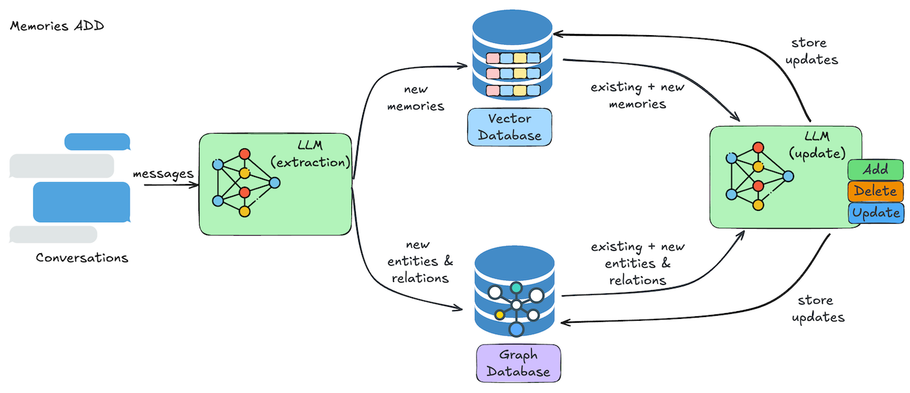
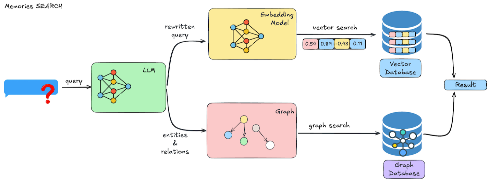

# ✅Mem0的实现原理

其实Mem0它并不是个存储，他只是一个框架，是一个协调了LLM+向量数据库+embedding模型+图数据库+sqlLite数据库的一个组件。

-   **LLM**：负责记忆提取和自然语言理解

-   **向量数据库**：用于高效语义检索，将对话中提取的关键信息嵌入为高维向量。

-   **Embedding模型*****：***用于将记忆内容做向量化嵌入

-   **图数据库（可选）**：用于追踪实体之间的关系（如“爱丽丝的朋友是约翰”），支持复杂的情境推理。

-   **sqlLite数据库（内置）**：本地存储记忆历史

这里面，除了sqlLite在Mem0中内置了一个以外，其他的都需要单独提供。比如上面的示例中我们单独部署了一个向量数据库，在代码中引入了对话模型和embedding模型。

Mem0 的记忆生命周期包括两个核心操作：**添加（add） 和 检索（search）**。

**添加记忆（add）**

1.  信息提取：利用 LLM（如 DeepSeek、GPT）从对话中自动识别关键事实（如“我喜欢Coding”）。

2.  冲突检测与合并：新记忆与已有记忆比对，自动处理矛盾（如先说“喜欢Coding”，后说“讨厌写代码”）。

3.  结构化存储：

-   内容被向量化并存入向量库；

-   实体和关系被提取并存入图数据库；

-   支持附加元数据（如 `category: movies`, `importance: high`）。

**检索记忆（search）**

1.  查询理解：LLM 对用户问题进行语义优化。

2.  多路检索：

-   向量搜索：基于语义相似度召回相关记忆；

-   图查询：根据实体关系扩展上下文（如“谁是蜘蛛侠？” → “彼得是蜘蛛侠”）。

1.  结果排序：综合相关性、时效性、重要性等维度返回最匹配的记忆。

总之，Mem0 的本质是一个**由 LLM 驱动、向量+图双引擎支撑、协议标准化、完全本地可控的 AI 记忆中间件。**它让 AI 智能体真正具备“记住你、理解你、持续为你服务”的能力，是构建个性化、上下文感知型 AI 应用的关键基础设施。
