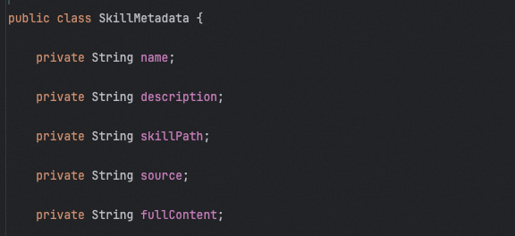

# ✅Spring AI中Skill集成的实现原理

在Spring AI Alibaba 中，Skill的实现设计灵感来源于 Claude Code 的 Skill 机制。一样的，这里面的每个 Skill 本质上就是一个目录，里面包含一个 `SKILL.md` 文件，这个文件用 YAML frontmatter 定义元数据（name、description），正文则是详细的使用说明、工作流、最佳实践等内容。Skill 目录下还可以放辅助脚本、参考文档等支撑资源。


（本文代码基于saa 1.1.2.0）


## SkillMetadata


数据模型是 `SkillMetadata`，包含 name（技能名）、description（描述）、skillPath（技能目录路径）、source（来源，区分 "user" 还是 "project"）、fullContent（SKILL.md 去掉 frontmatter 后的正文）。





## Skill 的发现与注册

Skill 的注册中心抽象为 `SkillRegistry` 接口，核心方法包括 `get(name)`、`listAll()`、`readSkillContent(name)`、`reload()`、`getSkillLoadInstructions()` 和 `getSystemPromptTemplate()`。


框架提供了两个主要实现：


| **实现** | **来源** | **特点** |
| --- | --- | --- |
| FileSystemSkillRegistry | 文件系统目录 | 支持 user/project 两级，project 覆盖同名 user Skill |
| ClasspathSkillRegistry | classpath / JAR | 兼容开发环境和 JAR 生产环境 |


**FileSystemSkillRegistry** 从文件系统加载技能，默认扫描两个目录——用户级目录 `~/saa/skills`（全局技能）和项目级目录 `./skills`（项目特定技能）。加载时项目级技能会覆盖同名的用户级技能，实现了优先级机制。


```java
@Override
protected void loadSkillsToRegistry() {
    Map<String, SkillMetadata> mergedSkills = new HashMap<>();

    // 第一步：加载用户级 Skill（默认 ~/saa/skills）
    if (userSkillsDirectory != null) {
        List<SkillMetadata> userSkills = scanner.scan(userSkillsDirectory, "user");
        for (SkillMetadata skill : userSkills) {
            mergedSkills.put(skill.getName(), skill);
        }
    }

    // 第二步：加载项目级 Skill（默认 ./skills）
    // 同名 Skill 会覆盖用户级，实现优先级合并
    if (projectSkillsDirectory != null) {
        List<SkillMetadata> projectSkills = scanner.scan(projectSkillsDirectory, "project");
        for (SkillMetadata skill : projectSkills) {
            mergedSkills.put(skill.getName(), skill);
        }
    }

    this.skills = mergedSkills;
}
```


底层使用 `SkillScanner` 遍历目录、读取 `SKILL.md`、解析 YAML frontmatter，同时按照 Agent Skills 规范（agentskills.io/specification）校验名称格式（小写字母+数字+连字符，最长 64 字符）和描述长度（最长 1024 字符）。


scan方法会调用同个类中的loadSkill方法来加载一个Skill：


```java
public SkillMetadata loadSkill(Path skillDir, String source) {
    Path skillFile = skillDir.resolve("SKILL.md");
    if (!Files.exists(skillFile)) { return null; }

    String content = Files.readString(skillFile);
    Map<String, Object> frontmatter = parseFrontmatter(content);

    String name = (String) frontmatter.get("name");
    String description = (String) frontmatter.get("description");

    // 校验名称格式（小写+数字+连字符，最长64字符）
    String directoryName = skillDir.getFileName().toString();
    validateSkillName(name, directoryName, skillFile);

    // 校验并截断描述长度（规范：最大1024字符）
    if (descriptionStr.length() > MAX_SKILL_DESCRIPTION_LENGTH) {
        descriptionStr = descriptionStr.substring(0, MAX_SKILL_DESCRIPTION_LENGTH);
    }

    // 去除 frontmatter，保留正文
    String fullContent = removeFrontmatter(content);

    return SkillMetadata.builder()
            .name(name)
            .description(descriptionStr)
            .skillPath(skillDir.toString())
            .source(source)
            .fullContent(fullContent)
            .build();
}
```


**ClasspathSkillRegistry** 则从 classpath（如 `resources/skills`）加载技能，同时兼容开发环境（文件系统）和生产环境（JAR 包）。如果是 JAR 环境，会创建 JAR FileSystem 读取资源，并将技能资源拷贝到 basePath（默认 `/tmp`）以便后续用普通文件路径访问，同时缓存 JAR 中的 SKILL.md 内容。


## Skill 的执行原理——"渐进式披露"


SAA 的 Skill 机制借鉴了 Claude Code 的 "Agent Skills" 理念，核心哲学是**不把所有 Skill 的完整内容一股脑塞进 System Prompt**，而是采用两阶段加载的方式。


**第一阶段**只把每个 Skill 的轻量级摘要信息（名称 + 描述 + 路径）注入到System Prompt中，让 LLM 知道有哪些能力可用；


在每次 LLM 调用前，通过 Advisor 或 Interceptor 机制，把所有已注册技能的简要信息（name + description + 路径）拼接成一段文本，追加到系统消息（System Message）中。这段文本还包含了如何使用 `read_skill` 工具的说明。LLM 看到的只是一个概览清单，并不包含每个技能的完整指令。


```java
//FileSystemSkillRegistry

public static final String DEFAULT_SYSTEM_PROMPT_TEMPLATE = """

       ## Skills System

       You have access to a skills library that provides specialized capabilities and domain knowledge. All skills are stored in a Skill Registry with a file system based storage.

       ### Available Skills

       {skills_list}

       ### How to Use Skills (Progressive Disclosure)

       Skills follow a **progressive disclosure** pattern - you know they exist (name + description above), but you only read the full instructions when needed:

       1. **Recognize when a skill applies**: Check if the user's task matches any skill's description
       2. **Read the skill's full instructions**: The skill list above shows the exact skill id to use with `read_skill`
       3. **Follow the skill's instructions**: SKILL.md contains step-by-step workflows, best practices, and examples
       4. **Access supporting files**: Skills may include Python scripts, configs, or reference docs - use absolute paths

       #### How to Read The Full Skill Instruction

       You are currently using the file system based Skill Registry. Please follow the skill loading guidelines below:

       {skills_load_instructions}

       **Important:**

         - **For SKILL.md files (skill instructions)**: Always use `read_skill` to read skill instructions. Do not attempt to access SKILL.md files through other methods.
         - **For other supporting files that skill uses (scripts, references, etc.)**: You may use other appropriate tools to read or access these files as needed, always use absolute paths from the skill list.

       #### When to Use Skills

         - When the user's request matches a skill's domain (e.g., "research X" → web-research skill)
         - When you need specialized knowledge or structured workflows
         - When a skill provides proven patterns for complex tasks

       #### Skills are Self-Documenting

         - Each SKILL.md tells you exactly what the skill does and how to use it
         - The skill list above shows the full path for each skill's SKILL.md file

       #### Executing Skill Scripts

       Skills may contain Python scripts or other executable files. Always use absolute paths from the skill list.

       ### Example Workflow

       User: "Can you research the latest developments in quantum computing?"

       1. Check available skills above → See "web-research" skill with its skill id
       2. Read the skill using the id shown in the list
       3. Follow the skill's research workflow (search → organize → synthesize)
       4. Use any helper scripts with absolute paths

       Remember: Skills are tools to make you more capable and consistent. When in doubt, check if a skill exists for the task!
       """;
```


**第二阶段**当 LLM 判断某个 Skill 与用户请求相关时，主动调用 `read_skill` 工具来读取该 Skill 的完整 SKILL.md 指令。这样做的好处是避免了 Token 浪费，同时保持了灵活的可扩展性。


框架向 LLM 注册了一个名为 `read_skill` 的 Tool（由 `ReadSkillTool` 实现）。当 LLM 判断用户请求匹配某个技能时，它会主动调用 `read_skill(skill_name)` 来获取该技能的完整 SKILL.md 内容。这个 Tool 内部调用 `SkillRegistry.readSkillContent(name)`，从注册中心读取并返回去掉 frontmatter 的正文。LLM 拿到完整指令后，再按照技能文档中的步骤去执行。


这种设计的好处是节省了 token 开销——只有真正需要用到的技能才会被完整加载，而不是在每次请求中都把所有技能的详细文档一股脑塞进去。


## 两条集成路径

框架提供了两种方式将 Skill 能力集成到 AI 应用中：


**路径一：Spring AI Advisor 模式**（适用于 ChatClient）。


> **📄 ✅SpringAI中如何使用Skill？（ChatClient）**
>
> 前面我们基于Agent继承了Skill，这一期讲讲直接用ChatClient如何集成。 1、增加依赖，增加skill、修改Skill.md、简历上传到minio、发起请求、输出结果等步骤和上一节课程一样，不重复了。 开发LLM相关代码 我
>
> 来源：LLMentor


`SpringAiSkillAdvisor` 和 `SkillPromptAugmentAdvisor` 都实现了 Spring AI 的 `BaseAdvisor` 接口。


```java
@Override
public ChatClientRequest before(ChatClientRequest chatClientRequest, AdvisorChain advisorChain) {
    // 加载/重新加载 Skill 注册信息
    loadSkillsToRegistry();

    List<SkillMetadata> skills = skillRegistry.listAll();
    if (skills.isEmpty()) { return chatClientRequest; }

    // 构建 Skill 提示词并追加到 System Message
    String skillsPrompt = buildSkillsPrompt(skills, skillRegistry, skillRegistry.getSystemPromptTemplate());
    SystemMessage systemMessage = chatClientRequest.prompt().getSystemMessage();
    SystemMessage enhanced = enhanceSystemMessage(systemMessage, skillsPrompt);

    return chatClientRequest.mutate()
        .prompt(chatClientRequest.prompt().augmentSystemMessage(enhanced.getText()))
        .build();
}
```

它们在 `before()` 方法中完成技能列表的注入——reload 注册中心、获取技能列表、构建技能 prompt、增强系统消息。`after()` 方法不做任何处理。这种方式适合直接用 `ChatClient` 的场景。


**路径二：Agent Hook + Interceptor 模式**（适用于 ReactAgent）。


> **📄 ✅SpringAI中如何使用Skill？（Agent）**
>
> 前面我们基于Qoder开发了一个帮我们做简历评估的Skill，我们接着把他集成到我们的应用代码中我们自己开发的Agent中。 Spring AI本身是不支持Skill的，但是Spring AI Alibaba 1.1.2版本发布了，他是支持
>
> 来源：LLMentor


`SkillsAgentHook` 是一个 `AgentHook`，标注了 `@HookPositions(HookPosition.BEFORE_AGENT)`，在 Agent 执行前触发。


```java
@HookPositions(HookPosition.BEFORE_AGENT)
public class SkillsAgentHook extends AgentHook {

    private final SkillRegistry skillRegistry;
    private final ToolCallback readSkillTool;
    private final Map<String, List<ToolCallback>> groupedTools;

    @Override
    public CompletableFuture<Map<String, Object>> beforeAgent(OverAllState state, RunnableConfig config) {
        if (autoReload) {
            skillRegistry.reload();
        }
        return CompletableFuture.completedFuture(Map.of());
    }

    @Override
    public List<ModelInterceptor> getModelInterceptors() {
        return List.of(
            SkillsInterceptor.builder()
                .skillRegistry(this.skillRegistry)
                .groupedTools(this.groupedTools)
                .build());
    }

    @Override
    public List<ToolCallback> getTools() {
        return List.of(readSkillTool);  // 暴露 read_skill 工具给 Agent
    }
}
```


它做了三件事：

（1）如果开启了 autoReload，在 beforeAgent 中重新加载 Skill；

（2）通过 getTools() 方法暴露 read\_skill 工具给 Agent；

（3）通过 getModelInterceptors() 自动创建并注册 SkillsInterceptor。


**SkillsInterceptor** 是一个模型拦截器，在每次 LLM 调用前执行 interceptModel 方法。它先通过 buildSkillsPrompt 将 Skill 列表注入 System Message；


```java
@Override
public ModelResponse interceptModel(ModelRequest request, ModelCallHandler handler) {
    List<SkillMetadata> skills = skillRegistry.listAll();
    if (skills.isEmpty()) { return handler.call(request); }

    // 1. 扫描历史消息，提取 read_skill 调用的 skill_name
    Set<String> readSkillNames = extractReadSkillNames(request.getMessages());

    // 2. 根据 skill_name 注入关联的动态工具
    List<ToolCallback> skillTools = new ArrayList<>(request.getDynamicToolCallbacks());
    for (String skillName : readSkillNames) {
        List<ToolCallback> toolsForSkill = getGroupedTools().get(skillName);
        if (toolsForSkill != null)
            skillTools.addAll(toolsForSkill);
    }

    // 3. 注入 Skill 列表到 System Prompt
    String skillsPrompt = buildSkillsPrompt(skills, skillRegistry, skillRegistry.getSystemPromptTemplate());
    SystemMessage enhanced = enhanceSystemMessage(request.getSystemMessage(), skillsPrompt);

    // 4. 构建增强后的请求
    return handler.call(ModelRequest.builder(request)
        .systemMessage(enhanced)
        .dynamicToolCallbacks(skillTools)
        .build());
}
```


同时它还支持 **动态工具注入**——扫描对话历史中的 AssistantMessage，如果发现 LLM 此前调用过 read\_skill 工具读取了某个 Skill，就从 groupedTools 中找到该 Skill 关联的专用工具，添加到 dynamicToolCallbacks 中。这意味着 LLM 读取某个 Skill 后，该 Skill 附带的工具能力会自动解锁。


```java
private Set<String> extractReadSkillNames(List<Message> messages) {
    Set<String> names = new LinkedHashSet<>();
    for (Message message : messages) {
        if (!(message instanceof AssistantMessage am) || !am.hasToolCalls()) continue;
        for (AssistantMessage.ToolCall toolCall : am.getToolCalls()) {
            if (!ReadSkillTool.READ_SKILL.equals(toolCall.name())) continue;
            String skillName = parseSkillNameFromArguments(toolCall.arguments());
            if (skillName != null) names.add(skillName);
        }
    }
    return names;
}
```

**ReadSkillTool** 是一个 BiFunction<ReadSkillRequest, ToolContext, String>，被包装成 Spring AI 的 ToolCallback。LLM 调用它时传入 skill\_name 参数，它就去 SkillRegistry.readSkillContent(name) 读取对应 SKILL.md 的完整内容并返回。


```java
public class ReadSkillTool implements BiFunction<ReadSkillRequest, ToolContext, String> {

    public static final String READ_SKILL = "read_skill";
    private final SkillRegistry skillRegistry;

    @Override
    public String apply(ReadSkillRequest request, ToolContext toolContext) {
        if (request.skillName == null || request.skillName.isEmpty())
            return "Error: skill_name is required";

        // 从 SkillRegistry 读取完整内容
        String content = skillRegistry.readSkillContent(request.skillName);
        return content;
    }

    // LLM 调用时的请求结构
    public static class ReadSkillRequest {
        @JsonProperty(required = true, value = "skill_name")
        @JsonPropertyDescription("The name of the skill to read")
        public String skillName;
    }
}
```


## 完整执行流程

用一个具体场景来串联：假设用户问 "帮我写一个查询上月消费超过 1000 元客户的 SQL"。

1.  **初始化阶段**：`ClasspathSkillRegistry`（或 `FileSystemSkillRegistry`）在 Bean 创建时扫描 `skills/` 目录，解析每个子目录下的 `SKILL.md` frontmatter，构建 `SkillMetadata` 并注册到内存 Map 中。

2.  **Agent 调用前**：`SkillsAgentHook.beforeAgent()` 触发，如果配置了 `autoReload` 则重新扫描目录。

3.  **模型调用前**：`SkillsInterceptor.interceptModel()` 被调用，从 SkillRegistry 获取所有 Skill 列表，格式化成类似 `"**User Skills:**\n- **sql-schema**: SQL数据库表结构专家 → MUST use read_skill tool..."` 的文本，追加到 System Message。同时 `read_skill` 工具已经被注册到 Agent 的可用工具列表中。

4.  **LLM 第一轮推理**：LLM 看到系统提示中列出的 Skill 列表，发现 "sql-schema" Skill 与当前请求匹配，于是决定调用 `read_skill({"skill_name": "sql-schema"})` 工具。

5.  **工具执行**：`ReadSkillTool.apply()` 收到请求，调用 `skillRegistry.readSkillContent("sql-schema")`，读取并返回该 Skill 的 SKILL.md 完整内容（去掉了 frontmatter 的纯指令部分）。

6.  **动态工具注入**：在下一轮 `interceptModel` 调用中，`SkillsInterceptor` 扫描对话历史，发现刚才有 `read_skill` 的 tool call，从 `groupedTools` 中找到 "sql-schema" 关联的专用工具（如果有的话），将它们添加到 `dynamicToolCallbacks`。

7.  **LLM 后续推理**：LLM 拿到了完整的 Skill 指令和可能新增的工具，按照 SKILL.md 中的工作流指引来完成用户请求。
