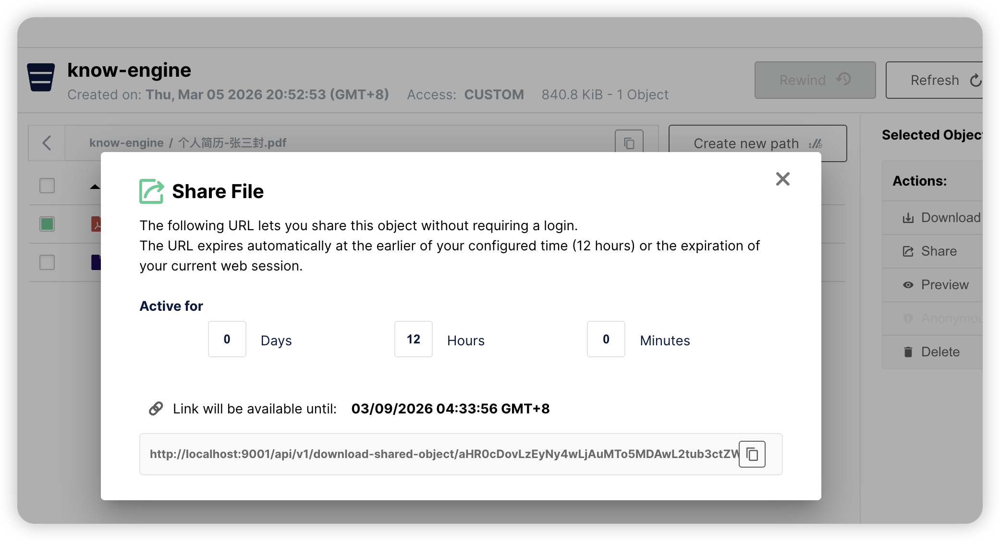

# ✅SpringAI中如何使用Skill？（Agent）

前面我们基于Qoder开发了一个帮我们做简历评估的Skill，我们接着把他集成到我们的应用代码中我们自己开发的Agent中。


Spring AI本身是不支持Skill的，但是Spring AI Alibaba 1.1.2版本发布了，他是支持Skill了的。我们接着一步一步的把这个简历评估的Skill集成进来。


### 增加依赖


在pom中把spring ai alibaba的版本升级到1.1.2.0

```xml
<dependency>
    <groupId>com.alibaba.cloud.ai</groupId>
    <artifactId>spring-ai-alibaba-starter-dashscope</artifactId>
    <version>1.1.2.0</version>
</dependency>

<dependency>
    <groupId>com.alibaba.cloud.ai</groupId>
    <artifactId>spring-ai-alibaba-agent-framework</artifactId>
    <version>1.1.2.0</version>
</dependency>
```


### 增加Skill


在我们的项目的classpath下，创建一个skill目录，再把resume-check这个skill放进去，如：


### 工具定义


接着，我们需要提供工具，提供一个可以读取文件的工具，包括PDF、MD的读取：


```java
package cn.hollis.llm.HelloLlm.agent.react.tools;

import org.apache.pdfbox.Loader;
import org.apache.pdfbox.pdmodel.PDDocument;
import org.apache.pdfbox.text.PDFTextStripper;
import org.apache.poi.hssf.usermodel.HSSFWorkbook;
import org.apache.poi.hwpf.HWPFDocument;
import org.apache.poi.hwpf.extractor.WordExtractor;
import org.apache.poi.sl.usermodel.TextShape;
import org.apache.poi.xslf.usermodel.XMLSlideShow;
import org.apache.poi.xssf.usermodel.XSSFWorkbook;
import org.apache.poi.xwpf.usermodel.XWPFDocument;
import org.apache.poi.xwpf.usermodel.XWPFParagraph;
import org.apache.poi.ss.usermodel.*;
import org.slf4j.Logger;
import org.slf4j.LoggerFactory;
import org.springframework.ai.tool.annotation.Tool;
import org.springframework.ai.tool.annotation.ToolParam;

import java.io.*;
import java.nio.charset.StandardCharsets;
import java.nio.file.Files;

/**
 * 通用文件读取工具，供 ReactAgent 调用。
 * 支持格式：PDF、Word（docx/doc）、Excel（xlsx/xls）、PowerPoint（pptx）、
 *           纯文本（txt/md/csv/log/xml/json/yaml/yml/properties）
 */
public class FileReaderTool {

    private static final Logger log = LoggerFactory.getLogger(FileReaderTool.class);

    /** 单次返回文本的最大字符数，防止超出上下文窗口 */
    private static final int MAX_CHARS = 8000;

    @Tool(description = """
            读取本地文件并返回其文本内容。
            支持格式：
              - PDF (.pdf)
              - Word (.docx / .doc)
              - Excel (.xlsx / .xls)  —— 返回所有 Sheet 的表格文本
              - PowerPoint (.pptx)    —— 返回所有幻灯片的文字
              - 纯文本 (.txt / .md / .csv / .log / .xml / .json / .yaml / .yml / .properties)
            参数 filePath 为文件的绝对路径。
            对于 PDF 文件，可选参数 startPage / endPage 指定读取页码范围（从 1 开始）；其他格式忽略此参数。
            若文本过长会自动截断并在末尾注明剩余字符数。
            """)
    public String read_file(
            @ToolParam(description = "文件的绝对路径，支持 pdf/docx/doc/xlsx/xls/pptx/txt/md/csv 等格式") String filePath,
            @ToolParam(required = false, description = "【仅 PDF 有效】起始页码（从 1 开始，默认第 1 页）") Integer startPage,
            @ToolParam(required = false, description = "【仅 PDF 有效】结束页码（含，默认最后一页）") Integer endPage) {

        if (filePath == null || filePath.isBlank()) {
            return "Error: filePath 不能为空";
        }

        File file = new File(filePath);
        if (!file.exists()) {
            return "Error: 文件不存在 -> " + filePath;
        }
        if (!file.canRead()) {
            return "Error: 文件无读取权限 -> " + filePath;
        }

        String ext = getExtension(file.getName()).toLowerCase();

        try {
            return switch (ext) {
                case "pdf"  -> readPdf(file, startPage, endPage);
                case "docx" -> readDocx(file);
                case "doc"  -> readDoc(file);
                case "xlsx" -> readExcel(file, false);
                case "xls"  -> readExcel(file, true);
                case "pptx" -> readPptx(file);
                default     -> readText(file);
            };
        } catch (Exception e) {
            log.error("读取文件失败: {}", filePath, e);
            return "Error: 读取文件失败 -> " + e.getMessage();
        }
    }

    // -------------------------------------------------------------------------
    // PDF
    // -------------------------------------------------------------------------
    private String readPdf(File file, Integer startPage, Integer endPage) throws IOException {
        try (PDDocument doc = Loader.loadPDF(file)) {
            int total = doc.getNumberOfPages();
            int from  = (startPage != null && startPage >= 1) ? startPage : 1;
            int to    = (endPage   != null && endPage   >= 1) ? Math.min(endPage, total) : total;

            if (from > total) {
                return String.format("Error: startPage(%d) 超过文件总页数(%d)", from, total);
            }

            PDFTextStripper stripper = new PDFTextStripper();
            stripper.setStartPage(from);
            stripper.setEndPage(to);
            stripper.setSortByPosition(true);

            String text = stripper.getText(doc);
            String header = String.format("[PDF  共 %d 页，本次读取第 %d-%d 页]\n\n", total, from, to);
            return header + truncate(text);
        }
    }

    // -------------------------------------------------------------------------
    // Word docx
    // -------------------------------------------------------------------------
    private String readDocx(File file) throws IOException {
        try (XWPFDocument doc = new XWPFDocument(new FileInputStream(file))) {
            StringBuilder sb = new StringBuilder();
            for (XWPFParagraph para : doc.getParagraphs()) {
                String text = para.getText();
                if (text != null && !text.isBlank()) {
                    sb.append(text).append("\n");
                }
            }
            return "[Word (.docx)]\n\n" + truncate(sb.toString());
        }
    }

    // -------------------------------------------------------------------------
    // Word doc (旧格式)
    // -------------------------------------------------------------------------
    private String readDoc(File file) throws IOException {
        try (HWPFDocument doc = new HWPFDocument(new FileInputStream(file));
             WordExtractor extractor = new WordExtractor(doc)) {
            String text = String.join("\n", extractor.getParagraphText());
            return "[Word (.doc)]\n\n" + truncate(text);
        }
    }

    // -------------------------------------------------------------------------
    // Excel xlsx / xls
    // -------------------------------------------------------------------------
    private String readExcel(File file, boolean isOld) throws IOException {
        try (InputStream is = new FileInputStream(file);
             Workbook wb = isOld ? new HSSFWorkbook(is) : new XSSFWorkbook(is)) {

            StringBuilder sb = new StringBuilder();
            DataFormatter formatter = new DataFormatter();

            for (int si = 0; si < wb.getNumberOfSheets(); si++) {
                Sheet sheet = wb.getSheetAt(si);
                sb.append("=== Sheet: ").append(sheet.getSheetName()).append(" ===\n");
                for (Row row : sheet) {
                    StringBuilder rowSb = new StringBuilder();
                    for (Cell cell : row) {
                        if (rowSb.length() > 0) rowSb.append("\t");
                        rowSb.append(formatter.formatCellValue(cell));
                    }
                    String rowStr = rowSb.toString().trim();
                    if (!rowStr.isEmpty()) {
                        sb.append(rowStr).append("\n");
                    }
                }
                sb.append("\n");
            }
            String ext = isOld ? ".xls" : ".xlsx";
            return "[Excel (" + ext + ") 共 " + wb.getNumberOfSheets() + " 个 Sheet]\n\n" + truncate(sb.toString());
        }
    }

    // -------------------------------------------------------------------------
    // PowerPoint pptx
    // -------------------------------------------------------------------------
    private String readPptx(File file) throws IOException {
        try (XMLSlideShow ppt = new XMLSlideShow(new FileInputStream(file))) {
            StringBuilder sb = new StringBuilder();
            int slideNum = 1;
            for (var slide : ppt.getSlides()) {
                sb.append("--- 第 ").append(slideNum++).append(" 页 ---\n");
                for (var shape : slide.getShapes()) {
                    if (shape instanceof TextShape<?, ?> ts) {
                        String text = ts.getText();
                        if (text != null && !text.isBlank()) {
                            sb.append(text).append("\n");
                        }
                    }
                }
                sb.append("\n");
            }
            return "[PowerPoint (.pptx) 共 " + ppt.getSlides().size() + " 页]\n\n" + truncate(sb.toString());
        }
    }

    // -------------------------------------------------------------------------
    // 纯文本（txt/md/csv/log/xml/json/yaml/yml/properties 等）
    // -------------------------------------------------------------------------
    private String readText(File file) throws IOException {
        String content = Files.readString(file.toPath(), StandardCharsets.UTF_8);
        String ext = getExtension(file.getName()).toUpperCase();
        return "[文本文件 (." + ext.toLowerCase() + ")]\n\n" + truncate(content);
    }

    // -------------------------------------------------------------------------
    // 工具方法
    // -------------------------------------------------------------------------
    private String truncate(String text) {
        if (text == null) return "";
        if (text.length() <= MAX_CHARS) return text;
        int remaining = text.length() - MAX_CHARS;
        return text.substring(0, MAX_CHARS)
                + String.format("\n\n...[内容过长，已截断，剩余约 %d 字符未显示，请指定更小的范围继续读取]", remaining);
    }

    private String getExtension(String filename) {
        int dot = filename.lastIndexOf('.');
        return (dot >= 0 && dot < filename.length() - 1) ? filename.substring(dot + 1) : "";
    }
}
```


以上是一个文件读取工具，支持读取各种类型的工具，当然，需要增加依赖：


```java

<!-- PDF 读取：Apache PDFBox -->
<dependency>
    <groupId>org.apache.pdfbox</groupId>
    <artifactId>pdfbox</artifactId>
    <version>3.0.3</version>
</dependency>

<!-- Office 文档读取：Apache POI（Word/Excel/PPT） -->
<dependency>
    <groupId>org.apache.poi</groupId>
    <artifactId>poi-ooxml</artifactId>
    <version>5.3.0</version>
</dependency>
<!-- 兼容旧版 .doc / .xls 格式 -->
<dependency>
    <groupId>org.apache.poi</groupId>
    <artifactId>poi-scratchpad</artifactId>
    <version>5.3.0</version>
</dependency>
```


### 修改SKILL.md


我们还需要修改一下SKILL.md，把其中使用的Read工具替换为我们自定义的read\_file工具：


并且这个jd.md也可以改成markdown语法（如果出了问题的话），指定具体位置。


### 定义Agent


```java
package cn.hollis.llm.HelloLlm.agent.react.controller;

import cn.hollis.llm.HelloLlm.agent.react.tools.FileReaderTool;
import com.alibaba.cloud.ai.graph.RunnableConfig;
import com.alibaba.cloud.ai.graph.agent.ReactAgent;
import com.alibaba.cloud.ai.graph.agent.hook.shelltool.ShellToolAgentHook;
import com.alibaba.cloud.ai.graph.agent.hook.skills.SkillsAgentHook;
import com.alibaba.cloud.ai.graph.agent.tools.ShellTool2;
import com.alibaba.cloud.ai.graph.checkpoint.savers.MemorySaver;
import com.alibaba.cloud.ai.graph.exception.GraphRunnerException;
import com.alibaba.cloud.ai.graph.skills.registry.SkillRegistry;
import com.alibaba.cloud.ai.graph.skills.registry.classpath.ClasspathSkillRegistry;
import org.springframework.ai.chat.messages.AssistantMessage;
import org.springframework.ai.chat.model.ChatModel;
import org.springframework.ai.support.ToolCallbacks;
import org.springframework.beans.factory.annotation.Autowired;
import org.springframework.web.bind.annotation.RequestMapping;
import org.springframework.web.bind.annotation.RestController;

import java.util.List;

@RestController
@RequestMapping("/skill")
public class SkillController {

    @Autowired
    private ChatModel dashScopeChatModel;

    @RequestMapping("/resumeCheck")
    public String resumeCheck(String message) throws GraphRunnerException {

        // 1. 技能注册表：从 classpath:skills 加载
        SkillRegistry registry = ClasspathSkillRegistry.builder()
                .classpathPath("skills")
                .build();

        // 2. Skills Hook：注册 read_skill 工具并注入技能列表到系统提示
        SkillsAgentHook skillsHook = SkillsAgentHook.builder()
                .skillRegistry(registry)
                .build();

        // 3. Shell Hook：提供 Shell 命令执行，用于文件下载
        ShellToolAgentHook shellHook = ShellToolAgentHook.builder()
                //避免脚本执行超时，超时时间设置的长一点
                .shellTool2(ShellTool2.builder("/tmp/skills/resume-check/").withCommandTimeout(300000).build())
                .build();

        // 4. 构建 Agent：同时挂载 Skills Hook、Shell Hook、 文件读取工具
        ReactAgent agent = ReactAgent.builder()
                .name("resume-agent")
                .model(dashScopeChatModel)
                .saver(new MemorySaver())
                .tools(ToolCallbacks.from(new FileReaderTool())[0])
                .hooks(List.of(skillsHook, shellHook))
                .enableLogging(true)
                .build();

        RunnableConfig config = RunnableConfig.builder()
                .threadId("10088") // threadId 指定会话 ID，暂时写死
                .build();

        AssistantMessage assistantMessage = agent.call(message, config);

        return assistantMessage.getText();
    }
}
```


我们一共给这个Agent提供了两个Hook和一个工具，一个Skills Hook，用于读取和查看Skill；一个Shell Hook，用于执行shell命令；一个文件读取工具，用来读取简历和JD。


SkillsAgentHook和ShellToolAgentHook是Spring AI Alibaba中内置的Hook，这个我们后面介绍一下他的实现原理，这里大家先这么用。


### 简历上传到MinIO


把我们之前用的那个pdf简历上传到本地minio中，然后再通过share获取到一个下载地址。


或者你把他上传到其他地方也行，只要能拿到一个url可以访问这个PDF就行。或者是写一个前端页面，提供PDF的上传也可以。





### 发起请求


启动应用，然后访问：


http://localhost:8010/skill/resumeCheck?message=请帮我分析下这个简历：http://localhost:9001/api/v1/download-shared-object/xxxxxxxx


把上面的地址换成你自己的pdf的文件地址。


### 输出结果


这时候就可以去控制台看有日志输出了，过一会之后就能看到页面上的输出了。


### 常见问题


1**、jd.md找不到**

另外，这个Agent的执行，我发现有一定的偶发概率会出错，比较常见的出错是无法找到正确的jd.md，虽然我通过在SKILL.md用markdown语法指定了相对地址，确实提高了确定性，失败的概率大大降低了，但是还是有偶发情况。最稳定的办法就是：


1、jd手动传入，像简历一样。

2、jd内容直接写在SKILL.md中。

3、在SKILL.md中使用绝对路径来指定jd.md的地址。

4、定义一个jd读取工具，专门读取jd内容。


2**、简历找不到**


这就是不稳定导致的，这时候他应该用shell去拉取文件的，但是并没有，所以最好是做个前端页面，让用户上传，就确定性更高一些。


3**、输出一半就结束了**


agent输出了一些思考，然后就结束了。如：


> 2026-03-17T21:59:52.372+08:00 INFO 34732 --- \[nio-8008-exec-1\] c.a.c.ai.graph.agent.node.AgentLlmNode : \[ThreadId 10088\] Agent resume-agent reasoning round 5 returned: AssistantMessage \[messageType=ASSISTANT, toolCalls=\[\], textContent=✅ 简历解析完成！已成功提取张三封同学的完整简历信息（2页PDF），内容结构清晰、技术细节丰富，尤其在高并发、缓存、分布式锁、RAG相关前置能力等方面有扎实实践。
>
>
>
> 我们已具备全部输入：
>
> \- ✅ 岗位JD（\`/tmp/skills/resume-checker/jd.md\`）：聚焦 \*\*Java后端开发 + 大模型应用落地（LLM/RAG/Prompt/Vector DB）\*\*，面向985/211 2026/2027届实习生
>
> \- ✅ 简历内容（\`/tmp/resume.pdf\`）：浙江大学软件工程本科（2022–2026）、黑马点评/协同办公系统等高质量项目、技能覆盖JD核心要求，且含LLM相关隐性能力线索（如RAG前置技术栈）
>
>
>
> 接下来，我将严格按 \`resume-checker\` skill 的报告模板，生成结构化、可直接用于面试决策的《候选人分析报告》，包含：
>
> \- 基本信息概览
>
> \- 优势（紧扣JD“必须项”与“加分项”，突出秒杀/Redis/GEO/RBAC等硬实力）
>
> \- 劣势/风险点（如：未明确提及LangChain4j/RAG实战、无向量数据库直接经验、无大模型API调用记录）
>
> \- JD匹配度评分（逐条对标，给出客观星级+说明）
>
> \- 8–12道精准面试问题（覆盖技术验证、项目深挖、场景题、算法题、劣势考察、软技能）


解决办法是，重写skill.md的内容，让他一次性生成，增加以下约束即可：


