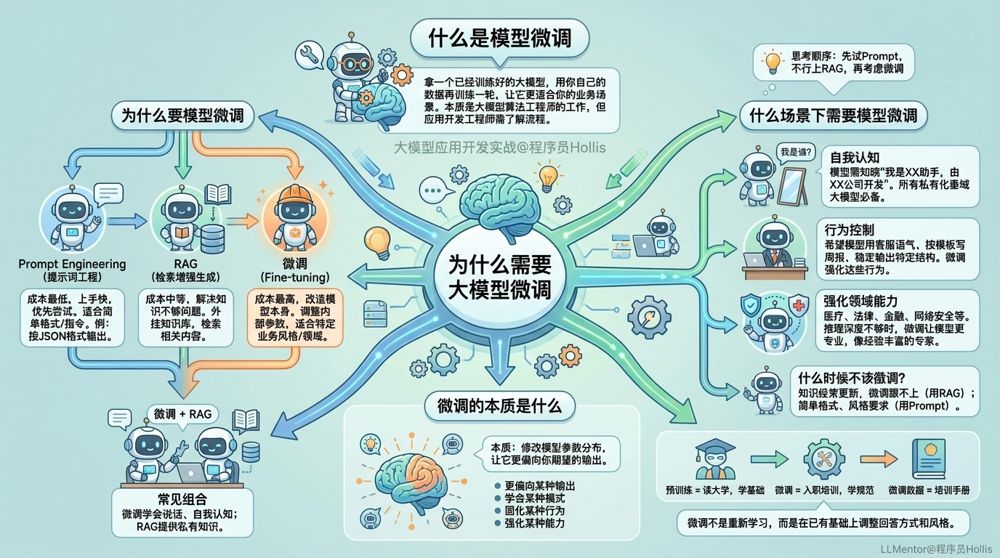

# ✅为什么需要大模型微调？

# 什么是模型微调

模型微调是什么？简单说就是拿一个已经训练好的大模型，用你自己的数据再训练一轮，让它更适合你的业务场景。但先说一句：**其实绝大部分场景根本用不到微调。**

微调这件事，本质上是**大模型算法工程师**干的活，不是我们大模型应用开发工程师该操心的。真实的大模型训练也好、微调也好，其实远没有我们看到的那么简单。背后涉及大量的数学公式、最优化理论、强化学习、概率统计等等，这些是科班出生的算法工程师花好多年才能搞明白的东西。

那我们作为大模型应用开发工程师，为什么要学这个？

**你不需要自己推导梯度下降的公式，不需要手写 Transformer 的注意力机制，但你至少要做到对大模型微调的整个流程了然于胸。知道什么时候该微调、什么时候不该微调，能自己把一个开源模型跑起来、完成微调、部署上线，至少在一些中小企业，这种能力是完全足够的。**

本章节所有课程不涉及复杂的数学公式和算法，只讲应用。学完之后，你出去就可以和别人说你熟悉大模型的微调了，大部分情况下（不需要深度优化的前提下），**这套生产流程基本就是这样的**。

# 为什么要模型微调

当大模型在业务中不好用的时候，我们通常有三种解决方案：

**Prompt Engineering（提示词工程）**：在提问方式上做文章。你想让模型按 JSON 格式输出，在 Prompt 里说清楚就行了，还不行就继续加约束，基本上绝大部分场景，用 Prompt 就够了。成本低，上手快，大部分场景优先试这个。

**RAG（检索增强生成）**：给模型外挂一个知识库。用户提问时，先从知识库中检索相关内容，再把结果和问题一起丢给模型。相当于给员工配了一本参考手册，遇到问题先翻手册。解决的是大模型私有知识不够的问题。

**微调（Fine-tuning）**：直接改造模型本身。用一批针对性的数据再训练，调整模型内部的参数，让它更适合你的业务场景。相当于送员工去参加专项培训。解决的是 Prompt 和 RAG 都搞不定的问题。

| 方案 | 改什么 | 解决什么问题 | 成本 |
| --- | --- | --- | --- |
| Prompt Engineering | 怎么问 | 简单格式/指令 | 最低 |
| RAG | 外挂知识 | 知识不够 | 中等 |
| 微调 | 模型本身 | 风格/行为/领域 | 高 |

实际上生产环境中，**微调 + RAG** 是最常见的组合，微调让模型学会怎么说话、学会自我认知、学会领域知识，而RAG 让模型知晓私有的知识。

# 什么场景下需要模型微调

当你发现大模型不够用时，按这个顺序思考：先试 Prompt，不行上 RAG，都搞不定再考虑微调。

那什么场景需要微调？举几个典型的例子。

**自我认知：**你把模型部署给客户用，客户问"你是谁？"，模型回答"我是由 OpenAI 开发的 ChatGPT"，这在生产环境中是绝对不可接受的。你需要通过微调让模型知道"我是 XX 助手，由 XX 公司开发"。所有号称私有化的垂域大模型，在生产部署都必须做这一步。

**行为控制：**你希望模型用客服的语气说话、按公司模板写周报、稳定输出特定 JSON 结构，Prompt 确实可以做到一部分，但不够稳定。微调则可以把这些行为强化到模型中。

**强化领域能力。** 医疗、法律、金融、网络安全这些垂直领域，通用大模型的知识是够的，但推理深度不够。比如在网络安全领域，你希望模型能分析 WebShell 的特征、识别混淆手法、给出专业的处置建议，通用模型往往只能泛泛而谈，缺乏实际的专业经验。通过微调可以让模型在特定领域表现得更专业，模型会更像是一个经验丰富的网络安全专家。

什么时候不该微调？只是知识不够，用 RAG；知识经常更新，微调跟不上变化，也用 RAG；只是简单格式、风格要求，Prompt 搞定就够了。

# 微调的本质是什么

简单来说：**微调就是修改模型的参数分布，让它更偏向你期望的输出。**

微调让模型可以做到：

-   **更偏向某种输出**：比如让模型总是用客服语气回答，而不是时而正式时而随意

-   **学会某种模式**：比如让模型学会一种反直觉但逻辑严密的推理方式

-   **固化某种行为**：比如让模型稳定地说"我是 XX 公司的 XX 助手"，不管用户怎么问

-   **强化某种能力**：比如让模型在医疗、法律、网络安全领域回答得更专业

类比一下：

-   预训练 = 员工读了四年大学，学了基础知识

-   微调 = 员工入职培训，学会按公司规范工作

-   你的微调数据 = 公司的培训手册

微调不是让模型重新学习所有知识，而是在已有知识基础上，调整回答方式和风格。模型本身已经很强了，微调只是让它按照你的规矩来做事。
