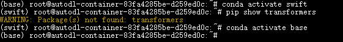
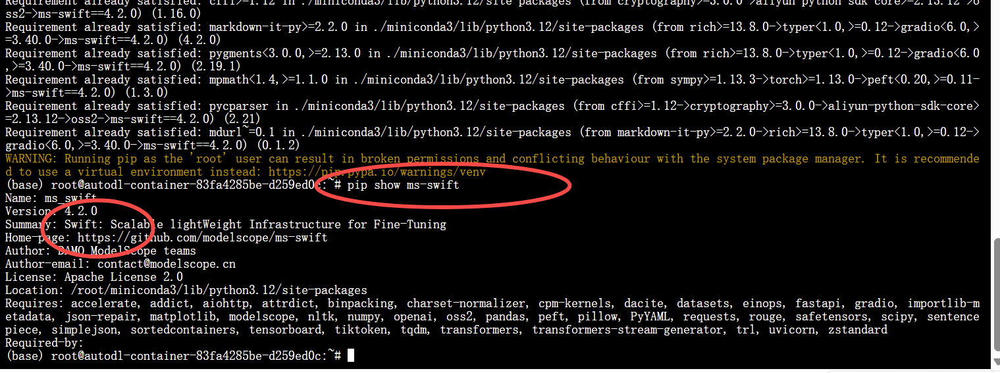
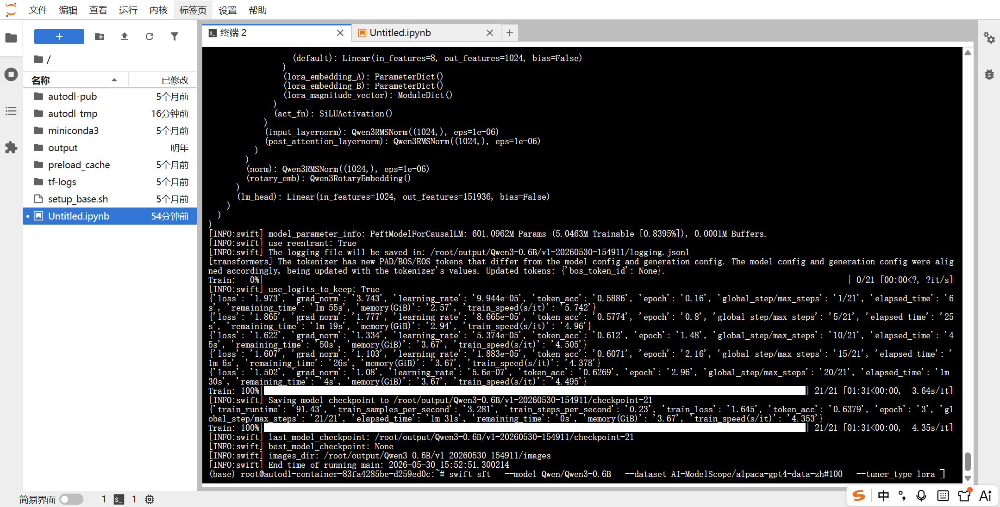

# ✅训练框架选择

# 为什么需要训练框架

在讲具体选择哪个框架之前，先回答一个更基本的问题：**为什么不直接用 PyTorch 写代码来训练？**

网上很多教程会给你看一段几行代码搞定微调的示例，看上去确实挺简单的。但那只是能跑通的 Demo 级别，真正要把微调跑好、用到生产环境，远没有这么轻松。

**显存永远不够用。** 模型加载到显存里就要十几 GB，加上梯度和优化器状态，一张 24G 的显卡都可能 OOM。你需要自己处理量化加载、梯度检查点、CPU 卸载这些显存优化手段。每一个都需要理解背后的原理才能正确配置。

**数据处理比你想的复杂。** 不同模型的 Chat Template 不一样（Qwen 和 Llama 的模板完全不同），多轮对话需要做 label masking（用户说的话不能参与 loss 计算），不同数据集的格式也不一样（Alpaca 格式和 ShareGPT 格式字段完全不同）。这些都需要你针对每个模型、每种数据格式单独写处理逻辑。

**训练过程一堆坑。** 训练到一半 loss 突然变成 NaN（学习率太大）、显存突然爆了（某条数据特别长）、想断点续训发现没保存 checkpoint、想看 loss 曲线要自己接可视化工具、多卡训练要配 DeepSpeed 或 FSDP 的配置文件等等。

**训练完还没结束。** LoRA 权重要合并回基座模型、要导出为推理框架能加载的格式、量化要用单独的工具链、测评要写评测脚本。

这些问题对于算法工程师来说是基本功，但对于我们大模型应用开发工程师来说，**没必要去啃这些底层的东西**。我们的目标是把模型微调跑通、用起来，而不是从零造轮子。

所以我们需要训练框架，并且现在大部分的算法工程师也都在使用这些框架，**把这些繁琐的工程问题全部封装好，你只需要指定模型、数据、参数，框架帮你搞定剩下的。**

> 类比到 Java 开发：
>
> 用 PyTorch 写训练脚本 = 用 Servlet 写 Web 应用，连接池、路由、序列化什么都要自己处理
>
> 用训练框架 = 用 Spring Boot，你只关注业务逻辑，框架帮你搞定剩下的一切

# 主流训练框架有哪些

目前大模型微调领域，常见的训练框架有：

**HuggingFace PEFT**：最底层的库，只提供 LoRA 等参数高效微调的实现，不包含数据处理、训练循环、模型导出等完整流程。你需要自己写大量代码来串联整个流程，相当于只给了你零件，组装靠自己。适合算法研究者，不适合应用开发者。

**LLaMA-Factory**：目前社区非常火的微调框架，由开源社区维护。最大亮点是提供了 WebUI，可以在浏览器里通过可视化界面完成微调，不用写一行代码。支持的模型种类非常多，文档和社区活跃度都很好。基本上算是一站式微调工具：数据加载、LoRA 配置、训练、导出、测评全流程都能覆盖。

**ms-swift（ModelScope Swift）**：阿里团队开发，ModelScope 官方的训练框架。功能和 LLaMA-Factory 类似，但在国产模型支持上有明显优势——Qwen、DeepSeek 等模型几乎第一时间适配。同时支持 CLI 和 WebUI 两种操作方式，功能覆盖预训练、微调、对齐、评估、部署的全流程。

| 特性 | ms-swift | LLaMA-Factory | HuggingFace PEFT |
| --- | --- | --- | --- |
| 国产模型支持 | 极强（Qwen/DeepSeek 第一时间适配） | 强 | 较慢（需手动配置） |
| 功能覆盖 | 预训练/微调/对齐/评估/部署 | 微调/对齐/评估 | 仅限微调 |
| 推理模型优化 | 针对 GRPO 和思维链有专项支持 | 支持部分对齐算法 | 较少底层优化 |
| 上手难度 | 低（CLI/GUI 并存） | 低（CLI/GUI 并存） | 高（需编写大量代码） |

# 为什么选择 ms-swift

LLaMA-Factory 和 ms-swift 都很好，选哪个其实都能把事情做完。但我们这门课程选择 **ms-swift**，主要基于以下几个原因：

**国产模型适配速度。** ms-swift 由阿里团队开发，对 Qwen 系列模型的支持几乎是第一时间跟进。我们课程用的是 Qwen3-4B，用 ms-swift 能获得更好的兼容性和更少的踩坑。

**功能覆盖更全。** ms-swift 覆盖了继续预训练、微调（SFT）、人类对齐、评估、部署的全流程，后面课程涉及到的量化、蒸馏、测评，ms-swift 都能直接支持。

**业界认可度高。** 目前针对微调 Qwen 系列小模型的场景中，ms-swift 基本上是业界公认的首选方案。你出去和别人聊，说用 ms-swift 微调 Qwen，这个技术栈是主流的、被认可的。

## 服务器安装

如果是自己的服务器，推荐直接使用docker，免去复杂的环境配置，需要注意的是：CUDA 版本需要与 NVIDIA 驱动兼容。通常高版本驱动可以兼容较低版本 CUDA，但反过来不行。可以用nvidia-smi查看，找到对应的版本下载。

**swift docker镜像版本对照表（自己服务器安装）：**

```
# swift4.2.0
modelscope-registry.cn-hangzhou.cr.aliyuncs.com/modelscope-repo/modelscope:ubuntu22.04-cuda13.0.3-py312-torch2.11.0-vllm0.20.1-modelscope1.36.3-swift4.2.0
modelscope-registry.cn-beijing.cr.aliyuncs.com/modelscope-repo/modelscope:ubuntu22.04-cuda13.0.3-py312-torch2.11.0-vllm0.20.1-modelscope1.36.3-swift4.2.0
modelscope-registry.us-west-1.cr.aliyuncs.com/modelscope-repo/modelscope:ubuntu22.04-cuda13.0.3-py312-torch2.11.0-vllm0.20.1-modelscope1.36.3-swift4.2.0

# swift4.1.3
modelscope-registry.cn-hangzhou.cr.aliyuncs.com/modelscope-repo/modelscope:ubuntu22.04-cuda12.9.1-py312-torch2.10.0-vllm0.19.1-modelscope1.35.4-swift4.1.3
modelscope-registry.cn-beijing.cr.aliyuncs.com/modelscope-repo/modelscope:ubuntu22.04-cuda12.9.1-py312-torch2.10.0-vllm0.19.1-modelscope1.35.4-swift4.1.3
modelscope-registry.us-west-1.cr.aliyuncs.com/modelscope-repo/modelscope:ubuntu22.04-cuda12.9.1-py312-torch2.10.0-vllm0.19.1-modelscope1.35.4-swift4.1.3

# swift4.0.3
modelscope-registry.cn-hangzhou.cr.aliyuncs.com/modelscope-repo/modelscope:ubuntu22.04-cuda12.8.1-py311-torch2.10.0-vllm0.17.1-modelscope1.34.0-swift4.0.3
modelscope-registry.cn-beijing.cr.aliyuncs.com/modelscope-repo/modelscope:ubuntu22.04-cuda12.8.1-py311-torch2.10.0-vllm0.17.1-modelscope1.34.0-swift4.0.3
modelscope-registry.us-west-1.cr.aliyuncs.com/modelscope-repo/modelscope:ubuntu22.04-cuda12.8.1-py311-torch2.10.0-vllm0.17.1-modelscope1.34.0-swift4.0.3

# swift3.12.5
modelscope-registry.cn-hangzhou.cr.aliyuncs.com/modelscope-repo/modelscope:ubuntu22.04-cuda12.8.1-py311-torch2.9.0-vllm0.13.0-modelscope1.33.0-swift3.12.5
modelscope-registry.cn-beijing.cr.aliyuncs.com/modelscope-repo/modelscope:ubuntu22.04-cuda12.8.1-py311-torch2.9.0-vllm0.13.0-modelscope1.33.0-swift3.12.5
modelscope-registry.us-west-1.cr.aliyuncs.com/modelscope-repo/modelscope:ubuntu22.04-cuda12.8.1-py311-torch2.9.0-vllm0.13.0-modelscope1.33.0-swift3.12.5
```

## **AutoDL上安装**

这边详细介绍的是在AutoDL上来安装镜像，这边再次说明下，AutoDL租的服务器本身就是镜像，不能使用docker了，在选择基础镜像的时候就要注意选择合适的cuda版本，然后通过pip来安装。

然后我们直接用conda的base环境来安装，因为base中已经包含了pytorch、cuda、transformers了，如果你自己重新整一个env，那么这些你都需要自己重装一下。如果是在自己的机器上，那么建议不要用base，可以单独创建一个swift的env，做好环境隔离比较好，但是在AutoDL上，为了方便学习和验证，我这边直接选择使用base env。

```java
conda activate base
```



看到root前面的括号变成base就好了，默认就是base。

接下来我们就来安装ms-swift，安装前建议先升级基础工具：

```java
pip install -U pip setuptools wheel
```

为了版本一致性，我们直接建议使用swift 4.2.0版本的最新版本。

```java
pip install ms-swift==4.2.0
```

安装完成后，通过下面的命令验证一下是否安装成功：

```java
pip show ms-swift
```



显示出他的版本号就表示安装ok了，然后可以再尝试执行下swift命令，看他是否能够正常训练。

牛刀小试一下，以下的命令其实就是执行一个简单的lora微调，我们没有设置所谓的其他超参数，只是设置了一下基模和数据集，以及训练方式lora，主要只是为了验证一下swift是否可用。

```java
swift sft \
  --model Qwen/Qwen3-0.6B \
  --dataset AI-ModelScope/alpaca-gpt4-data-zh#100 \
  --tuner_type lora
```



我们如果能够看到上图的结果，说明我们的swift安装是没问题的，可以正常进行训练，这里我们的model和dataset他都会自动的去modelscope上去拉取，--dataset后面的#100，表示的是只取100条数据，所以我们看到的结果是训练非常快就结束了，这就是因为我们的训练集很小。

然后也能从日志中看出来，我们的loss是持续下降，没有收敛的，也说明了我们的训练还不够，这个不着急，我们后面会详细的去讲这些到底怎么看，什么叫收敛。
