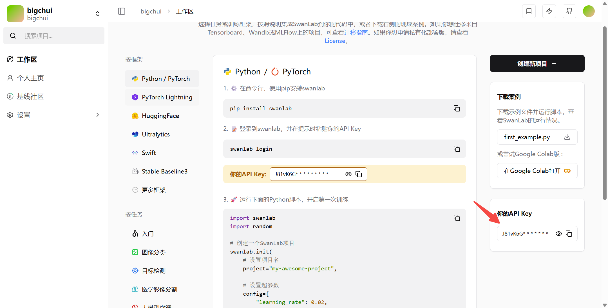
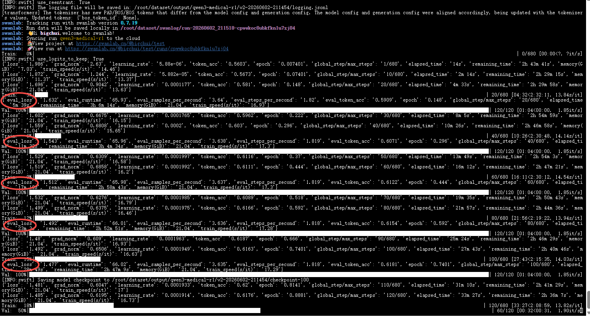

# 开启模型训练

# swanlab

SwanLab 是一款 **AI训练分析平台**，面向模型训练团队，提供**训练可视化、自动日志记录、超参数记录、实验对比、多人协同**等功能，帮助团队快速发现训练问题，加速模型迭代。

我们可以将自己的训练日志上传到swanlab平台上，就可以可视化的观测模型的训练效果了，非常的方便。

到这个网站进行账号注册：SwanLab官方文档 | 先进的AI训练分析平台，为顶尖模型团队而生


功能可参考官方文档：ModelScope Swift | SwanLab官方文档

注册好后到设置页面找到api key



后面训练的时候导入就可以在这里看到你所有的训练中间过程了。

## 开始训练

### 配置swanlab

在服务器上（autodl）先安装一下swanlab

```java
pip install swanlab
```

配置环境变量，建议不要把 token 写在命令行参数里，用配置变量更安全。

```java
export CUDA_VISIBLE_DEVICES=0
export SWANLAB_API_KEY="你的token"
```

我建议你课程里直接写成下面这种风格，保持紧凑，以命令参数为主线，重点参数详细讲，次要参数一句话带过。这样更符合 Java 开发者学习习惯。

### 启动医疗问答数据集微调

执行下面命令，开始基于医疗问答数据集对 Qwen3-0.6B 进行 LoRA 微调：

```java
swift sft \
    --model Qwen/Qwen3-0.6B \
    --tuner_type lora \
    --tuner_backend peft \
    --dataset /root/dataset/data/train.jsonl \
    --val_dataset /root/dataset/data/val.jsonl \
    --output_dir /root/dataset/output/qwen3-medical-r1 \
    --num_train_epochs 5 \
    --per_device_train_batch_size 2 \
    --per_device_eval_batch_size 2 \
    --gradient_accumulation_steps 8 \
    --learning_rate 2e-4 \
    --max_length 2048 \
    --torch_dtype bfloat16 \
    --lora_rank 8 \
    --lora_alpha 32 \
    --target_modules all-linear \
    --logging_steps 10 \
    --eval_steps 20 \
    --save_steps 100 \
    --save_total_limit 3 \
    --load_best_model_at_end true \
    --metric_for_best_model eval_loss \
    --greater_is_better false \
    --dataset_num_proc 4 \
    --dataloader_num_workers 4 \
    --warmup_ratio 0.05 \
    --seed 42 \
    --report_to swanlab \
    --swanlab_project test \
    --swanlab_exp_name qwen3-medical-r1 \
    --model_author swift \
    --model_name swift-robot
```

核心训练参数

**\--model**：指定底座模型。这里使用的是 Qwen3-0.6B。

**\--dataset / --val\_dataset**：训练集和验证集路径。训练集负责让模型学习知识，验证集不参与训练，只负责检查学习效果。

**\--output\_dir**：模型输出目录。训练过程中保存的 Checkpoint、日志文件以及最终模型都会存放在这里。

**\--num\_train\_epochs**：训练轮数。表示完整学习训练集多少遍。轮数太少可能学不会，轮数太多可能出现过拟合。

**Batch 相关参数**

-   **\--per\_device\_train\_batch\_size**：每次送入显卡的样本数量，越大越吃显存。

-   **\--gradient\_accumulation\_steps**：梯度累积次数，可以理解为多次计算后再统一更新参数。


当前配置：

```java
2 × 8 = 16
```

表示模型每次真正更新参数时，相当于参考了 16 条样本。

**\--learning\_rate**：学习率，控制模型每次调整参数的幅度。太大容易训练不稳定，太小收敛速度慢。LoRA 微调通常使用 1e-4～2e-4。

**\--max\_length**：单条样本允许的最大 Token 长度，包含 System、User、Assistant 全部内容。长度越大显存占用越高，但能够处理更长的上下文。

**\--torch\_dtype bfloat16**：使用 BF16 精度训练，在保证效果的同时降低显存占用，目前也是主流训练配置。

LoRA 参数说明

**\--tuner\_type lora**：采用 LoRA 微调，而不是全参数微调，大幅降低训练成本。

**\--lora\_rank 8**：LoRA 的学习容量。数值越大，可训练参数越多，但显存占用也会增加。

**\--lora\_alpha 32**：LoRA 缩放系数，用于控制 LoRA 对原模型的影响程度。

**\--target\_modules all-linear**：为模型中的所有线性层挂载 LoRA，这是目前最常见的配置方式。

模型评估与保存

**\--eval\_steps 20**：每训练 20 个 Step，在验证集上执行一次评估。

评估完成后会输出类似日志：

```json
{
  "eval_loss": 1.543,
  "eval_token_acc": 0.6071
}
```

其中：

-   **eval\_loss**：验证集损失值，可以理解为模拟考试扣分，越低越好。

-   **eval\_token\_acc**：验证集 Token 准确率，可以理解为答题正确率，越高越好。


例如：

```java
第20步：eval_loss = 1.632
第40步：eval_loss = 1.543
```

说明模型正在学习，效果持续提升。

**\--metric\_for\_best\_model eval\_loss**：使用 eval\_loss 作为最佳模型评判标准。

**\--greater\_is\_better false**：表示 eval\_loss 越小越好。

**\--load\_best\_model\_at\_end true**：训练结束后自动加载验证集表现最好的 Checkpoint。

**\--save\_steps 100**：每 100 个 Step 保存一次 Checkpoint。

**\--save\_total\_limit 3**：最多保留 3 个 Checkpoint，防止占满磁盘空间。

SwanLab相关参数

**\--report\_to swanlab**：将训练过程中的指标上传到 SwanLab。

**\--swanlab\_project**：实验所属项目名称。

**\--swanlab\_exp\_name**：当前实验名称。

通过 SwanLab 可以实时观察 Loss 曲线、验证集指标以及训练趋势。

其它参数

**\--dataset\_num\_proc 4**：数据预处理并行线程数。

**\--dataloader\_num\_workers 4**：数据加载线程数。

**\--warmup\_ratio 0.05**：前 5% 训练过程进行学习率预热，避免训练初期震荡。

**\--seed 42**：随机种子，保证实验结果尽可能可复现。

**\--model\_author swift**：模型作者信息。

**\--model\_name swift-robot**：模型名称，后续发布到模型仓库时会显示该名称。

## 重点关注哪些指标？

第一次训练其实不用盯着所有日志，重点关注下面三个指标即可：

```java
loss             训练集损失
eval_loss        验证集损失
eval_token_acc   验证集准确率
```

理想情况是：

```java
loss 持续下降
eval_loss 持续下降
eval_token_acc 持续上升
```

如果出现：

```java
loss 继续下降
eval_loss 开始上升
```

通常说明模型已经开始过拟合，需要考虑提前停止训练或者减少 Epoch。

看到这个界面说明，我们微调就正式开始了，前面的工作都是ok的。可以看到eval\_loss也是持续在下降的。



如果遇到下面这种情况，说明环境变量没配置成功，或者丢失了。重新配置一下SWANLAB\_API\_KEY即可。


下节课我们就来看下如何观察训练效果。
