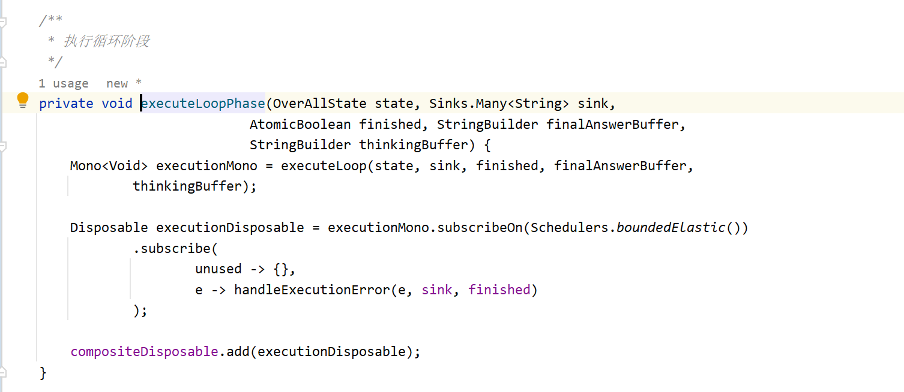
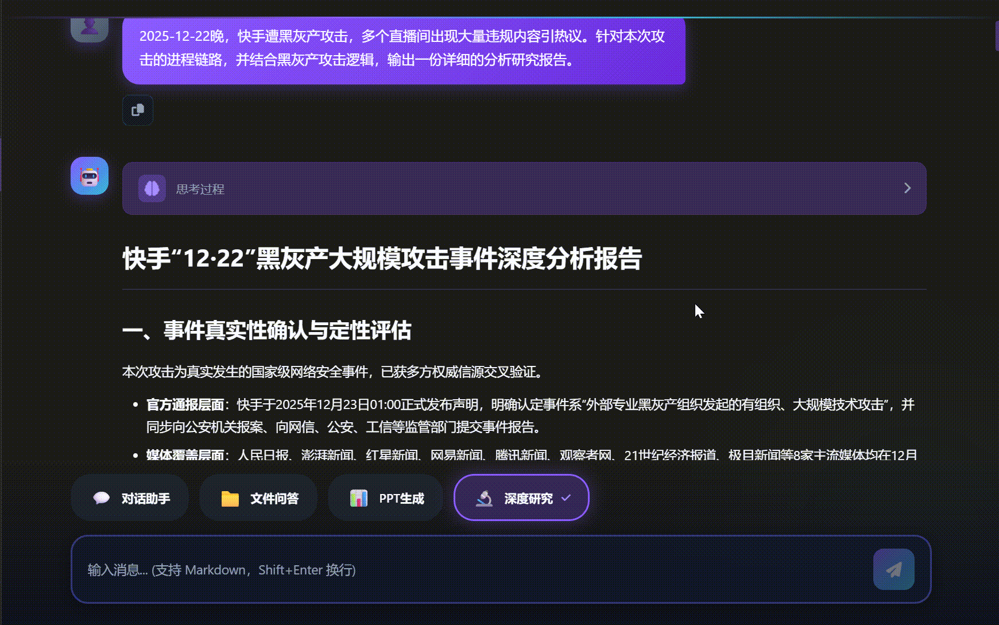

# ✅实现 DeepResearch（下）

在上节课中，我们已经分析过，**DeepResearch 的底层核心机制，其实就是基于 Plan-Execute 架构实现的**。因此在工程实现时，并不需要从零重新设计一套 Agent 体系，而是可以直接在我们之前讲解过的 **PlanExecuteAgent** 的基础上进行改造。

这次改造主要集中在三个方面：

1.  **提示词改造**将原本通用任务执行的 Prompt，调整为适用于 **DeepResearch 场景**的研究型 Prompt，例如研究计划生成、研究结果批判等。

2.  **任务执行体系兼容**让 Agent 的执行逻辑能够与 `taskManager` 配合，从而实现 **工具调用的并发控制**以及**流式执行管理**。

3.  **输出模式升级为流式**原本 PlanExecuteAgent 的返回值通常是一个最终的字符串结果，而在 DeepResearch 中，我们希望用户能够看到**每个阶段的实时执行过程**。因此整个流程的输出方式也需要调整为：`Flux<String>`


这样系统就可以在执行过程中持续输出，例如：

-   当前生成的研究计划

-   工具执行结果

-   批判分析

-   上下文压缩结果


也正因为如此，DeepResearch 不再是一个“黑盒式”的一次性回答，而是一个**完整的可观察研究过程**。

整个系统真正的核心，就是下面这个方法：

```java
executeLoop(...)
```

它负责驱动整个研究流程的 **多轮迭代执行（Iterative Research Loop）**。

在这个循环中，系统会不断地：

-   生成研究计划

-   执行工具获取信息

-   对结果进行批判评估

-   压缩上下文并进入下一轮


直到研究信息足够完整，最终输出完整的研究结论。

# 触发机制

循环核心是在这个方法中被链式调用触发的，当需求澄清完成 → 研究主题生成后，则会启动`executeLoopPhase`，整体任务会注册到taskmanager中，这个做法和我们在前面的智能体中的做法是一致的，也就是通过taskmanager来控制他的并发和停止。


`executeLoopPhase`也就是将我们之前`PlanExecuteAgent`中的执行逻辑封装成Mono，也就是异步任务，从而构造出`Disposable`，注册到`compositeDisposable`之中，具体为啥这么做，我在后面具体会讲。



# executeLoop：研究核心循环

executeLoop 本质上是一个**多轮循环研究过程**。同样也需要包装成Mono异步任务，循环轮数由配置控制：

```java
private final int maxRounds;
```


执行逻辑可以理解为：

```java
for (int round = 1; round <= maxRounds; round++) {

    // 1 生成计划
    plan()

    // 2 执行工具
    executeTools()

    // 3 批判结果
    critic()

    // 4 压缩上下文
    compressContext()
}
//5 总结输出
summarizeStream
```

接下来我们逐步拆解。

# 生成执行计划（Plan）

在 DeepResearch 的每一轮研究开始时，系统都会先生成一份 **执行计划**，确定这一轮需要完成哪些研究任务。

这个过程由 `generatePlan` 方法负责：

```java
private List<PlanTask> generatePlan(
        OverAllState state,
        Sinks.Many<String> sink,
        AtomicBoolean hasSentFinal,
        StringBuilder thinkingBuffer) {
```

方法最终返回：

```java
List<PlanTask>
```

也就是 **本轮需要执行的一组任务列表**。

## 构建规划 Prompt

首先系统会准备两个重要信息：

-   **工具说明**（用于规划参考）

-   **结构化输出格式**


```java
String toolDesc = renderToolDescriptions();

BeanOutputConverter<List<PlanTask>> converter =
        new BeanOutputConverter<>(new ParameterizedTypeReference<>() {});
```

这里的 `BeanOutputConverter` 用来约束 LLM 输出 **JSON 格式的计划**，并自动转换为 `PlanTask` 对象。

随后构建 Prompt：

```java
Prompt prompt = new Prompt(List.of(

                new SystemMessage(PlanExecutePrompts.PLAN + """

                                                ## 当前上下文

                                                当前轮次: %s

                                                ## 可用工具说明（仅用于规划参考）

                                                %s

                                                ## 输出格式

                                                %s

                        """.formatted(state.getRound(), toolDesc, converter.getFormat())),

                new UserMessage("【对话历史】\n\n" + state.renderFullContext() + """

                        \n\n

                        ## 重要约束

                        如果会话历史中存在【Critique Feedback】，你必须：

                        1. 仔细分析反馈中指出的不足

                        2. 新的计划必须直接解决这些问题

                        3. 不要重复之前失败的尝试

                        """)

        ));
```

其中包含三部分上下文：

-   用户问题

-   当前研究主题

-   上一轮 Critique 的反馈（如果有）


这样模型就可以针对 **上一轮不足之处重新规划任务**。

## 调用模型生成计划

生成 Prompt 后，系统会调用模型生成执行计划：

```java
String json = chatClient.prompt()
        .messages(prompt.getInstructions())
        .call()
        .content();
```

这里使用的是 `call()` 而不是 `stream()`，因为执行计划是 **结构化 JSON**，不需要流式输出。

## 解析为 PlanTask

模型返回 JSON 后，会被自动转换为任务对象：

```java
List<PlanTask> planTasks = converter.convert(json);
```

例如模型返回：

```json
[
  {"id":"task-1","order":"1","instruction": "搜索 AI Agent 定义"},
  {"id":"task-1","order":"1",{"instruction": "搜索 AI Agent 主流框架"},
  {"id":"task-1","order":"1","instruction": "搜索 AI Agent 行业应用"}
]
```

**其中instruction表示下发的指令，order表示执行顺序，如果一样，则表示可以并发执行。**

## 输出执行计划

生成完成后，系统会将执行计划输出给用户：

```java
emit(sink, hasSentFinal,
     "\n✅ 执行计划已生成，共 " + planTasks.size() + " 个任务\n",
     "thinking",
     thinkingBuffer);
```

并以简单列表形式展示：

```java
StringBuilder planText = new StringBuilder("\n📋 执行计划表：\n");
for (PlanTask task : planTasks) {
    planText.append(String.format("  🟠 %s \n", task.instruction()));
}
```

用户看到的效果类似：

```java
📋 正在生成执行计划...

✅ 执行计划已生成，共 3 个任务

📋 执行计划表：
🟠 搜索 AI Agent 定义
🟠 搜索 AI Agent 主流框架
🟠 搜索 AI Agent 行业应用
```

生成的 `PlanTask` 列表随后会进入下一阶段：**执行工具任务（Execute）**。

# 执行工具任务（Execute）

在生成执行计划之后，系统就会进入下一阶段：**真正执行计划中的任务**。这一阶段由 `executePlan` 方法负责，它会按照计划中的任务顺序，调用工具获取研究信息。

方法定义如下：

```java
private Map<String, TaskResult> executePlan(
        List<PlanTask> plan,
        OverAllState state,
        Sinks.Many<String> sink,
        AtomicBoolean hasSentFinal,
        StringBuilder thinkingBuffer)
```

方法最终返回：

```java
Map<String, TaskResult>
```

也就是 **每个任务对应的执行结果**。

## 执行顺序与并发控制

它的执行策略是：

```java
不同 order 串行
相同 order 并行
```

代码中首先按照 `order` 对任务进行分组：

```java
Map<Integer, List<PlanTask>> grouped =
        plan.stream().collect(Collectors.groupingBy(PlanTask::order));
```

然后按顺序执行：

```java
for (Integer order : new TreeSet<>(grouped.keySet())) {
```

同一组任务会并行执行，通过 `CountDownLatch` 等待全部完成：

```java
CountDownLatch latch = new CountDownLatch(tasks.size());
```

这样可以保证：

```java
Task1
Task2   → 并行
Task3

下一阶段任务
```

只有当前阶段全部完成，才会进入下一阶段。

## 任务执行流程

每个任务都会被包装成一个 `Mono` 异步执行：

```java
Disposable taskDisposable = Mono.fromRunnable(() -> {
```

在执行之前，系统会先获取一个执行许可：

```java
toolSemaphore.acquire();
```

这个 `Semaphore` 用来限制同时运行的工具数量，避免任务过多导致资源耗尽。

执行完成后会释放许可：

```java
toolSemaphore.release();
```

## 执行单个任务

真正的工具调用在 `executeWithRetry` 方法中完成：

```java
TaskResult result = executeWithRetry(task, dependencyContext, sink, hasSentFinal, thinkingBuffer);
```

构建任务上下文：

```java
String fullContext = """
【Available Results】
%s

【Current Task】
%s
""".formatted(
        dependencyContext,
        task.instruction()
);
```

这里包含两个部分：

```java
之前任务的执行结果
当前任务指令
```

这样后续任务就可以 **利用前面的研究结果继续推理**。

## 调用工具 Agent

任务执行时，使用的直接是我们之前课程中开发过的`SimpleReactAgent`

```java
SimpleReactAgent agent = SimpleReactAgent.builder()
        .chatModel(chatModel)
        .tools(tools)
        .systemPrompt(PlanExecutePrompts.EXECUTE)
        .build();
```

然后调用：

```java
SimpleReactResult result =
        agent.callWithReference(null, fullContext);
```

这个 Agent 会根据任务内容自动决定：如何去执行搜索任务，并返回一个结构化的返回值`SimpleReactResult`

任务执行成功后，系统会记录结果：

```java
results.put(task.id(), result);
```

同时还会收集搜索引用：

```java
allReferences.addAll(result.getSearchResults());
```

这样在最终生成研究报告时，就可以附带 **参考资料来源**了。

## 整体流程

执行工具阶段的核心逻辑可以概括为：

```java
执行计划
   ↓
按 order 分组
   ↓
同组任务并行执行
   ↓
调用工具 Agent 获取结果
   ↓
收集结果与引用
```

得到的任务结果会进入下一阶段：**研究结果评估（Critique）**，由模型判断当前研究是否已经足够，或者需要继续下一轮研究。

# 批判结果（Critic）

在工具任务执行完成后，系统并不会立即进入下一轮研究，而是会先进行一次 **结果评估（Critique）**。


这一步的目标是判断：

```java
当前获得的信息是否已经足够回答问题
```

如果信息已经完整，就可以结束研究并生成最终报告；如果信息仍然不足，就继续下一轮研究。

这个过程由 `critique` 方法完成：

```java
private CritiqueResult critique(
        OverAllState state,
        List<PlanTask> currentPlan,
        Map<String, TaskResult> currentResults,
        Sinks.Many<String> sink,
        AtomicBoolean hasSentFinal,
        StringBuilder thinkingBuffer)
```

方法最终返回：

```java
CritiqueResult
```

其中包含两个核心字段：

```java
passed   是否通过评估
feedback 未通过时的原因
```

## 构建评估上下文

构建评估所需的上下文信息，包括三部分：

```java
StringBuilder userMessage = new StringBuilder();
```

### 用户原始问题

```java
userMessage.append("【用户原始问题】\n");
userMessage.append(state.getQuestion());
```

### 研究主题

```java
userMessage.append("\n\n【研究主题】\n");
userMessage.append(state.getRefinedResearchTopic());
```

### 当前轮次的执行结果

包括：

-   本轮执行计划

-   工具执行结果


```java
userMessage.append("\n\n【当前轮次的执行计划】\n");
```

```java
userMessage.append("\n\n【当前轮次的工具结果】\n");
```

这样模型就可以根据 **当前轮次获得的信息** 判断研究是否充分。

## 调用模型进行评估

随后构建评估 Prompt：

```java
String prom = PlanExecutePrompts.CRITIQUE + "\n" + converter.getFormat();
```

这里同样使用 `BeanOutputConverter` 约束输出格式：

```java
BeanOutputConverter<CritiqueResult> converter =
        new BeanOutputConverter<>(new ParameterizedTypeReference<>() {});
```

然后调用模型，并解析为结构化对象：

```java
CritiqueResult result = converter.convert(raw);
```

## 输出评估结果

如果评估通过：

```java
if (result.passed()) {
    emit(sink, hasSentFinal,
         "\n✅ 研究结果评估通过，准备生成最终报告\n",
         "thinking",
         thinkingBuffer);
}
```

说明当前信息已经足够，系统会直接进入 **最终报告生成阶段**。

如果评估未通过：

```java
else {
    emit(sink, hasSentFinal,
         "\n⚠️ 研究结果评估未通过，原因分析：" + result.feedback() + "\n",
         "thinking",
         thinkingBuffer);
}
```

模型会给出反馈，例如：

```java
缺少行业应用案例
缺少数据来源
需要补充未来趋势分析
```

这些反馈会进入 **下一轮计划生成阶段**，从而指导系统继续研究。

## 整体流程

Critique 阶段的核心作用就是：

```java
评估当前研究质量
      ↓
决定是否继续研究
```

流程可以简单理解为：

```java
执行任务
   ↓
获取结果
   ↓
模型评估
   ↓
通过 → 生成最终报告
未通过 → 进入下一轮研究
```

这样 DeepResearch 就形成了一个 **Plan → Execute → Critique 的闭环研究流程**。

# 上下文压缩（Compress）

在 DeepResearch 中，最大的问题是：

**上下文会越来越长。**

例如：

```java
第一轮：2k tokens
第二轮：8k tokens
第三轮：20k tokens
第四轮：40k tokens
```

如果不处理，很快就会超过模型上下文。

**compressIfNeeded** 的逻辑其实很简单：**当上下文过长时，通过 LLM 生成一个压缩后的状态快照，并替换原有上下文，从而避免超出模型的 context 限制。**

因此代码中设置了一个阈值：

```java
private final int contextCharLimit;
```

目前我默认设置了5w字符，当超过这个长度时，就会触发**上下文压缩**。

核心逻辑类似：

```java
if (contextLength > contextCharLimit) {

    compressContext(state);

}
```

压缩方式通常是：利用大模型进行摘要总结

例如：

```java
总结当前研究结果：

1. AI Agent定义
2. 主流框架
3. 行业应用
```

然后替换原始上下文，这样就可以保持整个系统一直处于健康的运行状态。

# 生成总结报告

**summarizeStream** 是整个 DeepResearch 流程的最后一步，用于 **生成最终研究报告并以流式方式返回给用户**。

首先方法会输出提示信息“正在生成最终研究报告”，然后从 `state` 中提取所有工具执行结果：

```java
String toolResults = state.extractToolResults();
```

这里只保留 **真实的工具检索结果**，过滤掉中间推理过程，然后连同 **用户原始问题、研究主题** 一起构建 Prompt，交给模型生成最终报告。

模型调用使用的是 **流式接口**：

```java
chatClient.prompt()
        .messages(prompt.getInstructions())
        .stream()
        .chatResponse()
```

模型返回的内容会一段一段到达，每收到一个 `chunk` 就把文本追加到 `finalAnswerBuffer`，同时通过 `emit` 推送给前端：

```java
finalAnswerBuffer.append(text);
emit(sink, finished, text, "text");
```

这样用户就可以 **实时看到报告逐步生成的过程**。

当流式输出结束时，会把最终结果写入 `chatMemory`（用于会话记忆），然后再输出 **参考来源 references**，最后调用 `complete(sink, finished)` 结束整个 Flux 流。整个流式订阅返回的 `Disposable` 会加入 `compositeDisposable`，方便在任务取消或中断时统一释放。

# Disposables.composite

在 Agent 代码中，有这样一行：

```java
compositeDisposable = Disposables.composite();
```

我来解释下为啥要用这个方法：

`Disposables.composite()` 的作用是 **创建一个可统一管理多个** `**Disposable**` **的容器**。在使用 **Reactor / RxJava 流式调用**时，每一次 `subscribe()` 都会返回一个 `Disposable`，它代表一次可取消的订阅。如果系统中存在多个异步任务（例如工具调用、流式生成、总结等），逐个管理这些 `Disposable` 会非常麻烦，因此通常会使用 `CompositeDisposable` 进行集中管理。

在代码中：

```java
CompositeDisposable compositeDisposable = Disposables.composite();
```

这个对象就相当于一个 **订阅管理器**。当创建新的流式任务时，例如：

```java
Disposable disposable = chatClient.prompt()
        .messages(prompt.getInstructions())
        .stream()
        .chatResponse()
        .subscribe();

compositeDisposable.add(disposable);
```

每个新的订阅都会被加入 `compositeDisposable` 中。

这样做的好处是：当用户 **取消任务、超时、或者系统需要终止执行** 时，只需要调用一次：

```java
compositeDisposable.dispose();
```

就可以 **一次性取消所有正在运行的流式任务和异步操作**。因此在 DeepResearch 这种 **多轮推理 + 多工具并发 + 流式输出** 的系统中，`Disposables.composite()` 主要用于 **统一管理生命周期，确保任务可以被安全终止并释放资源**。

# 效果演示

**去年12月份的时候，快手遭遇的黑灰产攻击，我们尝试让 DeepResearch 对这个话题进行分析，并输出一份分析报告。**

```
2025-12-22晚，快手遭黑灰产攻击，多个直播间出现大量违规内容引热议。针对本次攻击的进程链路，并结合黑灰产攻击逻辑，输出一份详细的分析研究报告。
```



调用需谨慎，调用前，请检查下钱包余额是否充足。


