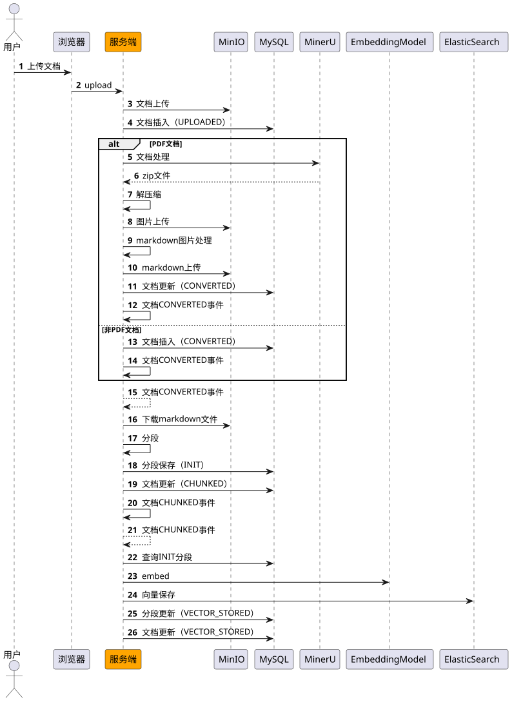
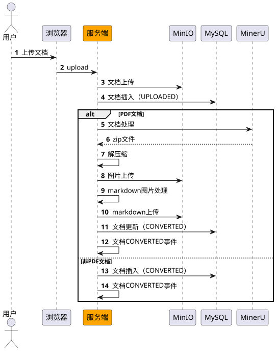
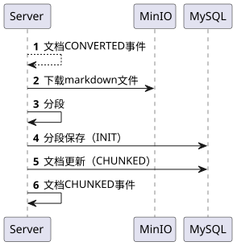

# ✅文档预处理阶段全流程讲解（事件驱动）

### 完整流程




1、多个流程之间，基于事件驱动。这样可以更好的解耦。

2、事件驱动如果处理失败了， 引入任务定时任务兜底。


### 文档上传




在文档上传的代码中，把Document状态更新成CONVERTED之后，触发一个DocumentConvertedEvent事件：


```java
@Override
public KnowledgeDocument uploadFile(MultipartFile file, String uploadUser, String accessibleBy) throws IOException {
    try {
        String fileName = file.getOriginalFilename();
        // 用minio上传

        // 构建文档记录

        // 保存到数据库
        boolean result = knowledgeDocumentService.save(document);
        Assert.isTrue(result, "文件上传失败");

        // 如果是 PDF 文件（通过后缀或文件头判断），调用转换处理
        if (isPdfFile(fileName) || isPdfContent(file)) {
            // 调用文件处理服务进行转换
            fileProcessService.processDocument(document, file.getInputStream());
        } else {
            // 非PDF文件，直接更新文档状态为已转换
            document.setStatus(DocumentStatus.CONVERTED);
            document.setConvertedDocUrl(fileUrl);
            result = knowledgeDocumentService.updateById(document);
            Assert.isTrue(result, "文件状态更新失败");
        }

        publishConvertedEvent(document);
        return document;
    } catch (Exception e) {
        throw new IOException("文件上传失败: " + e.getMessage(), e);
    }
}
```


```java
/**
 * 文档已转换事件
 * 当文档状态变更为CONVERTED时发送此事件
 */
public class DocumentConvertedEvent extends ApplicationEvent {

    /**
     * 文档ID
     */
    private final Long documentId;

    public DocumentConvertedEvent(Object source, Long documentId, KnowledgeDocument document) {
        super(source);
        this.documentId = documentId;
    }

    public Long getDocumentId() {
        return documentId;
    }

    @Override
    public String toString() {
        return "DocumentConvertedEvent{documentId=" + documentId + '}';
    }
}
```


### 文档分段




在DocumentEventListener中，接收DocumentConvertedEvent，做分段处理：


```java
/**
 * 监听文档CONVERTED事件
 * 触发文档分段流程
 *
 * @param event 文档已转换事件
 */
@Async("eventListenerExecutor")
@EventListener
public void onDocumentConverted(DocumentConvertedEvent event) {
    Long documentId = event.getDocumentId();
    log.info("收到文档CONVERTED事件，开始执行文档分段，documentId: {}", documentId);

    try {
        int segmentCount = documentProcessService.splitDocument(documentId);
        log.info("文档分段完成，documentId: {}, segmentCount: {}", documentId, segmentCount);
    } catch (Exception e) {
        log.error("文档分段失败，documentId: {}", documentId, e);
    }
}
```


在文档分段的代码中，把Document状态更新成CHUNKED之后，触发一个DocumentChunkedEvent事件（下面的第32行代码）：


```java
@Override
@Transactional
public int splitDocument(Long documentId) {

    // 1. 查询文档

    // 2. 从MinIO下载文件内容

    // 3. 使用 MarkdownHeaderParentTextSplitter 进行切分

    // 4. 转换为 KnowledgeSegment 并保存

    // 5. 批量保存片段

    // 6. 更新文档状态为 CHUNKED
    document.setStatus(DocumentStatus.CHUNKED);
    boolean updateResult = knowledgeDocumentService.updateById(document);
    Assert.isTrue(updateResult, "更新文档状态失败");

    // 发送文档已分段事件
    publishChunkedEvent(document, segmentCount);

    return segmentCount;
}
```


```java
/**
 * 文档已分段事件
 * 当文档状态变更为CHUNKED时发送此事件
 */
public class DocumentChunkedEvent extends ApplicationEvent {

    /**
     * 文档ID
     */
    private final Long documentId;

    /**
     * 分段数量
     */
    private final int segmentCount;

    public DocumentChunkedEvent(Object source, Long documentId, KnowledgeDocument document, int segmentCount) {
        super(source);
        this.documentId = documentId;
        this.segmentCount = segmentCount;
    }

    public Long getDocumentId() {
        return documentId;
    }

    public int getSegmentCount() {
        return segmentCount;
    }

    @Override
    public String toString() {
        return "DocumentChunkedEvent{documentId=" + documentId + ", segmentCount=" + segmentCount + '}';
    }
}
```


### 文档向量保存


1、事件驱动


在DocumentEventListener中，接收DocumentChunkedEvent，做向量化和保存处理：


```java
    /**
     * 监听文档CHUNKED事件
     * 触发向量嵌入流程
     *
     * @param event 文档已分段事件
     */
    @Async("eventListenerExecutor")
    @EventListener
    public void onDocumentChunked(DocumentChunkedEvent event) {
        Long documentId = event.getDocumentId();
        log.info("收到文档CHUNKED事件，开始执行向量嵌入，documentId: {}, segmentCount: {}",
                documentId, event.getSegmentCount());

        try {
            boolean success = documentProcessService.embeddingAndStore(documentId);
            log.info("向量嵌入完成，documentId: {}, success: {}", documentId, success);
        } catch (Exception e) {
            log.error("向量嵌入失败，documentId: {}", documentId, e);
        }
    }
```
