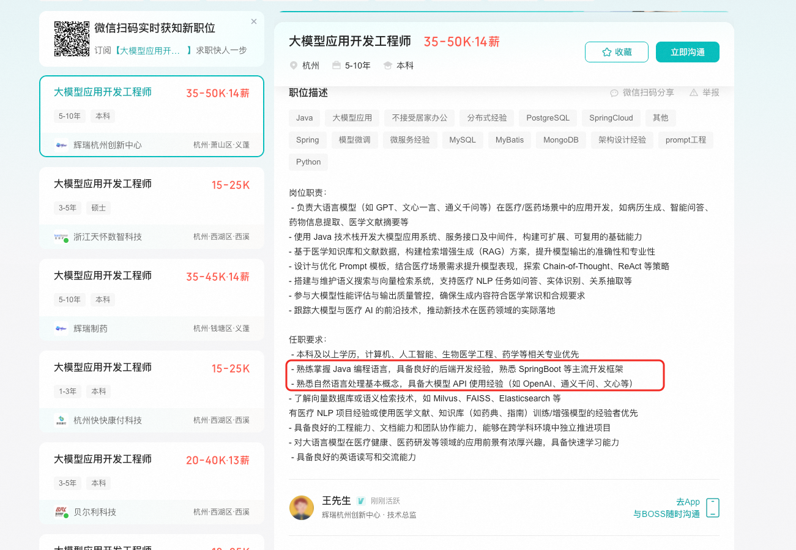
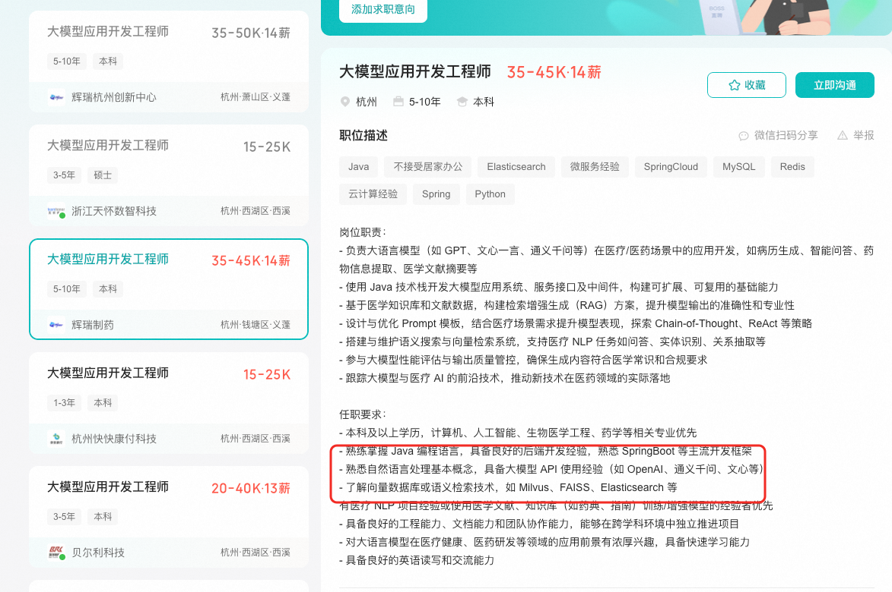

# ✅Java 在大模型应用开发中的优势

在AI开发的领域，一直都是Python的天下，因为py中有很多算法库，SDK，在模型训练、实验、快速构建 PoC 方面，Python 拥有无可比拟的生态（PyTorch, TensorFlow, Hugging Face Transformers, LangChain, LlamaIndex）。

但是，当需要将 LLM 能力集成到稳定、高性能、可扩展、易维护的企业级生产系统中时，**Java 凭借其成熟的企业级生态、卓越的性能、坚如磐石的稳定性和强大的集成能力，也能展现出巨大的优势。**

一方面，在国内很多企业做应用开发，还是以Java为主的，很多web应用都是用Java构建起来的，这些企业做大模型的落地，肯定不可能完全重新开发一套，而是要在原来的Java应用的基础上做一些AI的尝试，而这时候，Java就至关重要了。而且Java的体系很庞大， 虽然很多人说他很臃肿，但是也不可否认**他在应用层的开发上有着绝对的优势。**

另外，Java中也有一些框架可以帮助我们做AI的应用开发，比如Spring AI （Alibaba），Langchain4j等等。

而且，其实现在很多情况下，大模型的应用开发主要工作在于AI模型的对接，知识库的搭建、提示词的调优、Agent的开发等，并不是模型开发及调优，也很少涉及到预训练，偶尔会有些微调。那么从这些工作内容来看，其实Java也都是更加有优势的。

另外，我们在boss上随便搜一下大模型应用开发工程师的岗位其实也能发现，很多岗位都是要有Java背景的。

