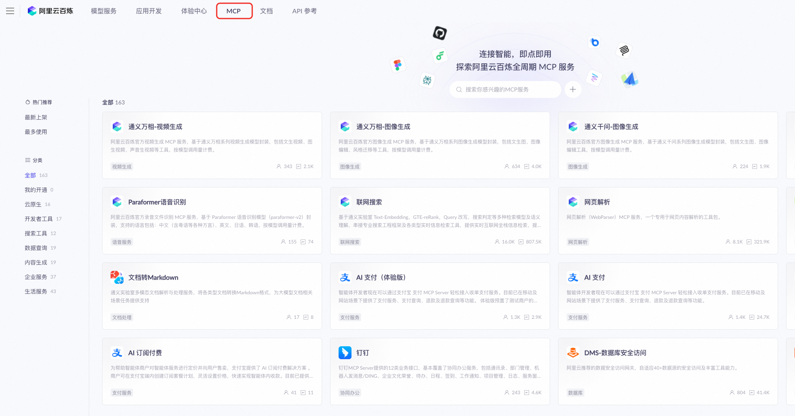
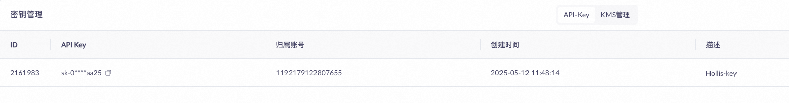
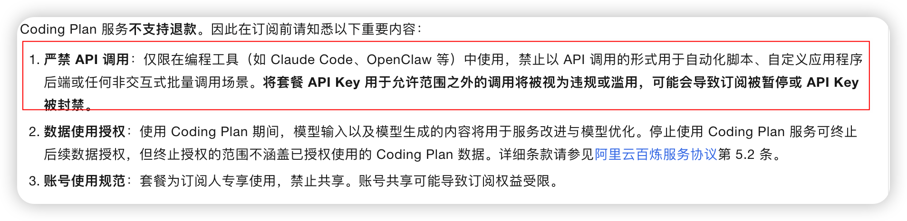

# ✅百炼介绍与基本使用

百炼，阿里云推出的大模型服务与应用开发平台。


-   大模型服务：提供了百余款通义系列大模型和国内优质的开源第三方大模型。

-   应用开发平台：提供大模型应用构建的全链路工具，没包括MCP、智能体搭建、工作流等。


### 模型服务

百炼上的模型服务中提供了模型的使用和模型的操作。


模型使用这里，分为文本、语音、视觉等入口，分别可以生成文字、音频、图片和视频。都可以在这里面直接体验。每个入口中也内置了一些模型可以直接调用。

下面的工作台中包含了模型的推理、微调、评测等功能。相当于提供了一整套模型相关的操作功能，可以自己训练一个模型、或者微调一个模型，然后针对这个模型做部署以及使用，并且还可以做评测和观测。形成了一个闭环。

接着应用开发部分就是围绕着开发自己的大模型应用的了，这里包含了开发自己的工具、MCP、Agent以及workflow等。


应用可以包括几种，比较常用的就是Agent（智能体应用）和workflow（工作流应用）

什么是agent，什么是workflow，我们后面的课程都会讲的。


百炼上还提供了一个MCP市场，官方会把一些MCP的服务放在这里，可以直接用



另外，还有相关的文档和API上面也都有，不展开介绍了， 百炼还是比较好用的一个平台，可以大大降低大模型应用开发的门槛，把模型对接、模型使用，模型训练，模型部署，模型评测，模型观测，应用开发等等都集成好了。做到了一站式。

### 获取API key

如果想要在代码中通过百炼来调模型服务，可以申请api key，操作方式如下：

1.  前往我的API-KEY页面，单击创建我的API-KEY。

2.  在已创建的API Key操作列，单击查看，获取API KEY。




这部分都需要操作下，我们后续在代码中会通过spring ai来调用百炼，这个api key是必须得。


### 如何调用百炼上面的模型


当我们通过上面的方式获取了api key了之后，就可以通过百炼来调用大模型了，可以通过以下命令：


```java
curl -X POST https://dashscope.aliyuncs.com/compatible-mode/v1/chat/completions \
-H "Authorization: Bearer $DASHSCOPE_API_KEY" \
-H "Content-Type: application/json" \
-d '{
    "model": "qwen-plus",
    "messages": [
        {
            "role": "system",
            "content": "You are a helpful assistant."
        },
        {
            "role": "user",
            "content": "你是谁？"
        }
    ]
}'
```


> 如果报错，提示{"error":{"message":"Required body invalid, please check the request body format.","type":"invalid\_request\_error","param":null,"code":null},"request\_id":"8f24513a-440e-9c0c-a4ae-5a74420e22c9"}
>
> windows系统执行curl不支持单引号 ' 包裹 JSON，导致请求体格式解析失败，改成双引号 + 转义就能解决。
>
> —————————— @程序员田宝宝 反馈


上面的$DASHSCOPE\_API\_KEY记得换成你上一步申请到的api key，直接在你的shell中执行就可以通过qwen-plus模型来和大模型对话了：


还可以问其他问题，比如：『你知道程序员Hollis吗』


PS：虽然有一部分内容还可以，但是也有错误的信息，比如他说我的本命是 杨昊。。。。这是谁啊？？？


这只是一些简单的使用，当然你还可以更换模型，使用流式输出，增加对话记忆等，这里先不展开，后面接入Spring AI之后我们会用Spring AI实现这些功能。


### Coding Plan


后来百炼推出了coding plan的套餐，价格更加优惠一些。


但是需要注意的是，coding plan的使用上，除了api key获取路径不一样之外，base\_url也不一样，在代码中使用的时候，记得要一起改。


> Coding Plan 专属的 API Key 和 Base URL 与百炼按量计费的 API Key（`sk-xxxxx`）和Base URL（`https://dashscope.aliyuncs.com/xxxxxx`）不互通，请勿混用。


-   **OpenAI 兼容协议**：`https://coding.dashscope.aliyuncs.com/v1`

-   **Anthropic 兼容协议**：`https://coding.dashscope.aliyuncs.com/apps/anthropic`


但是官方是禁止通过api调用的，有封号风险。


