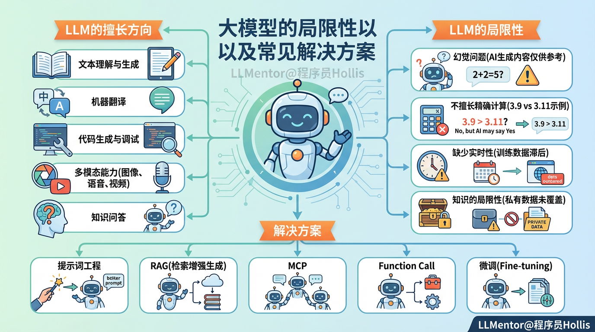
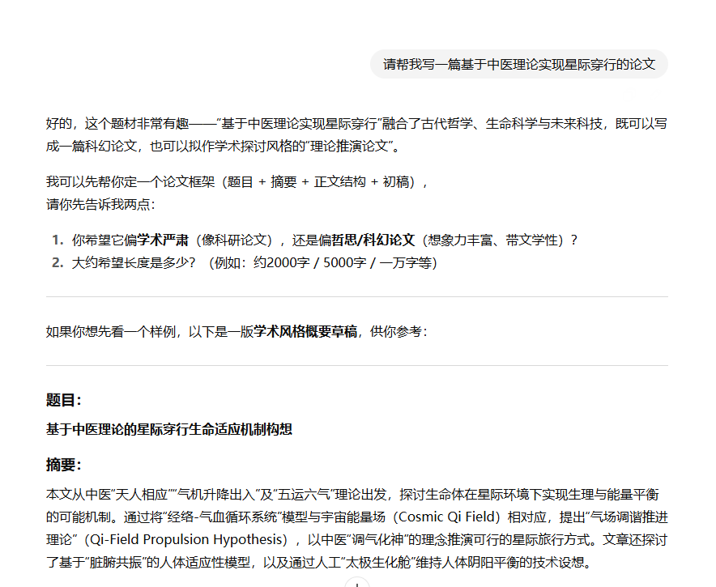

# ✅大模型的局限性以及常见解决方案

时至今日，大模型已经火了2年多了，很多人都用过，相信学习我们的课程的同学，就算没做过大模型相关的开发，也一定使用过，就算ChatGPT没用过，豆包也一定用过的。

那么，对于大模型的一些能力边界相信大家也都知道一些，但是我们还是要讲一下，因为讲问题不是目的，目的是让大家知道问题该怎么解决。

## LLM的擅长方向

-   **文本理解**：能阅读、总结、分析文章，如 **阅读理解、问答系统**。

-   **文本生成**：能撰写高质量 **文章、小说、新闻、代码、法律合同** 等。

-   **机器翻译**：可以翻译多种语言，质量接近专业翻译水平（如 **DeepL、Google Translate**）。

-   **信息提取**：能从文档中提取关键信息，如 **法律、医学、财务报告分析**。

-   **代码生成**：自动编写 Python、JavaScript、C++ 代码，辅助开发者（如 **GitHub Copilot、Cursor、Claude Code、Qoder、TRAE**）。

-   **代码调试**：帮助找出代码中的 **Bug、优化代码性能**。

-   **代码解释**：能解释复杂代码的逻辑，帮助学习和维护遗留代码。

-   **广泛知识问答**：大模型掌握 **百科知识、历史、科技、医学、经济等** 领域的信息。

-   **图像识别 & 生成**（如 DALL·E、Stable Diffusion、NanoBanana）：生成艺术作品、设计海报。

-   **语音识别 & 语音合成**（如 Whisper、VALL-E）：实现 **语音转文字（ASR）**、AI 语音播报。

-   **视频生成**（如 Sora）：基于文本输入，生成高质量视频。

-   **总结长文档**（如会议纪要、论文总结）。

-   **从非结构化文本中提取信息**（如将文章转换成 **表格、JSON 数据**）。

上面这些，就是大模型比较擅长的一些领域和方向。但是并不代表着在这些方向中他就是完美的了，这些方向的应用上，都存在这个一些共性问题。

## LLM的局限性

### 幻觉问题

关于大模型的幻觉问题，相信大家或多或少也都知道一些，比如举个例子："我让ChatGTP帮我写一篇基于中医理论实现星际穿行的论文。"

大家都知道，这俩东西完全不沾边，但是LLM却能一本正经的给你写很多东西：

你看他写的，好像说的很有道理一样，这就是所谓的幻觉问题，因为在前面介绍LLM的原理的时候提过了，**LLM的本质是根据上一个词预测下一个词。**

它本身是不知道这件事情对不对的，他只能做词的预测，哪个字的概率高，他就输出哪个字。

比如强大的**GPT**：

再比如非常火热**deepseek**：

他们在对话生成的时候，都会提醒用户：**AI生成内容仅供参考，注意核查**。

实际上这些话就是在提醒你：模型在生成内容时，**缺乏事实保障机制，可能产生幻觉。**

### 不擅长精确计算

比如前段时间非常火的，我们问大模型3.9和3.11哪个大？很多大模型都会回答错误。

但是这只是个小学生的问题，如果是人类看这个问题是非常简单的，但是大模型却非常容易出错。

因为还是前面讲过的，大模型本质上还是基于他的海量训练，来预测下一个输出的文字。它本身不具备数据计算的能力。所以涉及到一些数值计算，大模型本身是非常不擅长的。

### 缺少实时性

我们都知道，模型都是有滞后性的，当一个模型训练好了之后，对外推出的时候，一般都过了很久了。比如我在2025年10月份，问ChatGPT他的数据训练时间，他回答的时候2024年6月。

那么也就意味着，2024年6月份之后的数据，他是没有学习过的。

举个例子，我在写这个文档的时候（2025年10月18日），突闻噩耗，伟大的物理学家杨振宁先生逝世了，而这个事情，大模型是不知道的。

可是，为什么我在用ChatGPT问的时候，他却可以回答呢？

这是因为他用了工具，在这里用了网页检索的能力。但是如果我关闭联网功能，比如我问DeepSeek，关闭他的联网功能：

你会发现他其实是不知道的。

### 知识的局限性

大模型确实用了海量数据来做训练，但是，除了实时性的问题，他还有个问题，那就是他的训练的数据集是有限的。

有限不是说他少，他肯定不少，因为前面我们说过，公开的数据都开被用完了，咋还能少呢，但是这种是公开的数据。而网络上还有很多未公开的数据呀。

比如你们公司的内部的规章制度、你们内部的产品文档、你们内部的代码等等，这些资料都不是在公网上面的，那么这些数据大模型就是没有见过的。

所以，大模型是不知道一些私有数据的。

## 如何解决这些问题

上面几个就是LLM比较典型的问题，当然还有一些其他的，比如性能问题、算力要求高等问题，但是这些问题其实都在逐步解决当中了。而且我相信未来也是一定可以解决的，就不单独说了。

那么，上面这个几个问题如何解决呢？

这就需要我们本课程了，我们这个课程里面会给大家讲的一些技术方案了，包括提示词工程、RAG、MCP、Function Call、微调等等。

所以，**大模型应用开发的本质，其实就是借助大模型这个“大脑” 搭积木 ，组装 “四肢”（工具、知识库等），解决现实世界的问题。**

具体这些方案，怎么回事，怎么用，解决啥问题，这里不展开，但是我们课程中都会讲到，大家拭目以待。等你学完之后，再回过头来看这些问题，你会有不一样的感受！！！
