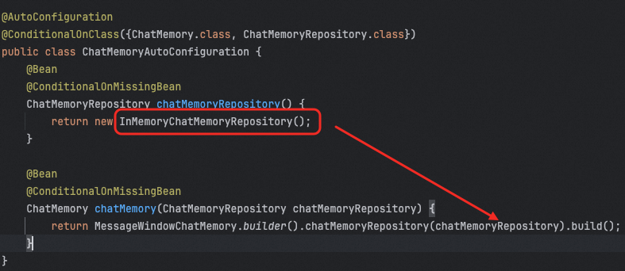
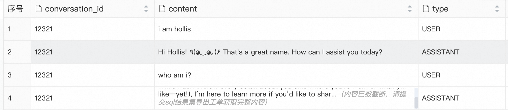

# ✅Spring AI 记忆管理技术：持久化记忆

在Spring AI中，我们最熟悉的就是`MessageWindowChatMemory` ，它默认是一个基于内存的短期记忆实现，它维护最多指定最大大小（默认值：20 条消息）的消息窗口。


当消息数量超过此限制时，较旧的消息会被逐出。这确保对话始终可以使用最新的上下文，同时保持内存使用有界。应用一旦重启，内存中的记忆就会丢失。


Spring AI中的记忆存储是基于ChatMemoryRepository这个接口扩展的，他提供了一些列实现用来做基于存储，包括前面的`MessageWindowChatMemory`所使用到的InMemoryChatMemoryRepository，这就是一种基于ConcurrentHashMap的本地内存的记忆方式。





这就是MessageWindowChatMemory的默认实现，除此之外，ChatMemoryRepository还有一系列扩展实现，我们也可以用，包括：

-   JdbcChatMemoryRepository

-   使用 JDBC 将消息存储在关系型数据库中，它支持多种数据库，PostgreSQL、MySQL / MariaDB、SQL Server、Oracle等

-   CassandraChatMemoryRepository

-   使用 Apache Cassandra 存储消息。它适用于需要持久化存储聊天记录的应用，特别是在需要高可用性、持久性、可扩展性，以及利用TTL功能时。

-   Neo4jChatMemoryRepository

-   使用 Neo4j 将聊天消息存储为属性图数据库中的节点和关系。它适用于希望利用 Neo4j 的图功能进行聊天记忆持久化的应用程序。

-   CosmosDBChatMemoryRepository

-   使用 Azure Cosmos DB NoSQL API 来存储消息。它适用于需要全球分布式、高度可扩展的文档数据库来持 久化聊天内存的应用程序。该存储库使用对话 ID 作为分区键，以确保高效的数据分布和快速检索。

-   MongoChatMemoryRepository

-   使用 MongoDB 存储消息。它适用于需要灵活的、面向文档的数据库进行聊天内存持久化的应用程序。

-


### 使用MySQL持久化记忆

我们借助Spring AI，使用Spring来做记忆保存，Spring AI提供了

```java
spring-ai-starter-model-chat-memory-repository-jdbc
```

我们可以直接用它来实现。首先我们在代码中增加依赖：

```xml
<dependency>
    <groupId>org.springframework.ai</groupId>
    <artifactId>spring-ai-starter-model-chat-memory-repository-jdbc</artifactId>
    <version>1.1.0</version>
</dependency>
```

增加依赖后会自动引入这两个jar包：

```java
spring-ai-autoconfigure-model-chat-memory-repository-jdbc
spring-ai-model-chat-memory-repository-jdbc
```

一个是jdbc操作的工具包，一个是对他做自动化配置的。


通过org.springframework.ai.model.chat.memory.repository.jdbc.autoconfigure.JdbcChatMemoryRepositoryProperties 我们可以知道，都需要增加哪些配置项目：


```yaml
spring:
  ai:
    chat:
      memory:
        repository:
          jdbc:
            platform: mysql
            initialize-schema: always
```

platform用于指定具体哪个数据库，他支持很多数据库，在platform和schema二选一进行配置就行了，就是指定用哪个表结构。


如果运行时还是提示没建表（initialize-schema: always 默认会自动创建表）：


```yaml
java.sql.SQLSyntaxErrorException: Table 'spring_ai_db2.spring_ai_chat_memory' doesn't exist
	at com.mysql.cj.jdbc.exceptions.SQLError.createSQLException(SQLError.java:121) ~[mysql-connector-j-8.0.33.jar:8.0.33]
	at com.mysql.cj.jdbc.exceptions.SQLExceptionsMapping.translateException(SQLExceptionsMapping.java:122) ~[mysql-connector-j-8.0.33.jar:8.0.33]
```

可以自己建个表，先创建一个数据库，然后建表一张，建表语句如下：


（不要用官方提供的SQL，会出现乱码和无法解析问题，就用我这个）

```sql
CREATE TABLE `spring_ai_chat_memory` (
  `conversation_id` varchar(36) CHARACTER SET utf8mb4 NOT NULL,
  `content` text CHARACTER SET utf8mb4 NOT NULL,
  `type` enum('USER','ASSISTANT','SYSTEM','TOOL') CHARACTER SET utf8mb4 NOT NULL,
  `timestamp` timestamp NOT NULL DEFAULT CURRENT_TIMESTAMP ON UPDATE CURRENT_TIMESTAMP,
  KEY `SPRING_AI_CHAT_MEMORY_CONVERSATION_ID_TIMESTAMP_IDX` (`conversation_id`,`timestamp`)
) ENGINE=InnoDB DEFAULT CHARSET=utf8mb4 COLLATE=utf8mb4_general_ci
;
```

有了这些之后，还需要一个单独的配置，就是他这个东西要和数据库交互还需要一个datasource，我们需要有个数据库连接的能力，所以需要导入包：

```xml
<dependency>
    <groupId>mysql</groupId>
    <artifactId>mysql-connector-java</artifactId>
    <version>8.0.33</version>
</dependency>
```


增加数据库相关配置：

```yaml
spring:
  datasource:
	  url: jdbc:mysql://xx.xx.xx.xx/spring_ai_db2?useUnicode=true&characterEncoding=UTF-8
	  username: xxx
	  password: xxx
	  driver-class-name: com.mysql.cj.jdbc.Driver
```

接着就需要定义一个使用JDBC做记忆的ChatMemory：

```java
public class JdbcChatMemoryConfiguration {

    @Bean
    ChatMemory chatMemory(JdbcChatMemoryRepository chatMemoryRepository) {
        return MessageWindowChatMemory.builder().chatMemoryRepository(chatMemoryRepository).build();
    }
}
```

然后在chatClient中使用这个memory：

```java

@RestController
@RequestMapping("/jdbc/memory")
public class JdbcChatMemoryController implements InitializingBean {

    @Autowired
    private ChatModel chatModel;

    private ChatClient chatClient;

    @Autowired
    private ChatMemory jdbcChatMemory;

    @GetMapping("/callDb")
    public Flux<String> callDb(String message, String chatId, HttpServletResponse httpServletResponse) {
        httpServletResponse.setCharacterEncoding("UTF-8");
        return chatClient
                .prompt()
                .user(message)
                .advisors(spec -> spec.param(ChatMemory.CONVERSATION_ID, chatId))
                .stream().content();
    }

    @Override
    public void afterPropertiesSet() throws Exception {
        this.chatClient = ChatClient.builder(chatModel)
                // 实现 Logger 的 Advisor
                .defaultAdvisors(MessageChatMemoryAdvisor.builder(jdbcChatMemory).build(), new SimpleLoggerAdvisor())
                // 设置 ChatClient 中 ChatModel 的 Options 参数
                .defaultOptions(
                        DashScopeChatOptions.builder()
                                .withTopP(0.7)
                                .build()
                ).build();
    }
}
```

接着可以做两次对话：


第一次：http://localhost:8010/ai/long\_term\_memory/chat?chatId=12321&message=i%20am%20hollis

第二次：http://localhost:8010/ai/long\_term\_memory/chat?chatId=12321&message=who%20am%20i?


然后查看数据库，可以看到数据已经存下来了，





我们重启应用，在用同一个chatId问问题，他还是可以正常回答，历史的记忆还是存在的。
