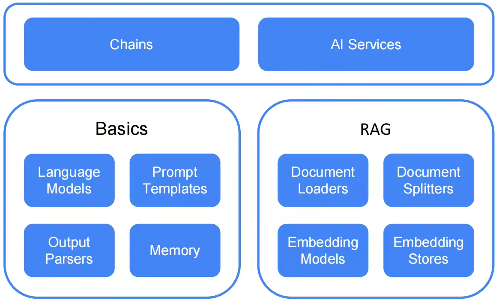

# ✅Java中大模型调用的多种方式

我们要讲的是基于Java的大模型应用开发，那么就需要介绍下在java中怎么和大模型交互。


坐稳扶好，正式开始进入代码部分了。**(注意， 我们的项目JDK要求最低是JDK17，建议用JDK 21）**


在前面介绍百炼的时候，我们讲过，可以通过curl来调用模型的：


```java
curl -X POST https://dashscope.aliyuncs.com/compatible-mode/v1/chat/completions \
-H "Authorization: Bearer $DASHSCOPE_API_KEY" \
-H "Content-Type: application/json" \
-d '{
    "model": "qwen-plus",
    "messages": [
        {
            "role": "system",
            "content": "You are a helpful assistant."
        },
        {
            "role": "user",
            "content": "程序员Hollis是谁？"
        }
    ]
}'
```


### HttpClient 调用大模型


那么也就意味着，想要在Java中调用大模型，最简单的方式，那就是使用一些HTTP的客户端发送一个http请求。比如用HttpClient。


我们先创建一个空的SpringBoot应用，通过https://start.spring.io/ 创建。


点击generate就会创建并下载一个空项目了。把他解压并导入到你的idea中。


接着，我们常使用HttpClient实现一个大模型的调用


```java
package cn.hollis.llm.llmentor;

import java.io.IOException;

import java.net.URI;

import java.net.http.HttpClient;

import java.net.http.HttpRequest;

import java.net.http.HttpResponse;

public class HttpClientCaller {

    private static final String API_KEY = "sk-8ef405c4686e456e91f6698272253126";

    private static final String API_URL = "https://dashscope.aliyuncs.com/compatible-mode/v1/chat/completions";

    public static void main(String[] args) throws IOException, InterruptedException {

        String requestBody = """

                {

                    "model": "qwen-plus",

                    "messages": [

                        {

                            "role": "system",

                            "content": "You are a helpful assistant."

                        },

                        {

                            "role": "user",

                            "content": "你好，介绍下JAVA？"

                        }

                    ],

                    "stream": true

                }

                """;

        HttpClient client = HttpClient.newHttpClient();

        HttpRequest request = HttpRequest.newBuilder()

                .uri(URI.create(API_URL))

                .header("Content-Type", "application/json")

                .header("Authorization", "Bearer " + API_KEY)

                .header("X-DashScope-SSE", "enable")

                .POST(HttpRequest.BodyPublishers.ofString(requestBody))

                .build();

        HttpResponse<String> response = client.send(

                request, HttpResponse.BodyHandlers.ofString());

        System.out.println(response.body());

    }

}
```


这里面有个问题，就是模型返回的比较慢，那是因为我们没用流式输出。我们知道现在很多模型的对话的返回都是流式输出的，就是一个字一个字吐出的。这块后面我们会讲。别急，慢慢来。


前面讲完了用最普通的HTTP Client的方式对接大模型，当然，除了我们讲的这种，你还可以用任意一个http的客户端框架发起请求，都可以。


那么，这种方式，有没有缺点，有，那就是代码太复杂了，不是结构化的，完全是组装http请求的方式实现的，没啥复用性。这还是一个简单的对话功能，如果要做更多的东西，比如rag、工具调用，mcp啥的，那代码就爆炸了。


所以，在Java中，也提供了框架，可以帮我们简化大模型应用开发中的模型调用，比较常用的就是：

-   Spring AI (Alibaba)

-   Langchain4j


### Spring AI


Spring Ai，是Spring为了降低Java人员开发AI应用的成本而推出的一套组件。（这里不得不说，在Java支持AI这方面的努力，Spring比Oracle要靠谱！！！）


Spring AI，截止我写这个文档的时候，他是1.0.3版本，其实他的时间并不长，1.0.0的正式版也就25年5月份才发布而已。


通过下面这个spring ai的官方文档的目录基本上就能看出来，spring ai目前有的功能：


1、对话客户端的API

2、提示词相关

3、结构化输出

4、模型相关

5、对话记忆

6、工具调用

7、MCP

8、RAG

9、向量数据库


**这里面的所有内容，我们的课程都会讲到！！！**


很多人认为，Spring AI 是对模型调用做了简单封装，但其实这么想的话就太简单了。


虽然它确实封装了底层模型 API，但它的价值远不止于此：

-   它提供了面向 Spring 开发者的编程模型，让 AI 功能像使用 JDBC 或 REST Client 一样自然。

-   它解决了多模型适配、提示工程、结构化输出、RAG 架构、对话记忆、可观测性等实际工程问题。

-   它鼓励最佳实践，比如将提示词外置、使用 POJO 映射输出、支持单元测试等。


所以，总结来说，**Spring AI 是一个面向生产级 AI 应用的全栈式开发框架**，目标是让 Java 开发者在熟悉的 Spring 生态中高效、可靠地构建 AI 原生应用。它不只是“调用模型的封装”，而是提供了一整套从提示管理、输出解析、向量存储到可观测性的解决方案。


（关于Spring AI的应用，是我们本课程的重点，后面会有单独章节介绍）


### Spring AI Alibaba


Spring AI Alibaba 开源项目基于 Spring AI 构建，是阿里云通义系列模型及服务在 Java AI 应用开发领域的最佳实践，提供高层次的 AI API 抽象与云原生基础设施集成方案，帮助开发者快速构建 AI 应用。


在Spring AI Alibaba的1.0 GA版本推出之前，Spring AI Alibaba可以理解为在Spring AI上面又做了一层封装，可以让我们更加方便的做各种模型的接入（尤其是alibaba自家的百炼的接入更方便），以及基于模型做的各种东西，比如MCP、RAG等等的。


但是，**自从Spring AI Alibaba 的1.0 GA之后，在Spring AI的基础上，面向企业级智能体（Agent）应用开发场景，进行了深度增强和架构升级。**它保留了 Spring AI 的所有能力，并在此之上构建了一套完整的 AI 原生应用开发平台，尤其适合需要复杂流程编排、多智能体协作、高可靠性和阿里云生态集成的生产环境。


Spring AI Alibaba 最大的创新点，是受 Python 社区 LangGraph 启发，提供了 基于有向图（DAG + 循环）的工作流编排能力（Graph）。**基于 Spring AI Alibaba Graph，开发者可快速构建工作流、多智能体应用，无需关心流程编排、上下文记忆管理等底层实现。**通过 Graph 与低代码、自规划智能体结合，为开发者提供从低代码、高代码到零代码构建智能体的更灵活选择。


Spring AI Alibaba 支持与百炼平台深度集成，提供模型接入、RAG 知识库解决方案；支持 ARMS、Langfuse 等可观测产品无缝接入；支持企业级的 MCP 集成，包括 Nacos MCP Registry 分布式注册与发现、自动 Router 路由等。


并且提供了一些开箱即用的智能体产品，如JManus、DeepResearch等。总之，Spring AI Alibaba个人认为是在Java 的大模型应用开发领域提供了一个非常强有力的框架。


对比下Spring AI和Spring AI Alibaba：

| **层级** | **Spring AI** | **Spring AI Alibaba** |
| --- | --- | --- |
| **基础层** | ✔️ 模型抽象、Prompt、Embedding、RAG | ✔️ 完全继承 |
| **编排层** | ❌ 无 | ✔️ Graph 工作流引擎 |
| **智能体层** | ❌ 需手动实现 | ✔️ 内置 Agent/Multi-Agent 框架 |
| **生态层** | ✔️ 国际模型 | ✔️ + 阿里云全栈集成 |
| **企业层** | ❌ 弱 | ✔️ 可观测、治理、稳定、安全 |


（关于Spring AI Alibaba的应用，是我们本课程的重点，后面会有更多介绍）


### LangChain4j


之前我们介绍过Spring AI，其实LangChain4J的作用和Spring AI差不多，就是让我们在Java代码中可以更方便的做大模型应用开发，更好的用上我们之前讲过的提示词工程、提示词模板、对话记忆、结构化输出，以及实现RAG、Agent、MCP等功能的。所以Spring AI中有的东西，LangChain4J也几乎都有的。


与其说他是对标Spring AI的， 不如说他其实是对标Langchain的，他其实是langchain的java版，毕竟他出现的时间其实是比spring还要早的。


LangChain4j整体为开发者提供了两种层次的抽象接口：


1.低层次：提供了如下Basics（大模型、提示词模版、模型记忆等）和RAG（向量模型、向量数据库、文本载入分割工具）两类低层次接口，开发者从而能够灵活的实现这些接口并根据自己的需求进行组合，定制化自己的大模型应用。


2.高层次：为了让Java开发者可以更加关注业务逻辑而不是这些底层实现，LangChain4J提供了两个高层次的API：

-   Chains：包括Chains和AI Services两种类别，Chains源于Langchain，相当于将低层次模块组合起来，形成一些固定的处理流程，并协调它们之间的交互。

-   AI Service：AI Services是LangChain4J为 Java 量身定制的解决方案，和Spring Data JPA类似，只需要显示的定义接口，并且可以自定义的加入Memory、Tools或者RAG，具体调用逻辑实现由LangChain4j代理完成。





（关于Langchain4j的更多应用，以及API的使用，后面会有单独章节介绍）


### Spring AI & Spring AI Alibaba & Langchain4j


| **能力** | **LangChain4j** | **Spring AI** | **Spring AI Alibaba** |
| --- | --- | --- | --- |
| **是否依赖 Spring** | ❌ 可独立使用 | ✔️ 深度集成 | ✔️ 深度集成 |
| **Prompt 模板** | ✔️ Mustache 风格 | ✔️ 类似 Thymeleaf | ✔️ 继承 Spring AI |
| **结构化输出** | ✔️ 强（JSON Schema） | ✔️ 基础支持 | ✔️ 增强版 |
| **RAG 支持** | ✔️ 全链路 | ✔️ 基础 | ✔️ 企业级增强 |
| **智能体（Agent）** | ✔️ 内置 ReAct 等 | ❌ 需手动实现 | ✔️ Graph + Multi-Agent |
| **工作流编排** | ⚠️ 简单 Chain | ❌ 无 | ✔️ Graph 引擎（核心优势） |
| **阿里云集成** | ✔️ Qwen/DashScope | ❌ 无官方支持 | ✔️ 深度集成（百炼、OSS、Nacos） |
| **生产可观测性** | ⚠️ 需自行集成 | ✔️ Micrometer | ✔️ ARMS/SLS 原生 |


**非 Spring 的纯Java项目项目**→ 选 **LangChain4j**

**需要快速原型验证**，且熟悉 LangChain 概念 → 选 **LangChain4j**

**已有 Spring Boot 项目，只需简单 LLM 调用或 RAG** → 选 **Spring AI**

**构建企业级、多步骤、多角色协作的 AI 应用** → 选 **Spring AI Alibaba**

**想用 Java 但又想要接近 Python LangChain 的体验** → **LangChain4j 是最佳选择**
