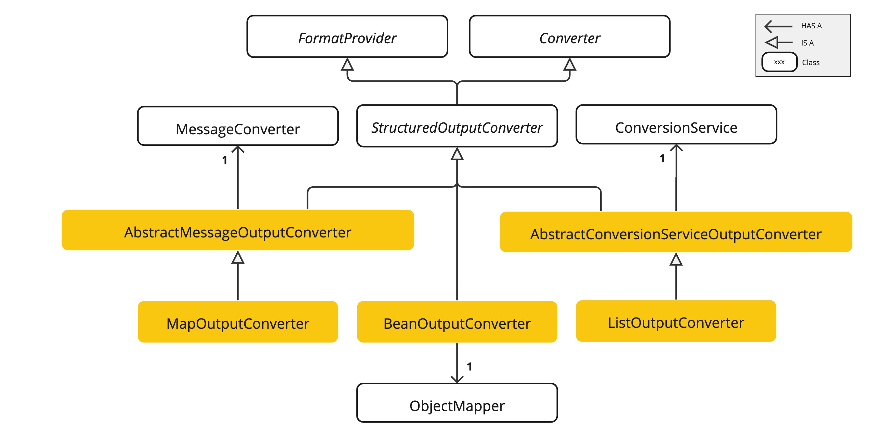
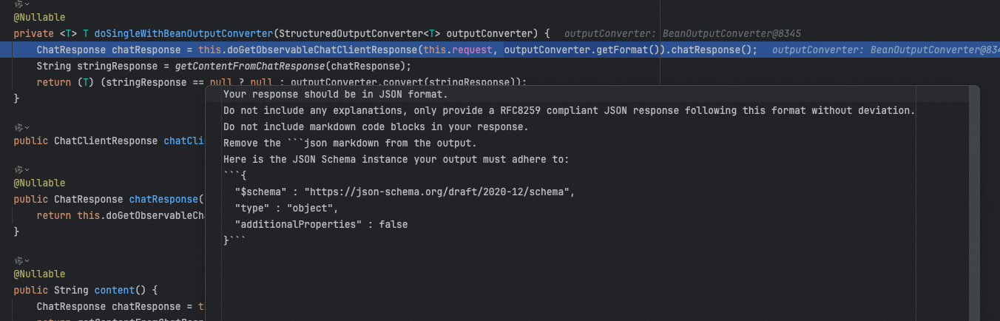
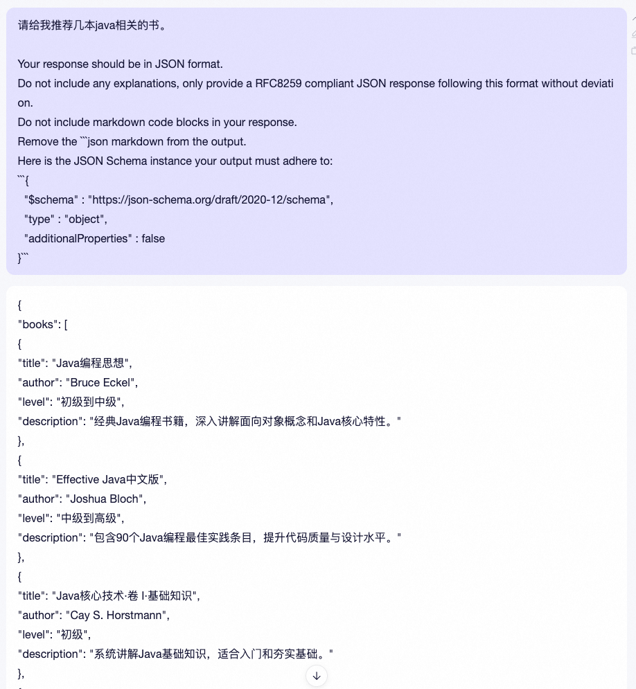

# ✅Spring AI 核心特性：结构化输出

### 什么是结构化输出

当我们在做大模型相关的对话的时候，模型的回答格式是不固定的，如果是人看的话，都是可以看懂的，但是如果我们靠代码来处理这些结果的话就比较费劲了。所以，在大模型应用开发中，结构化输出至关重要。


所谓结构化输出，就是让大模型按照我们要求的合适来做输出。比较常用的格式就是JSON，因为他最灵活。比如：


### StructuredOutputConverter


在Spring AI中，为了方便我们做结构化输出，也提供了一个StructuredOutputConverter的接口：


```java
/**
 * Converts the (raw) LLM output into a structured responses of type. The
 * {@link FormatProvider#getFormat()} method should provide the LLM prompt description of
 * the desired format.
 *
 * @param <T> Specifies the desired response type.
 * @author Mark Pollack
 * @author Christian Tzolov
 */
public interface StructuredOutputConverter<T> extends Converter<String, T>, FormatProvider {

}
```


他的原理很简单，在 LLM 调用之前，Converter向提示中添加格式指令，为模型提供明确的指导，以生成所需的输出结构。


在 LLM 调用之后，Converter将模型的输出文本转换为结构化类型的实例。此转换过程涉及解析原始文本输出并将其映射到相应的结构化数据表示，例如 JSON、XML 或特定领域的数据结构。


以上这段原理不是我YY的，是Spring AI的文档中写的，当然，后面我们会通过代码带大家看看具体实现，继续往后看就行了。


我们看下他的一个最常用的实现类BeanOutputConverter





### BeanOutputConverter原理


BeanOutputConverter这个类中重写了一个getFormat方法，可以看到方法定义：


````java
/**
 * Provides the expected format of the response, instructing that it should adhere to
 * the generated JSON schema.
 * @return The instruction format string.
 */
@Override
public String getFormat() {
    String template = """
            Your response should be in JSON format.
            Do not include any explanations, only provide a RFC8259 compliant JSON response following this format without deviation.
            Do not include markdown code blocks in your response.
            Remove the ```json markdown from the output.
            Here is the JSON Schema instance your output must adhere to:
            ```%s```
            """;
    return String.format(template, this.jsonSchema);
}
````


原来就是一段提示词，我们通过debug看一下，这个getFormat方法被调用后最终提示词的内容：





````java
Your response should be in JSON format.
Do not include any explanations, only provide a RFC8259 compliant JSON response following this format without deviation.
Do not include markdown code blocks in your response.
Remove the ```json markdown from the output.
Here is the JSON Schema instance your output must adhere to:
```{
  "$schema" : "https://json-schema.org/draft/2020-12/schema",
  "type" : "object",
  "additionalProperties" : false
}```
````


把这段提示词加到我们的对话的后面，就能得到我们想要的JSON格式了。





### BeanOutputConverter如何使用


那么，在代码中我们如何把这段提示词加到我们的prompt呢，很简单，就用我们上一篇讲过的提示词模板就行了，如：


```java
response.setCharacterEncoding("UTF-8");

PromptTemplate promptTemplate = new PromptTemplate("""
        请帮我推荐几本java相关的书
        {format}
        """);

return chatClient.prompt(promptTemplate.create(Map.of("format", beanOutputConverter.getFormat()).stream().content();
```

这里直接用beanOutputConverter.getFormat()返回的内容，来替换{format}即可。

但是，如果同样的对话问多次，有可能得到的结果也不一样，比如有的时候他返回了level，有的时候返回了rating


那么，就需要我们提前告诉Converter我们都需要哪些字段。BeanOutputConverter通过他的名字就能看出来，他其实是可以把模型的结构化输出转成一个bean的，而bean的话我们是可以提前定义好他的参数名的，是不是这样就可以让模型提前知道需要哪些字段了呢？


没错，就这么干。


### 模型输出转成Bean


代码如下：


```java
@RestController
@RequestMapping("/ai/structure")
public class StructuredOutputController implements InitializingBean {

    @Autowired
    private DashScopeChatModel chatModel;

    private ChatClient chatClient;

    @GetMapping("/chat")
    public Flux<String> chat(HttpServletResponse response) {
        response.setCharacterEncoding("UTF-8");

        BeanOutputConverter<Book> beanOutputConverter = new BeanOutputConverter<>(Book.class);

        PromptTemplate promptTemplate = new PromptTemplate("""
            请帮我推荐1本java相关的书
            {format}
            """);

        return chatClient.prompt(promptTemplate.create(Map.of("format", beanOutputConverter.getFormat()))).system("你是一个专业的图书推荐人员").stream().content();
    }
}
```


先定义一个BeanOutputConverter，并指定他的参数为Book.class类型，Book定义如下：

```java
import java.math.BigDecimal;

/**
 * @param title       书名
 * @param author      作者
 * @param description 简介
 * @param price       价格
 * @author Hollis
 */
public record Book(String title, String author, String description, BigDecimal price) {

}
```


这是一个record，是在Java 14中引入的，方便我们可以快速定义一个包含了基本的getter、setter等方法的bean。


运行以上代码，得到输出：


```json
{ "author": "Bruce Eckel", "description": "A comprehensive guide to Java programming, covering fundamentals and advanced topics with clarity.", "price": 49.99, "title": "Thinking in Java" }
```


这样，我们就拿到了一个我们想要的格式。如果想要更加准确，最好是在Book的定义中给每个字段增加说明，如：


```java
import com.fasterxml.jackson.annotation.JsonPropertyDescription;

import java.math.BigDecimal;

/**
 * @param title       书名
 * @param author      作者
 * @param description 简介
 * @param price       价格
 * @author Hollis
 */
public record Book(@JsonPropertyDescription("书籍名称") String title,
                   @JsonPropertyDescription("作者") String author,
                   @JsonPropertyDescription("书籍介绍") String description,
                   @JsonPropertyDescription("价格") BigDecimal price) {

}
```

如果，有的时候我们拿到模型的结构化输出以后，并不是展示在页面上，而是要在代码中使用这个结果，那么还是需要把结果转成具体的bean，上面结果也有了，bean convertor也有了，所以转成bean就很简单了：

```java
@GetMapping("/chat1")
public String chat1(HttpServletResponse response) {
    response.setCharacterEncoding("UTF-8");

    BeanOutputConverter<Book> beanOutputConverter = new BeanOutputConverter<>(Book.class);

    PromptTemplate promptTemplate = new PromptTemplate("""
        请帮我推荐1本java相关的书
        {format}
        """);

    String result = chatClient.prompt(promptTemplate.create(Map.of("format", beanOutputConverter.getFormat()))).system("你是一个专业的图书推荐人员").call().content();

    Book book = beanOutputConverter.convert(result);
    System.out.println(book);

    return result;
}
```

这里需要注意一下，BeanOutputConverter只能针对String做转换，Flux<String>是不支持的。这个也能理解，肯定要拿到完整结果才能转换成bean。

### 深入StructuredOutputConverter原理


以上代码，还是我们自己替换的{format}，其实这一步可以不用，Spring AI也帮我们封装好了，可以直接通过entity方法就能实现，如：


```java
@GetMapping("/chat2")
public String chat2(HttpServletResponse response) {
    Book book = chatClient.prompt("请帮我推荐几本java相关的书").system("你是一个专业的图书推荐人员").call().entity(Book.class);
    return book.toString();
}
```

以上代码，就是把模型的输出结果直接转成Book。


我们深入一下entity方法，看看原理，也把我们之前挖的坑（StructuredOutputConverter原理）给他埋上。

entity方法只有三行，第一行是参数合法性检测，第二行是new 一个 BeanOutputConverter，第三行是调用doSingleWithBeanOutputConverter方法：


```java
doSingleWithBeanOutputConverter@Nullable
public <T> T entity(Class<T> type) {
    Assert.notNull(type, "type cannot be null");
    BeanOutputConverter<T> outputConverter = new BeanOutputConverter(type);
    return (T)this.doSingleWithBeanOutputConverter(outputConverter);
}
```

其中BeanOutputConverter的构造函数可以简单看一眼，他是依赖了ParameterizedTypeReference创建的，这玩意不展开了，我们也可以直接用ParameterizedTypeReference.forType(clazz)来把一个任意Class转成BeanOutputConverter需要的东西。

```java
public BeanOutputConverter(Class<T> clazz) {
    this(ParameterizedTypeReference.forType(clazz));
}
```

接着就是非常重要的doSingleWithBeanOutputConverter方法了：

```java
@Nullable
private <T> T doSingleWithBeanOutputConverter(StructuredOutputConverter<T> outputConverter) {
    ChatResponse chatResponse = this.doGetObservableChatClientResponse(this.request, outputConverter.getFormat()).chatResponse();
    String stringResponse = getContentFromChatResponse(chatResponse);
    return (T)(stringResponse == null ? null : outputConverter.convert(stringResponse));
}

private ChatClientResponse doGetObservableChatClientResponse(ChatClientRequest chatClientRequest, @Nullable String outputFormat) {
    if (outputFormat != null) {
        chatClientRequest.context().put(ChatClientAttributes.OUTPUT_FORMAT.getKey(), outputFormat);
    }

    ChatClientObservationContext observationContext = ChatClientObservationContext.builder().request(chatClientRequest).advisors(this.advisorChain.getCallAdvisors()).stream(false).format(outputFormat).build();
    Observation observation = ChatClientObservationDocumentation.AI_CHAT_CLIENT.observation(this.observationConvention, DefaultChatClient.DEFAULT_CHAT_CLIENT_OBSERVATION_CONVENTION, () -> observationContext, this.observationRegistry);
    ChatClientResponse chatClientResponse = (ChatClientResponse)observation.observe(() -> this.advisorChain.nextCall(chatClientRequest));
    return chatClientResponse != null ? chatClientResponse : ChatClientResponse.builder().build();
}
```

看着挺复杂，但是也能看懂，基本上就是在 LLM 调用之前，Converter向提示中添加格式指令，为模型提供明确的指导，以生成所需的输出结构。（doGetObservableChatClientResponse方法中）

在 LLM 调用之后，Converter将模型的输出文本转换为结构化类型的实例。（outputConverter.convert(stringResponse)）

转换代码如下：

````java
/**
 * Parses the given text to transform it to the desired target type.
 * @param text The LLM output in string format.
 * @return The parsed output in the desired target type.
 */
@SuppressWarnings("unchecked")
@Override
public T convert(@NonNull String text) {
    try {
        // Remove leading and trailing whitespace
        text = text.trim();

        // Check for and remove triple backticks and "json" identifier
        if (text.startsWith("```") && text.endsWith("```")) {
            // Remove the first line if it contains "```json"
            String[] lines = text.split("\n", 2);
            if (lines[0].trim().equalsIgnoreCase("```json")) {
                text = lines.length > 1 ? lines[1] : "";
            }
            else {
                text = text.substring(3); // Remove leading ```
            }

            // Remove trailing ```
            text = text.substring(0, text.length() - 3);

            // Trim again to remove any potential whitespace
            text = text.trim();
        }
        return (T) this.objectMapper.readValue(text, this.objectMapper.constructType(this.type));
    }
    catch (JsonProcessingException e) {
        logger.error(SENSITIVE_DATA_MARKER,
                "Could not parse the given text to the desired target type: \"{}\" into {}", text, this.type);
        throw new RuntimeException(e);
    }
}
````

### 转成List和Map

以上演示了如何把模型结果转成Bean，但是有时候我们返回的一组Bean，那么就需要转成List或者Map了，这部分Spring AI也是支持的。


因为StructuredOutputConverter的实现类，除了BeanOutputConverter之外，还有ListOutputConverter、MapOutputConverter这两个。

```java
List<String> result = chatClient.prompt("请帮我推荐几本java相关的书").system("你是一个专业的图书推荐人员").call().entity(new ListOutputConverter(new DefaultConversionService()));

Map<String,Object> result = chatClient.prompt("请帮我推荐几本java相关的书").system("你是一个专业的图书推荐人员").call().entity(new MapOutputConverter());
```


但是，这两种用法，都不支持转成List<Bean>和Map<String,Bean>，只能转成List<String>和Map<String,Object>，也就是说最终转成的内容并不是我们想要的，比如我们要一个完成的book，他可能只输出了一个书名的List。


我感觉不太好用，我一般不怎么用这两个，List的话我反而下面这种用法比较多，可以拿到一个我想要的list，但是他底层也是用的BeanOutputConvertor

```java
List<Book> result = chatClient.prompt("请帮我推荐几本java相关的书").system("你是一个专业的图书推荐人员").call().entity(new ParameterizedTypeReference<List<Book>>() {
  });
```


而map的话，没找到好的办法可以拿到我们想要的格式，建议大家如果要转成map，可以考虑拿到list之后自己转成map吧。


或者如果你在提示词中能给出更明确的关于map的定义：


```java
Map<String, Object> book = chatClient.prompt("请给我推荐几本心理学有关的书，书的内容包括书名、作者、价格、上市时间等信息，以书名作为key，书的信息作为value")
        .call().entity(new MapOutputConverter());
```
