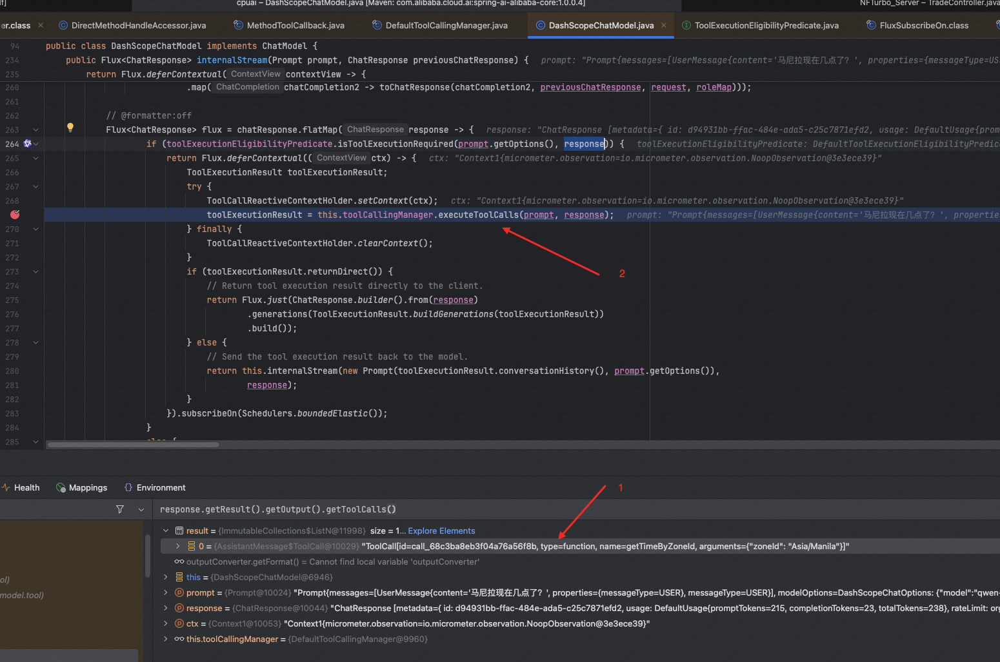
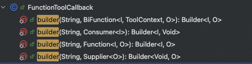
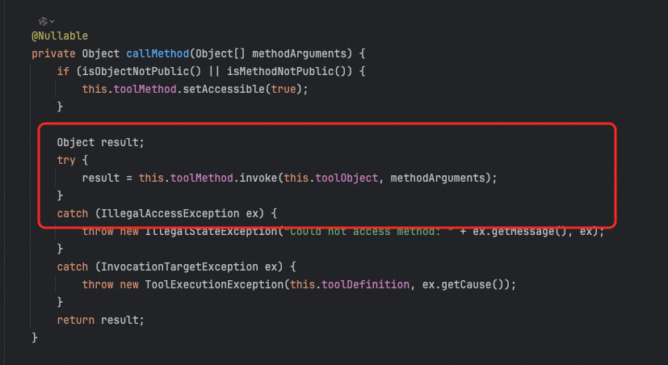

# ✅Spring AI中的Tool Calling怎么实现的

前面几节都是用Function Call或者Function Calling来介绍的，因为工具使用最开始在OpenAI提出的时候就是叫Function Calling的，所以这么叫的更多。


这一篇为啥改成Tool Calling了呢，因为在SpringAI中，一开始是提供了一套Function Calling的API的，但是在正式版发布的时候，废弃了，都改成Tool Calling了。


那么，Tool Calling在Spring AI中是如何支持的呢？


### 实现原理


之前在讲Function Call的时候提过，大模型自己不会调用工具，他只是决策什么时候、调用哪个工具、参数是什么。


而工具的调用是交由用户进行的，而我们这里的”用户”——Spring AI帮我做了工具调用的事情。如下图是Spring AI官方给的一张图，也和我们的说法是一致的，是Spring做的工具调用，而不是模型。


1.  当我们想要使工具对模型可用时，我们在聊天请求中包含其定义。每个工具定义包括名称、描述和输入参数的架构。

2.  当模型决定调用工具时，它会发送一个包含工具名称和按照定义架构建模的输入参数的响应。

3.  应用程序负责使用工具名称来识别和执行具有提供的输入参数的工具。

4.  工具调用的结果由应用程序处理。

5.  应用程序将工具调用结果发送回模型。

6.  模型使用工具调用结果作为额外上下文生成最终响应。


以下是我debug过程中，找到的一处关于Spring调用工具的证据。


这里面的模型输出是告知要调用的工具和具体参数，然后Spring AI会通过反射的方式调用具体的方法，然后再把结果组装到一起再给到模型。（这部分讲解视频中会带着大家debug看）




### ToolCallback

talk is cheap，show me the code ，下面是我们之前介绍过的，chatClient的tools方法具体实现：

```java
@Override
public ChatClientRequestSpec tools(Object... toolObjects) {
	Assert.notNull(toolObjects, "toolObjects cannot be null");
	Assert.noNullElements(toolObjects, "toolObjects cannot contain null elements");
	this.toolCallbacks.addAll(Arrays.asList(ToolCallbacks.from(toolObjects)));
	return this;
}
```

可以看到，这里关键的就是`this.toolCallbacks.addAll(Arrays.asList(ToolCallbacks.from(toolObjects)));` 这行代码。


这个ToolCallbacks是啥呢？Toolbacks只是个工具类，他的功能就是帮我们把一个Object转成ToolCallback\[\]。

```java
public final class ToolCallbacks {

	private ToolCallbacks() {
	}

	public static ToolCallback[] from(Object... sources) {
		return MethodToolCallbackProvider.builder().toolObjects(sources).build().getToolCallbacks();
	}

}
```

那ToolCallback是啥呢？看看他是怎么定义的：

```java
/**
 * 表示一个可由 AI 模型触发执行的工具。
 *
 * @author Thomas Vitale
 * @since 1.0.0
 */
public interface ToolCallback {

    /**
     * 由 AI 模型使用的工具定义，用于确定何时以及如何调用该工具。
     */
    ToolDefinition getToolDefinition();

    /**
     * 提供有关如何处理该工具的额外元数据信息。
     */
    default ToolMetadata getToolMetadata() {
       return ToolMetadata.builder().build();
    }

    /**
     * 使用给定的输入执行工具，并将结果返回给 AI 模型。
     */
    String call(String toolInput);

    /**
     * 使用给定的输入和上下文执行工具，并将结果返回给 AI 模型。
     */
    default String call(String toolInput, @Nullable ToolContext toolContext) {
       if (toolContext != null && !toolContext.getContext().isEmpty()) {
          throw new UnsupportedOperationException("不支持工具上下文！");
       }
       return call(toolInput);
    }

}
```

所以，这就是Spring AI中最终的一个Tool的具体定义了。

### FunctionToolCallback&MethodToolCallback

ToolCallback共有两个实现，一个是FunctionToolCallback，另一个是MethodToolCallback。


懵逼了，一个是函数（Function）一个是方法（Method）？这特么有啥区别？函数不就是方法，方法不就是函数吗？？？


我们通过在org.springframework.ai.model.tool.DefaultToolCallingManager#executeToolCall中增加断点，可以看到，前面我们讲过的两种工具调用方式分别是用的MethodToolCallback和FunctionToolCallback：


```java
return chatClient
                .prompt().toolNames("getTimeFunction")
                .user(city + "现在几点了？")
                .stream().content();
```


这种方式是FunctionToolCallback


```java
return chatClient
                .prompt().tools(new TimeTools())
                .user(city + "现在几点了？")
                .stream().content();
```


这种方式是MethodToolCallback


FunctionToolCallback这种，其实是你通过他的几个构造的方法builder来看，他都需要接受都包含一个函数式接口（Consumer，Function，Supplier，BiFunction）。





包括我们在用toolNames的时候，也是用了函数式接口的：


```java
@Bean
@Description("根据用户输入的时区获取该时区的当前时间")
public Function<TimeService.Request, TimeService.Response> getTimeFunction(TimeService timeService) {
    return timeService::getTimeByZoneId;
}
```


那么可想而知，他的方法的具体调用，是依赖函数式接口回调的。


而MethodToolCallback，主要是针对非函数式接口，比如普通的一个方法，那可想而知，他一定是通过反射调用的。



